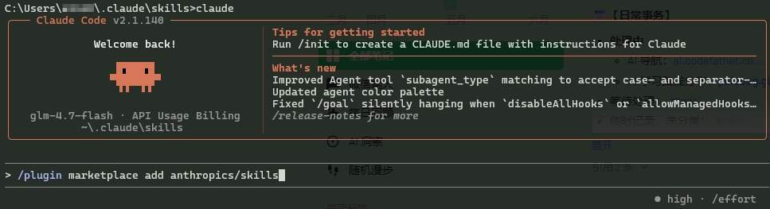
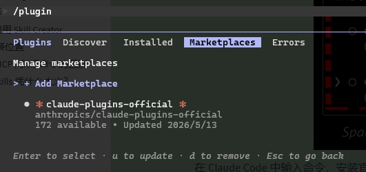
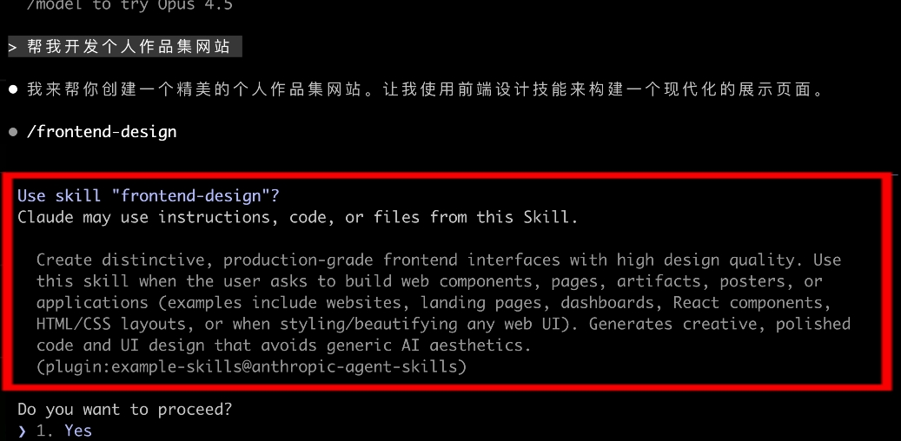
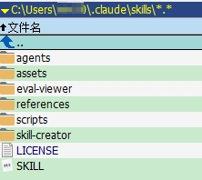

## 什么是 Agent Skills？

[Agent Skills](https://claude.com/blog/skills) 是 Anthropic 推出的[一套开放标准](https://platform.claude.com/docs/zh-CN/agents-and-tools/agent-skills/overview)，目的是让 AI 能够学习使用各种专业技能，而不用每次都重复输入提示词。

它定义了一种**封装 AI 工作流**的标准：开发者可以把复杂的任务指令、脚本和资源打包成一个**技能（Skill）**。简单来说，它就是给 AI 装备可重用的 **技能包(工具集)**。技能包里有精心设计的提示词、代码脚本、还有各种资源文件。作为用户，只需要安装这些技能，AI 就能立刻学会这项本事，不用重复造轮子。

每个 Skill 都是一个专门的 AI 能力，用于处理特定类型的任务。Skills 通过 `/<skill-name>` 命令调用，为用户提供了专业的功能支持。Agent Skills 最大的优势是：

1. 可复用性：安装一次技能，以后就能直接使用，不用重复输入提示词
2. 跨工具通用：在 Claude Code 中安装的技能，以后在 Cursor 等其他工具中也能用
3. 社区驱动：任何人都可以创建和分享技能
4. 降低门槛：像装 APP 一样简单，让普通用户也能让 AI 变得更专业

Agent Skills 不仅仅是个技术概念，更是一种新的工作方式。可以把它融入到日常工作中，比如把重复的任务封装成技能、把团队的最佳实践固化成技能，让 AI 真正成为得力助手。

## Agent Skills 入门实战

目前对 Agent Skills 支持最完善的工具是 Anthropic 官方的 [Claude Code](https://claude.com/product/claude-code)，以此为例，安装并使用 Skills。

### 安装 Skills 技能

打开 Claude Code 并输入以下命令，添加官方技能市场：

```bash
/plugin marketplace add anthropics/skills
```



就像在 AI 助手里开通了一个技能商店，接下来就可以从商店中获取技能了。



在 Claude Code 中输入命令，安装官方提供的技能包：

```bash
/plugin install example-skills@anthropic-agent-skills
```

这个 example-skills 包含了一堆官方示例技能，包括前端设计、网页测试、动图制作等等。装完之后，就可以直接让 AI 使用这些技能了。

还有另外一种安装方式，也可以在 Claude Code 中输入一行命令来安装 frontend-design 技能。

```bash
skill install anthropic-agent-skills:frontend-design
```

### 示例：前端设计技能

现在安装了 frontend-design 这个 **教 AI 生成专业设计感网站** 的技能后，输入：“帮我开发个人作品集网站”。AI 会主动问你：我发现你安装了前端设计技能，需要用它来生成更具设计感的页面吗？确认之后，AI 会利用技能生成代码，告别蓝紫渐变，生成独特风格的精美页面。



## Claude Code 内置 Skills 列表

### 核心开发 Skills

- **init** - 初始化新的 CLAUDE.md 文档，为代码库生成文档
- **review** - 审查拉取请求（PR）
- **security-review** - 对当前分支的待更改内容进行安全审查

### Claude API 相关 Skills

- **claude-api** - 构建、调试和优化 Claude API / Anthropic SDK 应用。包括：
    - 提示词缓存（prompt caching）
    - 适合新项目的提示词模板
    - 迁移现有代码在不同 Claude 模型版本间（4.5 → 4.6, 4.6 → 4.7, 已退役模型替换）
    - 模型选择和优化建议

### Python/代码质量 Skills

- **simplify** - 审查修改后的代码，评估可重用性、质量和效率，然后修复发现的问题
- **fewer-permission-prompts** - 扫描对话记录中的常见只读 Bash 和 MCP 工具调用，然后添加优先级 allowlist 到项目 .claude/settings.json 以减少权限提示

### 编辑器 Skills

- **obsidian-markdown** - 创建和编辑 Obsidian Flavored Markdown（Wiki 链接、嵌入、属性等）
- **obsidian-cli** - 使用 Obsidian CLI 交互 vault（读取、创建、搜索、管理笔记、任务等）
- **obsidian-bases** - 创建和编辑 Obsidian Bases（视图、过滤器、公式、摘要等）
- **json-canvas** - 创建和编辑 JSON Canvas 文件（节点、边、组、连接）

### 主题开发 Skills

- **obsidian-style-settings** - 用于 Obsidian 主题开发的专用工具
- **obsidian-hover-editor** - 在 Obsidian 中悬停预览笔记
- **obsidian-outliner** - Obsidian 的大纲模式
- **obsidian-quiet-outline** - 视觉大纲显示
- **obsidian-custom-attachment-location** - 附件位置管理

### 实用工具 Skills

- **keybindings-help** - 自定义键盘快捷键、重新绑定键、添加和弦绑定、修改 ~/.claude/keybindings.json
- **update-config** - 配置 Claude Code harness（通过 settings.json 自动化行为）
- **defuddle** - 使用 Defuddle CLI 从网页提取干净的 markdown 内容，移除杂乱内容和导航

### 定期任务 Skills

- **loop** - 按定期间隔运行提示词或斜杠命令（例如 `/loop 5m /foo`，默认 10 分钟）

## Agent Skills 内部原理

Skills 其实就是一个包含 `SKILL.md` 技能说明文件的文件夹，还可以包含可执行脚本、资源和参考文档。

```plaintext
my-skill/
├── SKILL.md          # 必需：指令和元数据
├── scripts/          # 可选：可执行脚本
├── references/       # 可选：参考文档
└── assets/           # 可选：模板和资源
```

由于每个技能的复杂度不同，结构也会存在区别。可以在本地目录中找到已安装的技能文件夹。



### SKILL.md 文件结构

`SKILL.md` 文件是每个技能的核心，它包含两个关键部分。

- **元数据**，用 YAML 格式写在文件开头：

```yaml
---
name: frontend-design
description: 生成具有专业设计感的前端代码，避免千篇一律的 AI 审美
---
```

其中 `name` 是技能的名字。`description` 是技能的描述，告诉 AI 什么时候应该使用这个技能。描述写得越清晰，AI 就越容易在合适的时机调用它。

- **指令内容**，就是一套经过精心设计的提示词，指导 AI 具体怎么做。以 frontend-design 技能为例，它的指令内容包括：
    - 设计思考：在写代码前，先分析产品目的、用户群体、技术约束，然后选择一个大胆的美学方向（极简、复古未来、工业风、有机自然、奢华精致等）
    - 前端美学指南：包括字体选择（避免 Arial、Inter 等烂大街字体，选择有个性的组合）、配色主题（主色调配鲜明点缀色）、动效设计、空间构成、背景和视觉细节
    - 避坑指南：明确禁止紫色渐变、系统字体、千篇一律的布局等 AI 审美陷阱

## skill-creator 安装与使用指南

### 什么是 skill-creator

skill-creator 是 Claude Code 的官方技能创建和管理工具，用于创建新 Skill、修改和优化现有 Skill、以及测量 Skill 性能。它是一个基于 Node.js 的开发工具，帮助你开发和维护 Claude Code Skills。

### 安装和使用 skill-creator 的详细步骤

#### 1. 前置要求

在开始之前，请确保你已经安装并配置好以下环境：

- **Node.js** (版本 18+) - skill-creator 需要运行在 Node.js 环境中
- **Git** - 用于克隆和版本管理
- **Claude Code** - 已安装 Claude Code CLI

检查 Node.js 版本：

```bash
node --version
```

检查 Git 版本：

```bash
git --version
```

#### 2. 安装 skill-creator

**方法一：使用 npm 安装（推荐）**

```bash
# 全局安装 skill-creator
npm install -g @anthropic/skill-creator

# 验证安装
skill-creator --version
```

**方法二：从源码安装**

```bash
# 克隆官方仓库
git clone https://github.com/anthropics/claude-code-plugins.git
cd claude-code-plugins/packages/skill-creator

# 安装依赖
npm install

# 构建
npm run build

# 全局链接
npm link
```

#### 3. 初始化 skill-creator

安装完成后，需要进行初始化配置：

```bash
# 初始化 skill-creator
skill-creator init

# 这会提示你：
# - 输入项目名称
# - 选择是否启用默认配置
# - 选择是否启用调试模式
```

初始化后会在当前目录创建以下结构：

```
skill-creator-project/
├── .claude/
│   └── skills/          # 你的 Skills 目录
├── package.json
├── skill-creator.config.js
└── README.md
```

#### 4. 验证安装

运行以下命令验证 skill-creator 是否正确安装：

```bash
# 查看帮助信息
skill-creator --help

# 查看版本信息
skill-creator --version

# 列出所有命令
skill-creator list
```

### skill-creator 主要功能

#### 1. 创建新 Skill

使用 skill-creator CLI 创建新的 Skill：

```bash
# 创建新 Skill
skill-creator create my-custom-skill

# 这会自动创建以下文件：
# - .claude/skills/my-custom-skill.md
# - .claude/skills/my-custom-skill.ts
# - skill.yaml
```

创建后，你需要编辑以下文件：

- **skill.yaml** - 定义 Skill 的元数据和触发条件
- **.claude/skills/my-custom-skill.ts** - TypeScript 实现
- **.claude/skills/my-custom-skill.md** - 技能说明文档

#### 2. 编写 Skill

**示例：创建一个简单的代码审查 Skill**

在 `.claude/skills/code-reviewer.md` 中编写：

```markdown
# Role
你是一个专业的代码审查专家。

# Context
用户需要对其代码进行审查，请提供专业的代码质量和安全建议。

# Guidelines
1. 读取用户提供的代码
2. 识别潜在的问题和风险
3. 提供具体的改进建议
4. 解释每个问题的原因

# Output Format
以以下格式输出：
## 代码质量评估
- 可读性: ⭐⭐⭐⭐⭐
- 可维护性: ⭐⭐⭐⭐
- ...

## 潜在问题
1. 问题 1
2. 问题 2
...
```

在 `.claude/skills/code-reviewer.ts` 中实现：

```typescript
import { Skill } from '@anthropic/skill-creator';

@Skill('code-reviewer')
export class CodeReviewerSkill {
  async execute(prompt: string, context: any) {
    // 实现你的 Skill 逻辑
    return {
      analysis: '...',
      suggestions: [...]
    };
  }
}
```

#### 3. 测试 Skill

```bash
# 测试单个 Skill
skill-creator test my-custom-skill

# 运行所有测试
skill-creator test --all

# 测试模式
skill-creator test --dry-run
```

#### 4. 部署 Skill

```bash
# 部署到本地
skill-creator deploy --local

# 部署到远程服务器
skill-creator deploy --remote

# 验证部署
skill-creator verify
```

#### 5. 管理已安装的 Skills

```bash
# 列出所有已安装的 Skills
skill-creator list

# 查看 Skill 详情
skill-creator show <skill-name>

# 更新 Skill
skill-creator update <skill-name>

# 删除 Skill
skill-creator remove <skill-name>
```

#### 6. 性能评估

```bash
# 评估 Skill 性能
skill-creator benchmark

# 生成性能报告
skill-creator benchmark --report
```

#### 7. 调试

```bash
# 启用调试模式
skill-creator debug

# 查看日志
skill-creator logs

# 清除缓存
skill-creator cache clear
```

### Skill 配置文件 (skill.yaml)

每个 Skill 都需要一个 `skill.yaml` 配置文件：

```yaml
name: "my-custom-skill"
version: "1.0.0"
description: "一个自定义的示例 Skill"
author: "Your Name"

# 触发条件
triggers:
  - "/my-skill"
  - "使用我的技能"
  - "help"

# 分类
categories:
  - "开发工具"

# 依赖
dependencies: []

# 权限要求
permissions:
  read: true
  write: false
  network: false

# 配置选项
config:
  - name: "option1"
    type: "string"
    default: "default-value"
    description: "配置选项 1"

# 资源文件
resources:
  - "README.md"
  - "assets/logo.png"
```

### 开发工作流

#### 1. 创建新 Skill

```bash
# 使用模板创建
skill-creator create --template basic

# 使用自定义模板
skill-creator create --template custom my-skill
```

#### 2. 编码和测试

```bash
# 启动开发服务器
skill-creator dev

# 在另一个终端运行测试
skill-creator test my-skill
```

#### 3. 代码审查

```bash
# 使用内置的代码审查工具
skill-creator lint
```

#### 4. 文档生成

```bash
# 自动生成文档
skill-creator docs

# 生成 API 文档
skill-creator docs --api
```

### 常见问题

#### skill-creator 命令找不到？

A: 确保：
1. skill-creator 已正确安装（`npm install -g @anthropic/skill-creator`）
2. Node.js 在 PATH 中
3. 重启终端后重试

#### 如何调试 Skill？

A: 使用调试模式：
```bash
skill-creator debug
```

然后运行你的 Skill，查看详细的调试信息。

#### Skill 无法触发怎么办？

A: 检查：
1. `skill.yaml` 中的触发条件是否正确
2. Skill 是否已安装（`skill-creator list`）
3. 查看日志：`skill-creator logs`

#### 如何更新 skill-creator？

A:
```bash
# 更新到最新版本
npm update -g @anthropic/skill-creator

# 或者重新安装
npm install -g @anthropic/skill-creator@latest
```

## Spring AI 中的 Agent Skills 支持

Spring AI 社区已将 Agent Skills 概念集成到 Spring 生态中，允许在 Spring Boot 应用内部运行 AI Agent 并加载 Skills。这个就比较有意思了，使用 springAI 相关的 skill 开发 AI Agent。

### Spring AI Agent Utils

Github 仓库 https://github.com/spring-ai-community/spring-ai-agent-utils

将 Claude Code 的 Skills 概念作为 Spring AI 工具重新实现。可将 Skills 打包为 Maven/Gradle 依赖，在团队间分发。通过 `SkillsTool` 在 `ChatClient` 中注册 Skills。

```java
ChatClient chatClient = chatClientBuilder
    .defaultToolCallbacks(SkillsTool.builder()
        .addSkillsDirectory(".claude/skills")
        .build())
    .defaultTools(FileSystemTools.builder().build())
    .defaultTools(ShellTools.builder().build())
    .build();
```

### 官方示例：在 Spring Boot 中创建 Code Reviewer Skill

在 Spring Boot 应用内创建可复用的 AI Agent Skill

```bash
mkdir -p .claude/skills/code-reviewer
cat > .claude/skills/code-reviewer/SKILL.md << 'EOF'
---
name: code-reviewer
description: Reviews Java code for best practices, security issues, and Spring Framework conventions.
Use when user asks to review, analyze, or audit code.
---

# Code Reviewer
## Instructions
When reviewing code:
1. Check for security vulnerabilities (SQL injection, XSS, etc.)
2. Verify Spring Boot best practices (proper use of @Service, @Repository, etc.)
3. Look for potential null pointer exceptions
4. Suggest improvements for readability and maintainability
5. Provide specific line-by-line feedback with code examples
EOF
```

### 自定义 Spring Boot Skill

```bash
# 1. 创建 skill 目录
mkdir -p .claude/skills/spring-boot-rest-api

# 2. 创建 SKILL.md
cat > .claude/skills/spring-boot-rest-api/SKILL.md << 'EOF'
---
name: spring-boot-rest-api
description: 编写 Spring Boot REST API 的最佳实践。当用户要求创建 Controller、DTO 或 REST 端点时自动激活。
---

# Spring Boot REST API 开发指南

## 触发条件
- 创建新的 REST Controller
- 编写 DTO / VO 类
- 设计 API 响应格式

## 核心规则
1. 使用 @RestController + @RequestMapping
2. 所有响应统一包装为 Result<T> 格式
3. 使用 @Valid 进行请求参数校验
4. 全局异常处理使用 @ControllerAdvice
5. 分页查询使用 Pageable 参数

## 代码示例
（见 references/ 目录）
EOF

# 3. 创建参考文件
mkdir -p .claude/skills/spring-boot-rest-api/references
```

## Skill 编写最佳实践

- **控制体量**：SKILL.md 控制在 500 token 以内，超出部分放入 `references/` 目录按需加载
- **明确触发**：触发条件用 “当用户要求……时” 的句式
- **正反对比**：包含正反例对比，帮助 Agent 理解"什么是好的代码"
- **模板复用**：使用模板文件，放在 `templates/` 目录供 Agent 复制使用
- **团队共享**：提交到版本控制，让团队共享

## 参考资源链接

- [Claude Code GitHub Repository](https://github.com/anthropics/claude-code)
- [skill-creator GitHub](https://github.com/anthropics/claude-code-plugins/tree/main/packages/skill-creator)
- [Claude Code 文档](https://docs.anthropic.com/claude-code)
- [官方 Skills 示例](https://github.com/anthropics/claude-code/tree/main/skills)

## Skill 推荐

### Spring Boot 专用 Agent Skills

以下 Skills 专为 Spring Boot 开发设计，直接提升 AI Agent 在 Spring Boot 项目中的编码质量。

#### Dr JSkill — Spring Boot 项目脚手架生成

Gihub 仓库 https://github.com/jdubois/dr-jskill

- **功能**：按 Julien Dubois 最佳实践生成 Spring Boot 4.x 项目脚手架，生成的项目结构遵循业界最严格的 Spring Boot 规范，适合作为新项目起点。
- **特性**：Java 25、PostgreSQL、Docker 支持，可选 Vue.js / React / Angular / Vanilla JS 前端
- **兼容**：Claude Code、GitHub Copilot CLI、Windsurf
- **安装**：克隆到 skills 目录，AI Agent 自动发现

#### Spring Boot Skills 集合 — 生产级开发规范

Gihub 仓库 https://github.com/rrezartprebreza/spring-boot-skills

- **功能**：生产级 AI 编码 Agent Skills 集合，专为 Spring Boot 日常开发设计
- **核心理念**：“AI 擅长 Python，但在 Spring Boot 上会幻觉。这个 repo 教 Agent 像高级 Spring 工程师一样编码。”
- **包含技能**：REST API 规范、测试策略、MCP Java SDK、数据库迁移等
- **技能结构**：每个 skill 包含 `SKILL.md` + `conventions.md` + `examples/` + `templates/`。每个 Skill 都是 `约定 + 示例 + 模板` 的完整组合，Agent 不仅知道怎么做，还能直接复制正确的代码模板。
- **安装**：克隆单个 skill 目录到 `.claude/skills/` 即可

#### Spring Boot Skills Marketplace — 渐进式架构模式

Gihub 仓库 https://github.com/a-pavithraa/springboot-skills-marketplace

- **功能**：Spring Boot 架构模式渐进式 Skills 集合，兼容 Claude Code 和 Codex
- **架构模式**：Layered → Package-by-Module → Modular Monolith → Tomato → DDD+Hexagonal
- **设计哲学**：“从简单开始，只在复杂度需要时才增加复杂度”
- **包含内容**：Spring Data JPA 参考、测试 Skills、架构演进路径指南
- **安装**：`npx skills add` 或手动克隆

#### Spring Boot Engineer — 高级编码 Subagent

Gihub 仓库 https://github.com/VoltAgent/awesome-claude-code-subagents

- **角色**：高级 Spring Boot 工程师 Subagent。作为独立 Subagent 使用，适合"让专家做专家的事"的多 Agent 协作模式。
- **专长**：Spring Boot 3+、微服务架构、WebFlux 响应式、Spring Cloud、GraalVM Native
- **工作流**：架构规划 -> 实现 -> Spring Boot Excellence 三阶段
- **质量标准**：88%+ 测试覆盖率、2.3s 启动时间、GraalVM Native 内存减少 75%

#### Java Architect — 企业级架构 Subagent

Gihub 仓库 https://github.com/VoltAgent/awesome-claude-code-subagents

### 大型 Skills 集合中的 Spring Boot 相关 Skills

#### Antigravity Awesome Skills

- Gihub 仓库 https://github.com/sickn33/antigravity-awesome-skills
- 安装 `npx antigravity-awesome-skills --claude`

**与 Spring Boot 相关的 15 个 Skills：**

| Skill 名称                        | 说明                            | 适用场景               |
| --------------------------------- | ------------------------------- | ---------------------- |
| `java-architect`                  | 企业级 Java 架构师              | 系统架构设计、技术选型 |
| `spring-boot-engineer`            | Spring Boot 3+ 专家             | 日常开发、微服务实现   |
| `api-design-principles`           | REST/GraphQL API 设计原则       | API 接口设计           |
| `database-optimization`           | 数据库优化                      | 查询调优、索引策略     |
| `tdd-mastery`                     | Red-Green-Refactor 测试驱动开发 | 测试编写               |
| `security-hardening`              | 安全加固                        | 输入验证、认证模式     |
| `code-refactoring-refactor-clean` | 重构专家                        | 代码清理、SOLID 原则   |
| `production-code-audit`           | 生产级代码审计                  | 上线前审查             |
| `cqrs-implementation`             | CQRS 架构实现                   | 读写分离架构           |
| `ddd-strategic-design`            | DDD 战略设计                    | 限界上下文划分         |
| `ddd-tactical-patterns`           | DDD 战术模式                    | 聚合、值对象、领域事件 |
| `event-sourcing-architect`        | 事件溯源架构                    | 事件驱动系统           |
| `postgres-best-practices`         | PostgreSQL 最佳实践             | 数据库设计             |
| `sql-optimization-patterns`       | SQL 优化模式                    | 慢查询优化             |
| `monorepo-architect`              | 单仓库架构                      | 大型多模块 Spring 项目 |

#### VoltAgent Awesome Agent Skills

- Gihub 仓库 https://github.com/VoltAgent/awesome-agent-skills
- 安装：`git clone` 后手动配置 skills 目录

与 Antigravity 类似的精选集合，兼容 Claude Code / Codex / Gemini CLI / Cursor。Java 相关 Skills 分类在 `02-language-specialists/` 目录下，包含 Spring Boot Engineer 和 Java Architect 等角色 Subagent。

#### Awesome Claude Code Toolkit

- Gihub 仓库 https://github.com/rohitg00/awesome-claude-code-toolkit
- 安装：克隆后手动配置 skills 目录

包含 135 agents + 35 curated skills + 42 commands + 176+ plugins。Spring Boot 相关的 Skills 在 API Design、Database Optimization、TDD、Security 等目录下。

### Spring AI 中的 Agent Skills 支持

Spring AI 社区已将 Agent Skills 概念集成到 Spring 生态中，允许在 Spring Boot 应用内部运行 AI Agent 并加载 Skills。


