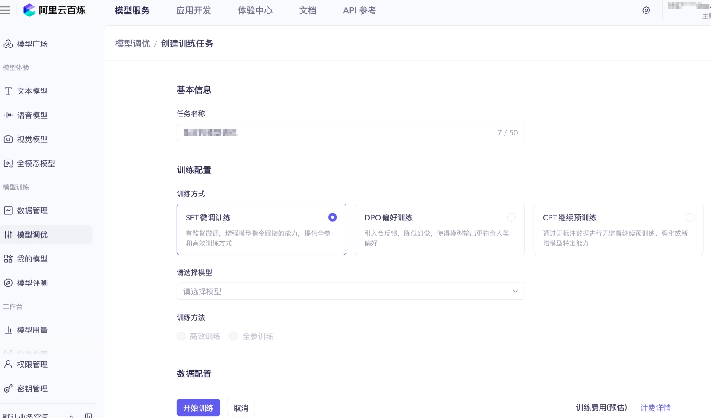

## AI 基础概念

### 概述

- 🌐 AGI（通用人工智能）：具备类似人类广泛认知能力的 AI，能跨多个领域自主解决问题
- 💬 GPT：基于 Transformer 架构的生成式预训练模型，能撰写文章也能生成对话内容
- 🔊 TTS（语音合成）：文字转自然语音技术，像把电子书变成广播剧的 AI 配音演员
- 🎤 ASR（语音识别）：语音转文字技术
- 🎨 AIGC：人工智能生成内容统称
- 🎨 MidJourney：文生图扩散模型应用
- 📊 机器学习：通过数据训练模型实现预测决策
- 🧠 深度学习：基于多层神经网络的特征抽象技术
- ⚡ 神经网络：仿生物神经元连接的计算模型，像快递分拣中心般层层传递处理信息
- 🗣️ NLP（自然语言处理）：计算机理解与生成人类语言的技术，涉及翻译、文本生成、情感分析等多种应用
- 👁️ CV（计算机视觉）：机器解析视觉信息的技术
- ⚡ 算力：计算机处理数据的能力基准，驱动AI宇宙运转的引擎
- 🧩 Transformer：基于注意力机制的模型架构
- 🔓 OpenAI：知名 AI 研究机构，ChatGPT 诞生的摇篮
- 🤗 Hugging Face：开源 AI 模型社区，程序员界的 AI 应用"应用商店"
- ✏️ Prompt（提示词）：引导 AI 输出的指令文本，唤醒 AI 潜能的"咒语密码"
- ✨ 生成式 AI：创造全新数字内容的技术
- 🎮 强化学习：通过奖惩机制不断优化决策过程，类似玩家在游戏中根据反馈提升策略
- 📘 训练集：用于模型训练的数据集合
- 🚫 过拟合：模型过度拟合训练数据特征
- 🔄 迁移学习：通过将已学知识迁移到新领域，帮助 AI 更高效地适应新任务
- 🔍 特征提取：从数据中识别并提取出最具辨识度的特征，帮助模型更好地理解和处理信息
- 🎛️ 参数调整：优化模型内部配置的过程
- 👨‍🏫 监督学习：用标注数据训练模型，像是有个老师逐题批改作业
- 🎓 无监督学习：自主发现数据规律的模式，像是没有参考答案的自学考试
- 📚 半监督学习：结合标注与非标注数据训练
- 🎭 GAN（生成对抗网络）：生成器与判别器对抗训练框架，模拟生成数据与评估数据质量的博弈
- ✂️ Fine-tuning（微调）：模型针对性优化

### 🤖 AI（人工智能）

人工智能（Artificial Intelligence）是让计算机通过算法模拟人类智能的技术系统。简单来说，就像给机器装上会自主学习升级的"电子大脑"，能像人一样思考、学习和解决问题。

在 Vibe Coding 中，AI 就是编程助手。只管告诉它要做什么，它就会全力做方案、写代码、修 Bug。就像一个 24 小时在线的程序员，随时可以干活，大幅提升编程效率，降低上手难度。

### 📖 LLM（大语言模型）

大语言模型（Large Language Model）是一种能够理解和生成人类语言的 AI 系统。ChatGPT、Claude、Gemini、DeepSeek 都是目前主流的大语言模型，此外国内的通义千问、文心一言也属于这类模型。因为这些模型的参数量非常庞大，动辄几十亿甚至上万亿个参数。参数越多，模型通常越聪明，能够处理更复杂的任务，但同时也越消耗计算资源，使用成本相对更高。

可以简单将"大语言模型"理解成一个能处理海量语言信息的 AI 系统，能吞下整个图书馆资料的超级处理器，它见过无数的编程案例、技术文档和行业知识，所以它能写代码、解释代码、修复 Bug，甚至提供技术方案建议。

除了文本大语言模型之外，AI 领域还有专门处理图片的视觉模型（比如 Stable Diffusion、MidJourney）、处理语音的音频模型（比如 Whisper）、以及能同时处理文字、图片、音频、视频的多模态模型（如 GPT-4o、Gemini 3.1 Pro）。在 AI 编程时，主要和文本大语言模型打交道，借助其语言理解和生成能力辅助开发。

### Token (词元)

Token 是 AI 模型处理文本的基本单位。它是 AI 识别和处理文本信息的最小单元，也是 AI 服务计费的核心依据。Token 是必须掌握的核心概念，因为 AI 服务通常按照 Token 收费。输入的文字、代码、文件，以及 AI 返回的回答、生成的代码、工具调用指令等，都会消耗 Token。Token 用得越多，花的钱就越多，**合理控制 Token 用量能有效降低使用成本**。

在英文中，一个 Token 大约是一个单词或单词的一部分；在中文中，一个汉字通常是 1 ~ 2 个 Token。例如：

- “Hello World” 大约是 2 个 Token
- “你好世界” 大约是 4 ~ 6 个 Token

但不同模型使用的分词器（Tokenizer）不同，所以同一段文字在不同模型中可能对应不同数量的 Token。目前很多 AI 编程工具（比如 Cursor、Claude Code）都自带了 Token 消耗量的实时统计和展示功能，方便随时掌握用量和成本，及时调整提示词或对话方式以节省 Token。

#### 输入 Token 和输出 Token

AI 服务在计费时，一般会分别计算输入和输出的 Token，二者的计费标准通常不同。

- 输入 Token：你发给 AI 的内容，比如提示词、代码片段、上传的文件内容、对话历史等，都属于输入 Token，是 AI 理解你需求的基础。
- 输出 Token：AI 返回给你的内容，比如问题回答、生成的代码、工具调用指令、修改建议等，都属于输出 Token，是 AI 处理需求后的成果。

一般来说，输出 Token 比输入 Token 更贵。这是因为生成内容比单纯理解内容更消耗算力，对模型的运算能力要求更高。

最简单的省 Token 小技巧是：**编写简洁清晰的提示词**，让 AI 一次就能理解需求、背景和输出格式等，减少反复对话和无效交互，从而降低 Token 消耗。

#### Token 缓存

Token 缓存是一个能帮你省钱的机制。简单来说，大模型在处理提示词时，需要做大量的计算。如果连续多次对话，很多内容（比如系统提示词、引用的代码文件）是重复的，缓存机制会把这些中间计算结果保存下来，下次遇到相同的前缀内容就直接复用，不仅更快，还更便宜。

缓存相关的 Token 分为两种：

- 缓存写入 Token：AI 第一次处理上下文时，会把计算结果存起来，比普通输入略贵一点
- 缓存读取 Token：后续再用相同的上下文时，直接复用缓存，价格甚至可以低到普通输入的1/10，非常便宜

所以在对话时，尽量保持上下文稳定，比如引用的文件、规则文件不要频繁改动，这样能持续享受缓存优惠。有时连续对话比开新对话更省钱，就是因为缓存在起作用。

### 模型参数

参数是模型在训练过程中学到的“知识点”，用数字的形式存储在模型中，是模型具备智能能力的核心基础。

例如，模型在训练时读到了大量 “天空是蓝色的”“树叶是绿色的” 这类内容，它就会在参数中记住 “天空” 和 “蓝色”、“树叶” 和 “绿色” 之间的关联关系。参数越多，模型能记住的知识和关联就越丰富，处理复杂问题的能力也就越强。

参数量直接影响模型的能力和使用成本。参数越多，模型越聪明，能处理的任务越复杂，但运行时消耗的算力（GPU 计算资源）也越多，所以使用价格也越贵。

不同场景下，选择合适参数量的模型能在效果和成本之间找到平衡。目前主流大模型中，明确公开参数量的有：

- DeepSeek-V3：6710 亿参数（采用 MoE 混合专家架构，实际激活 370 亿）
- Qwen3-235B：2350 亿参数（通义千问系列，激活 220 亿）
- Llama 4 Scout：1090 亿参数（Meta 开源模型，激活 170 亿）

值得一提的是，即使是同一系列的大模型，厂商也会提供不同参数量的版本以供选择，适配不同的使用场景和成本预算。

### 模型训练和推理

- 训练（Training）是让 AI 模型从大量数据中学习知识的过程。这个过程需要海量的计算资源（通常是大规模 GPU 集群）和漫长的时间，一般由 AI 公司（如 OpenAI、Anthropic、百度、阿里等）完成，绝大多数情况下，普通开发者无需自行训练模型，直接使用 AI 公司训练好的成品模型即可，既节省成本，又能快速投入使用。
- 推理（Inference）是模型训练完成、具备了知识之后，用学到的知识来回答问题、生成内容、处理任务的过程。我们日常使用 AI 工具，比如和 ChatGPT 对话、让 Cursor 写代码、用 Claude 分析问题，本质上都是 AI 模型在进行推理。

打个比方，训练就像学生上学读书，通过大量学习积累知识；推理就像学生参加考试答题，用学到的知识解决具体问题。二者是模型发挥作用的两个核心阶段。

### 模型微调（Fine-tuning）

微调是在已有预训练模型的基础上，用特定领域的数据继续训练，让模型在某个特定领域表现更好、更贴合具体需求的过程。

比如，用大量的医学资料微调一个模型，让它成为医学领域的专家，能够准确回答医学相关问题；或者用公司的代码库、业务文档微调模型，让它更了解公司项目风格、业务逻辑，生成更贴合项目风格的代码。

对于普通用户来说，微调成本较高，需要一定的技术能力和计算资源，一般不需要自己做，直接使用现成的模型就足够满足日常编程需求。不过，很多大模型应用开发平台（比如阿里云百炼、火山引擎、百度智能云等）都提供了模型微调的能力，降低了微调的技术门槛，开发者可以根据自身需求进行尝试。



### 模型蒸馏

模型蒸馏，也叫知识蒸馏（Knowledge Distillation），是一种把大模型的知识“压缩”到小模型里的技术。就像一个经验丰富的高级开发带新人，高级开发（教师模型）不只是告诉新人最终答案，还会分享自己的推理过程和思考逻辑。新人（学生模型）通过学习这些思维方式，能做出接近的决策，但成本低得多。

蒸馏的核心在于“软标签”。举个例子，让大模型识别一张动物图片，它不会只说“这是狗”，而是会给出一组概率：狗 92%、猫 5%、狼 3%。那个 5% 的“猫”其实包含了珍贵的信息，说明这张图里的动物和猫有某些相似特征。小模型通过学习这些概率分布，能学到类别之间的微妙关系，效果比只看“对或错”的硬标签好得多。

蒸馏的好处非常多，比如成本降低 5 ~ 30 倍、推理速度提升 4 倍、性能保留 95% 以上。典型案例就是 DeepSeek-R1 的蒸馏版本，用 671 亿参数的教师模型训练出 32 亿参数的学生模型，性能依然出色。

蒸馏和微调的区别是：

- 微调是在已有模型基础上用特定数据继续训练，让它在某个领域更专业。
- 蒸馏是把大模型的知识转移到小模型里，让小模型更轻量、更便宜。

### 上下文窗口

上下文窗口（Context Window）是指 AI 模型一次能 “记住” 的最大内容量，用 Token 来衡量，它决定了模型能处理的文本长度和对话历史长度。不同模型的上下文窗口大小不同，这也是选择模型时的重要参考因素：

- GPT-4o：128 K Token（约 10 万中文字）
- Claude Opus 4.6：标准 200 K Token，支持扩展到 1 M Token（约 75 万中文字）
- Gemini 3.1 Pro：1 M Token（约 75 万中文字），且支持同时处理文字、图片、音频、视频

上下文窗口越大，AI 能处理的代码量就越多，能记住的对话历史就越长，适合处理大型项目代码、长文档分析、多轮复杂对话等场景。如果项目代码很多，或者不确定 AI 能否在一次对话中完成任务，选择上下文窗口大的模型会更合适。

但要注意，上下文窗口越大，每次请求消耗的 Token 也越多，使用成本也会更高。比如在 Cursor 中使用 Claude Sonnet 模型时，单次请求超过 20 万 Token，输入价格就会翻倍，因此需要根据需求合理选择，避免不必要的成本浪费。

## 提示词（Prompt）

### 提示词的概念

提示词是给 AI 的指令或问题，是 AI 理解需求的核心载体。在 AI 编程中，提示词就是开发者用自然语言描述的需求、问题或指令，其质量直接决定了 AI 是否能快速理解并生成符合预期的结果。一个好的提示词应该具备以下三个特点：

1. 具体明确：避免模糊笼统的表述，明确说明需求的核心内容、技术要求、输出格式等；
2. 包含必要的背景信息：比如项目的技术栈、代码风格、业务场景等，让 AI 更贴合实际需求；
3. 说明期望的输出格式：比如要求生成代码片段、详细解释、步骤清单等，让 AI 的输出更符合使用需求。

在 AI 对话中，消息一般分为 3 种角色，理解这 3 种角色有助于你更好地使用 AI：

- 系统提示词（System）：设置 AI 的角色和行为规则，对用户不可见，用于定制 AI 的回答风格和能力范围；
- 用户提示词（User）：使用者发送给 AI 的消息，是需求的直接表达；
- 助手提示词（Assistant）：AI 回复给使用者的消息，是 AI 处理需求后的成果。

很多 AI 编程工具允许设置系统提示词来定义 AI 的行为规则，从而让 AI 的输出更贴合某些使用场景。

### 系统提示词（System Prompt）

**系统提示词**是在对话开始前给 AI 设置的指令，用来定义 AI 的角色、行为和限制。相当于给 AI 设定了一个 “身份” 和 “行为准则”，在整个对话过程中都会生效。

比如，设置系统提示词：“你是一位资深的 Java 后端开发专家，精通 SpringBoot、MySQL 等技术，擅长编写高效、规范的代码，回答问题时要简洁明了，重点解释核心逻辑，避免冗余表述。”

系统提示词是定制 AI 行为的重要方式，能够让 AI 更贴合你的具体需求。在 AI 刚流行的时候，市面上冒出了一大堆 AI 助手网站。其实很多就是 “套壳”，底层调用的是同一个大模型，只不过给不同的 AI 助手设定了不同的系统提示词，比如 “你是一个翻译专家”、“你是一个法律顾问”、“你是一个编程助手” 等，从而实现不同的功能定位。

### 提示词工程（Prompt Engineering）

**提示词工程**是设计和优化提示词的技术，目的是让 AI 更好地理解使用者的意图，生成更符合预期的结果，同时降低 Token 消耗、提高交互效率。

这是 Vibe Coding 的核心技能之一，也是 AI 编程中提升效率的关键。好的提示词工程师能用更少的对话轮次、更低的 Token 成本，让 AI 生成更高质量的代码、更精准的回答，大幅提升编程效率。

### 零样本提示（Zero-shot）

零样本提示是指在给 AI 下达任务时，不提供任何示例，直接描述你的需求让 AI 去完成，依靠 AI 自身的预训练知识来执行任务。

比如：“请把这段英文翻译成中文。”“请解释这段 Java 代码的功能。”“请修复这段代码中的 Bug。”

AI 会根据自己的训练知识来完成任务，无需你额外提供示例。对于简单任务，零样本提示一般就够用了，不需要提供额外的示例内容，还能节约一些 Token 成本，提高交互效率。

### 少样本提示（Few-shot）

少样本提示是指在给 AI 下达任务时，额外提供几个输入输出的示例，让 AI 通过这些示例学习你想要的格式、风格或逻辑，从而更准确地完成任务。

比如，你需要 AI 按照特定格式进行翻译，可以提供以下示例：

请按以下格式翻译：

英文：Hello ￫ 中文：你好

英文：Thank you ￫ 中文：谢谢

英文：Good morning ￫ 中文：早上好

通过提供示例，AI 能更准确地理解你的需求，输出更一致、更符合预期的结果，尤其适合格式要求严格、逻辑复杂的任务，比如代码格式规范、数据整理、特定风格的文案生成等。

### 思维链提示（Chain-of-Thought）

思维链提示（Chain-of-Thought，简称 CoT）是一种引导 AI 展示推理过程、一步一步思考问题的提示技术，而不是让 AI 直接给出答案。这对于复杂的推理任务特别有效，比如多步骤的数学计算、代码逻辑分析、系统架构设计、复杂 Bug 排查等。

触发思维链提示的方法很简单。很多推理模型（比如 DeepSeek-R 1、Claude Opus）和 AI 编程工具天然内置了思维链能力，会自动展示推理过程；你也可以在提示词中手动加上 “请一步一步思考，详细说明你的推理过程”，AI 就会展示它的思考步骤，一般能得到更准确、更可靠的答案。

在 AI 编程中，涉及复杂业务逻辑、多模块交互、或者需要权衡多种技术方案的项目，特别适合利用推理模型和思维链提示能力，让 AI 想清楚再动手，减少错误，提高代码质量。

### Markdown 语言

Markdown 是一种轻量级的文本标记语言，用简单的符号来表示文本格式，无需复杂的排版操作，就能快速编写规范、清晰的文档。

在 AI 编程中，Markdown 非常重要，主要原因有三点：

1. AI 生成的回答大多数都是 Markdown 格式，比如代码片段、步骤说明、表格等，学会 Markdown 能更好地阅读和使用 AI 生成的内容；

2. 项目文档（如 README 文件、接口文档、技术说明文档）通常采用 Markdown 编写，规范的 Markdown 文档能提高项目的可维护性；

3. 定义 AI 智能体的规则文件、提示词模板等，也常用 Markdown 格式，学会 Markdown 能更好地定制 AI 行为。

学会 Markdown 能让你更好地跟 AI 交流，也能写出更规范的项目文档。更重要的是，结构化的内容（标题层级、列表、代码块等）有助于 AI 更准确地理解你的意图，同时也能培养你自己的结构化思维能力，这对写好提示词、梳理编程思路非常有帮助。

## AI 编程模式

### Vibe Coding 氛围编程

Vibe Coding 是由计算机科学家 Andrej Karpathy 在 2025 年 2 月提出的概念。它描述了一种全新的编程方式：通过自然语言和 AI 对话，让 AI 帮你写代码，你只需要描述需求、测试结果、指导方向，无需精通复杂的编程语法。

你不需要精通编程语法，不需要记住繁琐的代码细节，只需要能清楚表达你的想法、需求和预期，AI 就会负责把你的想法变成可运行的代码、可落地的方案。这种方式大幅降低了编程的门槛，让更多人能够参与到编程中来，提高开发效率。

所以说，Vibe Coding 的重点不是写代码，而是明确需求并清晰表达。你描述得越清楚、越具体，AI 给你的结果就越靠谱，就能减少反复修改的次数，提高开发效率。

这就像点外卖一样，你告诉外卖平台你想吃什么、口味偏好、送餐时间，餐厅就会帮你做好送到手上。你不需要会做饭，但要知道自己想吃什么；同理，你不需要精通编程，但要知道自己想实现什么功能。

### Agentic Engineering 智能体工程

Agentic Engineering（智能体工程）是 2026 年 2 月由 Andrej Karpathy（也就是提出 Vibe Coding 的那位大佬）提出的新概念，可以理解为 Vibe Coding 的规范版、系统化版本。

Vibe Coding 就是跟着感觉写代码：你给 AI 一句话，AI 吐出代码，能跑就行，跑不了就把报错粘回去让 AI 再改，这种方式灵活高效，做个小工具、小项目贼拉快，但项目一大、逻辑一复杂就容易翻车，代码质量难以保证，后期维护困难。

而 Agentic Engineering 的思路是：你先想清楚要干嘛、写好详细的项目方案、拆好具体的任务模块，再把活交给 AI 去执行，AI 干完了你还得验收，质量不行再打回去重做，全程有规范、有流程、有验收，确保项目质量和可维护性。

打个比方，Vibe Coding 的时候你是个 DJ，放什么歌全凭感觉，灵活自由但缺乏规划；Agentic Engineering 里你是包工头，流程、质量、验收都得你说了算，规范有序，能保证项目顺利落地。

当然，不是说 Vibe Coding 已经过时了。Vibe Coding 负责让你看到可能性，快速验证想法，适合小工具、小原型的快速开发；Agentic Engineering 负责把可能性变成真正能用、可维护的产品，适合企业级项目、复杂项目的开发。二者适用于不同的场景，可根据需求灵活选择。

### Agentic Coding 智能体编程

Agentic Coding 智能体编程是指让 AI 像一个自主的 “智能体”（Agent）一样工作，能够自己规划任务、执行操作、验证结果、修复错误，而不只是被动地回答问题、生成代码。

它和前面提到的 Agentic Engineering 的区别在于，Agentic Coding 强调的是 AI 的自主执行能力（AI 能干什么），关注 AI 本身的功能和能力；而 Agentic Engineering 强调的是人对 AI 的管理方法论（人该怎么管），关注项目的流程和质量。

如今，几乎所有主流 AI 编程工具都提供了智能体编程的能力。比如在 Cursor 的 Agent 模式中，AI 可以：

1. 自动读取和分析多个文件，理解项目结构和代码逻辑；

2. 根据需求规划实现方案，拆解任务模块；

3. 按照方案执行代码修改、功能开发；

4. 运行测试用例，验证代码正确性；

5. 发现错误后自动修复，无需人工干预。

这比传统的问答式 AI 更强大，因为它能自主完成复杂的多步骤任务，减少人工干预。可以说，AI 不再只是辅助编程的配角，而是正在成为项目开发的核心驱动力，大幅提升开发效率。

### 多智能体协作

多智能体协作（Multi-Agent）是指多个 AI 智能体分工合作，各自承担不同的角色和任务，共同完成复杂任务的模式。

比如，一个智能体负责设计系统架构，明确技术栈和模块划分；一个负责写前端代码，实现页面交互；一个负责写后端代码，处理业务逻辑和数据存储；一个负责代码审查，发现潜在 Bug 和优化空间；一个负责文档生成，编写项目说明和接口文档。它们像一个完整的软件开发团队一样协作，各司其职、高效配合。

这两年，多智能体系统正在成为 AI 编程的重要趋势。它的优势不仅仅是能处理更复杂的项目，还能通过并行工作大幅提升效率，让原本需要几小时、几天的任务在几分钟、几小时内完成，尤其适合大型项目、复杂项目的快速开发。

### 智能体编排

编排（Orchestration）是指协调和管理多个 AI 智能体或 AI 任务的过程，确保它们按正确的顺序、节奏和方式工作，相当于多智能体系统的“指挥中枢”。

如果说多智能体协作关注的是 “有哪些角色参与”，明确每个智能体的职责；那编排关注的是 “谁先干、谁后干、结果怎么汇总、出现问题怎么处理”，确保整个协作过程有序、高效，避免出现任务冲突、流程混乱的情况。

就像乐队指挥一样，编排器决定哪个智能体在什么时候做什么事情、如何传递信息、如何汇总结果、如何处理异常，确保多个智能体能够协同工作，共同完成目标任务。

### Subagents 子代理

Subagents（子代理）是指主 AI 智能体将部分任务分派给独立的子智能体来并行处理的机制，相当于主智能体的“下属”或“助手”。

你可以把它理解成 AI 的下属，就像一个经理把活分给手下的几个员工同时干一样。当主 AI 遇到一个大任务、复杂任务时，它可以把独立的小任务分给几个子代理同时干，自己继续处理其他核心工作，从而提高整体效率。

Subagents 的好处是：

1. 并行处理多个独立任务，效率翻倍，缩短任务完成时间；

2. 主代理的上下文保持干净，不会被子任务的细节污染，能更专注于核心任务；

3. 每个子代理可以专注于自己的任务领域，发挥各自的优势，结果更准确、质量更高。

比如你可以让几个子代理同时审查代码库的不同模块，分别检查前端、后端、数据库相关的代码，速度会比一个智能体逐一审查快很多。

在 Claude Code 中，AI 会通过内置的 Task 工具自动生成子代理来处理子任务，你不需要做额外配置。你也可以在 `.claude/agents/` 目录下创建自定义的子代理（用 Markdown 文件定义），给它指定专属的角色描述、工具权限和行为规则，适配你的具体需求。

不过子代理也有局限，每个子代理的上下文是独立的，它们之间无法直接共享信息，所以不适合有强依赖关系的任务（比如一个任务的结果需要作为另一个任务的输入）。另外，多个子代理同时运行会消耗更多 Token，使用成本会相应增加。就像公司招人一样，多招几个人确实能干得更快，但工资支出也得跟着涨，而且人多了沟通协调的成本也会上来。

### Agent Teams 智能体团队

Agent Teams（智能体团队）是 2026 年兴起的多智能体编程新模式，由 Claude Code 率先推出。它让 3 ~ 5 个独立的 AI 智能体组成团队，在同一个项目上并行工作，分工协作完成复杂任务。

和传统的单 AI 对话不同，Agent Teams 中有一个 Team Lead（队长）负责拆解任务、分配工作和协调沟通，其他 Teammates（队员）各自领取任务独立执行，还能通过消息系统互相沟通、传递信息、协同解决问题，模拟真实的软件开发团队工作模式。

打个比方，以前用 AI 编程就像你一个人带一个实习生干活，所有任务都需要你安排、指导；现在 Agent Teams 相当于你直接管了一个小团队，前端、后端、测试、文档等角色齐全，同时开工，效率翻了好几倍。Anthropic 的工程团队曾用 16 个 Agent 同时工作，产出了 10 万行 Rust 代码，把原本需要数天的工作压缩到了几小时，充分体现了智能体团队的高效性。

当然，代价就是花费的 Tokens 可能会更多，不是什么时候都建议使用 Agent Teams。对于简单任务、小项目，单智能体就足够满足需求；对于复杂项目、大型任务，使用 Agent Teams 才能发挥其优势，实现效率最大化。

### Background Agent

后台 Agent（Background Agent）是让 AI 在后台自主运行、完成任务后再通知你结果的能力，无需你一直盯着屏幕等待，大幅提升使用体验和效率。

传统的 AI 编程需要你盯着屏幕等 AI 一步步做完，电脑还不能关，一旦关闭就会中断任务；而后台 Agent 允许你把任务交给 AI 后，就去做别的事情，AI 会在云端独立完成工作，你甚至可以关掉电脑、退出工具，任务完成后 AI 会通过消息、邮件等方式通知你来验收。

比如让 AI 在后台修复一批 Bug、跑一轮代码审查、完成一个完整的功能模块、分析一份长文档，做完了会通知你来验收，你只需要负责最终的质量检查，无需全程值守。

目前 Claude Code、Cursor 等主流 AI 编程工具都已经支持后台 Agent 能力。以后 AI 编程可能就像发微信一样，你在手机上把需求发过去，该干嘛干嘛，等 AI 做完了来找你验收就行，彻底解放你的时间和精力。

### Agent Loop 智能体循环

Agent Loop（智能体循环）是 AI 智能体的核心工作机制，简单来说就是 AI 通过不断重复 “感知 - 思考 - 行动 - 观察” 的循环来一步步完成任务，直到任务完成或达到终止条件。

一个典型的 Agent Loop 包括：

1. 感知：获取当前环境信息，比如读取项目文件、查看代码错误、接收用户需求等；

2. 思考：分析当前情况，结合自身知识和任务目标，决定下一步行动；

3. 行动：执行具体操作，比如写代码、修改代码、运行测试、调用工具等；

4. 观察：检查行动的结果，判断是否符合预期，是否存在错误；

5. 循环：根据观察结果决定是否继续循环，若任务未完成或存在错误，则返回感知阶段，继续执行下一轮循环；若任务完成，则终止循环。

理解 Agent Loop 能帮你更好地规划任务和管理 AI 的工作过程，合理设置任务目标和终止条件。需要特别注意的是，AI 编程时 Agent Loop 的循环次数不要太多，很多工具都有最大循环次数限制，循环太多不仅效果不好，还会疯狂消耗 Token！有朋友一觉醒来发现额度用光了，就是因为让 AI 陷入了无限循环，反复执行无效操作。

### ReAct 推理与行动

ReAct（Reasoning and Acting）是一种让 AI 智能体交替进行推理和行动的技术范式，是 Agent Loop 的核心实现方式之一。它的核心思想很简单：让 AI 先想清楚再动手，动完手再看看效果，然后继续想下一步怎么做，形成“思考 - 行动 - 观察”的闭环。

传统的 AI 要么只思考不行动（比如只给出方案，不执行代码），要么只行动不思考（比如盲目生成代码，不考虑逻辑和需求）；而 ReAct 让 AI 能够做到“思考与行动结合”，更可靠地完成复杂任务。

ReAct 模式的具体流程：

1. 先推理：思考当前情况，分析任务目标，制定具体的行动计划；

2. 再行动：按照计划执行具体操作，比如写代码、修改错误、调用工具等；

3. 观察结果：查看行动效果，判断是否达到预期，是否存在问题；

4. 继续推理：根据观察结果调整策略，制定下一步行动计划，进入下一轮循环。

这种“思考 - 行动 - 观察”的循环让 AI 能更可靠地完成复杂任务，避免盲目行动，减少错误，是现代 AI 编程工具的核心技术之一。

### 深度思考

深度思考（Deep Thinking）是让 AI 在回答之前先进行一段内部推理的能力，也叫 “扩展思考” 或 “思考模式”，能够让 AI 更深入地分析问题，给出更准确、更全面的答案。

它和前面提到的思维链提示（CoT）有明显区别：

思维链提示是一种提示词技巧，需要你在提示词中明确引导，AI 才会展示推理过程；而深度思考是模型内置的能力，AI 会在内部自动进行深度推理，不需要你在提示词中特别要求，推理过程也不会直接展示给你，只会输出最终的思考结果。

普通模式下，AI 收到问题后会直接生成回答，思考过程较为简单，适合简单任务；而开启深度思考后，AI 会先在内部进行一系列推理步骤，比如分析问题核心、考虑多种解决方案、评估每种方案的利弊、排查潜在问题等，然后才输出最终答案。你有时能在 AI 的回复中看到一个 “思考中...” 的过程，那就是深度思考在工作。

深度思考特别适合复杂的编程任务，比如设计系统架构、排查难以定位的 Bug、优化算法性能、分析复杂业务逻辑等。代价是速度更慢、Token 消耗更多，因为 AI 需要花费更多的时间和算力进行内部推理。

目前主流 AI 模型和 AI 编程工具都支持深度思考，并且你可以选择是否开启思考模式，根据任务复杂度和成本预算灵活调整。

### 自适应思考

自适应思考（Adaptive Thinking）是深度思考的智能化版本，让 AI 自动判断当前问题需要多深的思考程度，无需人工手动开关深度思考模式，实现“简单问题快速响应，复杂问题深度思考”。

以前深度推理模式只能手动开关，存在明显弊端：开了的话，即使是简单问题，AI 也会慢吞吞地进行深度思考，浪费时间和 Token；关了的话，遇到复杂问题，AI 又容易思考不深入，导致答案错误或不全面。

AI 有了自适应思考能力后，可以自动识别问题的复杂度：对于简单问题（比如翻译、简单代码补全、基础概念解释），会快速响应，不进行多余的深度思考，节省时间和成本；对于复杂问题（比如系统架构设计、复杂 Bug 排查），会自动进入深度思考模式，深入分析问题，确保答案的准确性和全面性。这样既保证了质量，又节省了时间和成本，大幅提升使用体验。

Anthropic 在 Claude Opus 4.6 中率先引入了自适应思考能力，开发者可以设置不同的思考力度级别来平衡质量和成本，根据自身需求灵活调整。

## 工具调用

### 工具调用（Tool Use / Function Calling）

工具调用（Tool Use / Function Calling）是让 AI 能够使用外部工具和功能的技术，打破了 AI 只能生成文字的局限，让 AI 能够“动手做事”，大幅扩展 AI 的能力边界。

AI 本身只能生成文字，无法直接操作文件、执行命令、访问数据库等，但通过工具调用，它可以读写文件、搜索网页、执行命令和脚本、调用 API、操作数据库、访问外部服务等，真正实现“能说能做”。

工具调用的工作流程分为 4 步：

1. 识别需求：AI 接收用户需求后，判断当前任务是否需要使用外部工具，以及需要使用哪些工具；

2. 选择工具：从可用的工具列表中，选择最适合当前任务的工具；

3. 执行调用：按照工具的要求，传入正确的参数，调用工具执行操作；

4. 整合结果：将工具返回的结果融入自己的回答，继续完成任务，直到满足用户需求。

举个例子，用户想要获取编程导航网站的热门文章，工具调用的完整流程就是：AI 识别到需要获取外部信息，选择“网页搜索工具”，传入编程导航网站的 URL 参数，调用工具获取热门文章列表，然后将列表整理成清晰的格式，返回给用户。

需要注意的是，AI 模型本身并不直接执行工具，而是生成 “我想调用这个工具，参数是这些” 的指令，由外部系统（比如 AI 编程工具的后端）执行工具操作后，再把结果返回给 AI，AI 再根据结果继续处理需求。

有了工具调用，AI 就从 “只会说” 变成了 “能动手”。如果没有工具调用，AI 只能告诉你该怎么改代码、该怎么操作，你还得自己去复制粘贴、执行命令；而有了工具调用，AI 可以直接帮你读取文件、修改代码、运行命令、排查错误，一条龙搞定，大幅提升编程效率。比如 Cursor 的 Agent 模式就是通过工具调用来实现自主编程的。

### MCP 模型上下文协议

MCP（Model Context Protocol）是 Anthropic 在 2024 年底推出的开放标准，用于让 AI 模型安全地连接外部数据源和工具，相当于 AI 世界的 “USB 接口”。

你可以把 MCP 理解成 AI 世界的 “USB 接口”。就像 USB 接口让各种设备（键盘、鼠标、U 盘）都能用同一种方式连接电脑一样，MCP 让各种外部工具（文件管理、数据库、搜索引擎、代码仓库等）都能用同一种方式连接 AI，不用为每个工具单独写一套对接代码，降低了 AI 与外部工具对接的技术门槛。

MCP 的核心价值在于标准化。开发者不需要为每个 AI 工具单独开发连接器，只需要按照 MCP 标准开发一次，就能被所有支持 MCP 的 AI 工具使用，大幅提升开发效率，促进 AI 工具生态的发展。目前 Claude Code、Cursor、Windsurf 等主流 AI 编程工具，以及各种网页 AI Agent 应用都已经支持 MCP 协议。

在 Vibe Coding 中，MCP 让 AI 能够连接更多外部工具和数据源，大大扩展了 AI 的能力边界。比如通过 Figma MCP，AI 可以直接读取设计稿并生成对应的网页代码；通过 GitHub MCP，AI 可以直接操作代码仓库、创建 PR、查看代码提交记录；通过数据库 MCP，AI 可以查询和分析业务数据、生成 SQL 语句；通过浏览器 MCP，AI 可以自主浏览网页、提取信息。

### Agent Skills 智能体技能

Agent Skills（智能体技能）是 Anthropic 在 2025 年 10 月推出的一套开放标准，目的是让 AI 能够学习使用各种专业技能，快速扩展特定领域的专业能力，无需重新训练模型。

简单来说，Agent Skills 就是给 AI 准备的技能包。技能包里有精心设计的提示词、代码脚本、参考资料、操作规范等，AI 加载技能包后，就能快速掌握对应的专业技能，完成特定领域的任务。

把 AI 想象成一个职场小白，给他装上文档处理技能，它就立刻知道怎么生成 PPT、处理 Excel 表格、编写规范文档；装上代码规范技能，它就知道怎么按照公司标准写代码、进行代码审查；装上测试技能，它就知道怎么编写测试用例、运行测试、排查 Bug。

Skill 的本质是一个包含 SKILL.md 文件的文件夹，里面可以放置指令说明、脚本代码、参考资料、示例案例等。当 AI 遇到相关任务时，会自动加载对应的 Skill 来增强自己的能力，无需人工手动干预。

Skills 的核心设计是渐进式披露，AI 只在需要时才加载相关内容，不会一次性把所有信息都塞进上下文，既节省 Token，又保持灵活性，避免信息过载影响 AI 的判断。

### Hooks 钩子

Hooks（钩子）是 AI 编程工具中的一种自动化触发器。当 AI 完成某个动作（比如生成代码、提交代码、运行命令、调用工具）时，Hook 会自动执行你预设的脚本或检查流程，实现工作流的自动化，减少手动操作。

各种主流 AI 编程工具都支持 Hooks，比如在 Claude Code 中，Hooks 可以用来：

1. 代码生成后自动运行格式化工具，确保代码风格统一；

2. 文件修改后自动执行测试用例，及时发现错误；

3. 权限请求时自动判断是否安全并批准，提升操作效率；

4. 提交代码前自动检查代码规范、排查潜在 Bug，保证代码质量。

Hooks 让你的 AI 工作流更加自动化，减少手动操作，提升效率和代码质量。但是要注意，Hooks 配置不当可能会阻塞 AI 的正常工作流程，比如配置的检查脚本存在错误，会导致 AI 无法完成代码提交、工具调用等操作。建议先在小范围测试，确认配置无误后再推广到整个项目。

### 斜杠命令

斜杠命令（Slash Commands）是在 AI 编程工具的对话框中输入 / 触发的快捷指令，可以快速执行常用操作，无需手动输入复杂的指令或进行多步操作，提升交互效率。

你可以把斜杠命令理解成操作 AI 的快捷键，就像电脑上的 Ctrl+C、Ctrl+V 一样，简单输入就能完成复杂操作。Cursor、Claude Code 等主流 AI 编程工具都支持斜杠命令，比如 Claude Code 内置了这些常用的斜杠命令：

`/help` ：查看所有可用命令及使用说明；

`/compact` ：压缩当前对话的上下文，释放 Token 空间；

`/config` ：修改 AI 的配置参数（如温度、上下文窗口大小等）；

`/skills` ：查看已安装的智能体技能包，管理技能加载状态。

你还可以自定义斜杠命令，把常用的工作流封装起来复用，进一步提升效率。比如创建一个 `/commit-push-pr` 命令，一次性完成代码提交、推送至远程仓库、创建 PR 三个操作；或者搞个 `/techdebt` 命令，每次会话结束后自动运行代码审查，清理重复代码、偿还技术债。

自定义命令的本质其实就是一个 Markdown 文件，在 Cursor 中，只需要在项目的 `.cursor/commands/` 目录下创建 `.md` 文件，里面写上你想要 AI 执行的指令，这个文件名就会变成一个斜杠命令。你还可以用 Git 版本控制工具来管理自定义命令的文件，实现跨项目复用。

### A 2 A（Agent-to-Agent）

A 2 A（Agent-to-Agent）是指 AI 智能体之间相互通信和协作的协议或方式，是多智能体系统的基础技术，相当于 AI 智能体之间的“语言”。

就像人和人之间需要语言来沟通、协作一样，AI 智能体之间也需要标准化的方式来交换信息、分配任务、汇报结果、协同解决问题。A 2 A 协议就是为了解决这个问题而设计的，让不同的 AI 智能体能够无缝协作，组成高效的智能体团队。

A 2 A 协议让不同的 AI 智能体能够组成团队，分工合作完成复杂任务。这个协议由 Google 在 2025 年推出，目前已有超过 150 家企业加入支持，形成了完善的多智能体协作生态。

不要把 A 2 A 和 MCP 搞混！二者是互补关系，MCP 解决的是 AI 连接工具的问题，A 2 A 解决的是 AI 之间沟通协作的问题。

### BMAD 敏捷 AI 开发方法

BMAD-METHOD（Breakthrough Method of Agile AI-Driven Development，突破性敏捷 AI 驱动开发方法）是一套系统化的 AI 智能体开发框架，目标是将原本混乱的 AI 编程过程变得结构化、可复用。

BMAD 使用角色化智能体的方式组织开发流程，每个智能体扮演特定角色：

Analyst Agent 分析师：创建项目简报，包含市场分析和用户画像

PM Agent 产品经理：将简报转化为详细的产品需求文档（PRD）

Architect Agent 架构师：设计技术实现方案和系统架构

BMAD 中的智能体分为两种类型：

Simple Agents 简单智能体：单文件、自包含，适合代码审查、文档生成等聚焦任务

Expert Agents 专家智能体：具有跨会话持久记忆，配有专属文件夹存放资源，适合复杂的多步骤工作流

每个智能体都有标准化的组成部分，包括人设（角色、身份、沟通风格、原则）、能力列表、交互菜单，以及可选的关键行动。

BMAD 在 GitHub 上获得了几万+ Star，说明这种结构化的 AI 开发方法正在被越来越多的开发者认可。

### Browser Use 浏览器使用

Browser Use（浏览器使用）是让 AI 智能体能够自主操控网页浏览器的技术能力。通过 Browser Use，AI 可以像人类一样浏览网页、点击按钮、填写表单、提取数据。

Browser Use 的典型应用场景：

自动化研究：让 AI 在多个网站上搜索、整理信息

数据采集：从网页中提取结构化数据

表单填写：自动完成繁琐的在线表单

跨平台操作：在不同网站间完成多步骤任务

比较知名的开源项目是 Browser-Use，支持通过 Python 调用多种大模型来控制浏览器。此外，Cursor、Claude Code 等主流 AI 编程工具也内置了 Browser Use 能力，可以在开发过程中自动打开浏览器预览效果、执行测试等操作。

Browser Use 的一个关键优势是，AI 可以利用你现有的浏览器会话和登录状态，无需为每个网站单独开发 API 集成。也就是说，AI 能够访问那些没有公开 API 的网站，大大扩展了自动化的应用范围。

### Computer Use 计算机使用

Computer Use（计算机使用）是 Anthropic 公司在 2024 年推出的 AI 能力，让 Claude 大模型能够像人类一样操作整个计算机桌面。

和 Browser Use 只能操作浏览器不同，Computer Use 可以操作任何桌面应用程序，比如：

查看屏幕截图，理解界面元素

移动鼠标光标，点击按钮

使用键盘输入文字

执行命令行操作

Computer Use 的工作原理是一个持续的反馈循环：

1. 截图分析：AI 捕获并分析当前屏幕

2. 决策规划：根据任务目标确定下一步操作

3. 执行操作：发送鼠标/键盘输入

4. 观察结果：检查操作效果，调整策略

为了安全起见，Computer Use 一般需要在虚拟机或容器中运行，不会直接控制你的真实电脑。

Computer Use 代表了 AI 从 “只能生成文字” 到 “能够操作软件” 的重大跨越，彻底改变人机交互方式。

基于 Computer Use 技术，Anthropic 在 2026 年推出了 Claude Cowork，这是一个桌面端 AI 助手，可以直接访问你电脑上的文件和文件夹，帮你整理下载目录、从截图中提取数据到表格、准备品牌报告等日常办公任务。

## 上下文管理

### 上下文（Context）

上下文是 AI 在回答问题时能够参考的所有信息，包括：

当前对话的历史

你打开的代码文件

项目的结构和配置

你提供的参考资料

上下文越丰富、越和当前任务相关，AI 生成的代码就越符合你的需求。这就像给一个新同事交接工作，你给的背景信息越多，他上手就越快。

在 Cursor 中，你可以通过对话框附近的 Token 用量指示器来大致了解当前上下文的大小；在 Claude Code 中，可以使用 /context 命令查看上下文占用情况。

### 上下文工程

上下文工程（Context Engineering）是有策略地管理和优化提供给 AI 的上下文信息的技术。

核心目标是让 AI 拥有恰到好处的信息。既不能太少（导致 AI 不了解情况），也不能太多（导致信息过载、成本上升）。

好的上下文工程包括：

选择最相关的文件

提供必要的背景说明

使用规则文件定义项目规范

适时清理无关的对话历史

上下文工程是目前 AI 领域非常热门的研究方向。2026 年的趋势正在从简单的上下文管理，演进到更复杂的记忆架构 —— 让 AI 拥有短期记忆（当前对话上下文）、长期记忆（跨会话的知识积累）和外部记忆（向量数据库、知识图谱等）。

比如 Claude Opus 4.5 就引入了 Memory Tool，能让 AI 在超出上下文窗口的情况下，通过文件系统式的持久化存储来记住重要信息。根据 Anthropic 官方数据，这项技术在长时间工作流中减少了 84% 的 Token 消耗！

可以说，谁能更好地解决上下文和记忆的问题，谁就能在 AI 编程领域占据优势。

### 上下文压缩

上下文压缩（Context Compaction）是 AI 自动压缩和总结之前对话内容的技术，解决的是长时间运行任务中上下文溢出的问题。

以前跑长任务的时候，AI 经常会撞到上下文长度的天花板，前面聊过的内容被挤掉后 AI 就失忆了，导致生成的代码和之前的约定对不上。有了上下文压缩，AI 会在上下文快要满的时候，自动把前面的对话总结成更精简的形式，保留关键信息的同时释放空间，这样就能持续工作更久而不会失忆。

你可以把它想象成项目经理写会议纪要。已经开了 3 小时的会，不可能把每句话都记下来，但关键决策、待办事项、重要结论都会被记录。AI 的上下文压缩也是类似的思路，把冗长的对话历史浓缩成关键信息。

Claude Opus 4.6 已经内置了上下文压缩能力，搭配它的 100 万 token 上下文窗口，可以让长时间运行的编程任务更加稳定。

### 规则文件

规则文件（Rules File）是放在项目中的配置文件，用来告诉 AI 你的项目规范、技术栈、代码风格等信息。有了规则文件，AI 每次生成代码时都可以参考这些规则，生成的代码更符合你的项目风格，省去了反复强调的麻烦。

不同 AI 编程工具使用不同的规则文件格式：

Cursor：早期使用 `.cursorrules` 单文件格式，现在推荐使用 `.cursor/rules/*.mdc` 多文件格式

Claude Code：使用 CLAUDE.md 文件

GitHub Copilot：使用 `.github/copilot-instructions.md` 文件

以 Cursor 为例，.mdc 规则文件支持 YAML 元数据（frontmatter），可以指定规则的适用范围。根据 Cursor 官方文档，其格式如下：

```yaml
description: React 组件开发规范
globs: src/components/**/*.tsx
alwaysApply: false
# React 规范
- 使用函数式组件
- 优先使用 hooks
```

规则文件的激活方式有多种，比如：

始终生效：设置 alwaysApply: true

模式匹配：当引用匹配 globs 的文件时自动激活

手动调用：在对话中用 @规则名 引用

AI 自主决定：AI 根据任务相关性自动加载

注意，随着工具版本的更新，这些文件的名称和标准可能会发生改变，一切以工具官方文档为主。

### AGENTS.md

AGENTS.md 是一种开放的文件格式，专门用于给 AI 编程智能体提供项目指令。它本质上也是一种规则文件，只不过是跨工具通用的开放标准。

传统的 README.md 是写给人看的，主要介绍项目是什么、怎么用。而 AGENTS.md 是写给 AI 看的，包含 AI 工作时需要的技术细节：

项目的构建和启动命令

测试运行方式

代码风格和规范

项目结构说明

一个典型的 AGENTS.md 文件大概长这样：

```markdown
# 项目设置
- 安装依赖: npm install
- 启动开发: npm run dev
- 运行测试: npm test
# 代码规范
- 使用 TypeScript 严格模式
- 组件文件使用 PascalCase 命名
- 工具函数使用 camelCase 命名
```

AGENTS.md 的优势在于它是一个开放标准，被数万个开源项目采用。当你使用支持该标准的 AI 编程工具（比如 Claude Code、Codex、Cursor、GitHub Copilot 等）时，AI 会自动识别项目根目录下的 AGENTS.md 文件，并将其中的指令发送给 AI，不需要你手动引用。

### SDD 规范驱动开发

SDD（Spec-Driven Development，规范驱动开发）是 AI 时代的一种新型开发方法论，强调在编码之前先创建明确的、AI 能直接理解和执行的规范文档。

传统开发流程是：想到什么写什么，边写边改，最后再补文档。这样容易导致需求不清晰、代码和文档对不上。

而 SDD 的思路正好相反：先把需求写成规范文档，并且把规范文档当作代码的唯一真相来源。

你可以把规范文档理解为 “项目宪法”，它包含了详细的需求描述、系统设计和接口定义。AI 必须严格遵守这些条文来生成代码，确保产出完全符合预期。

为什么 SDD 越来越受重视？

因为 AI 生成代码的质量直接取决于上下文的清晰度，而不仅仅是依靠提示词技巧。一个清晰的规范文档能比任何 Prompt 黑魔法更有效地减少错误。

SDD 的典型工作流程如下：

1. Constitution 制定准则：定义项目的基本原则、代码规范、性能标准
2. Specify 编写规范：描述要做什么功能、为什么做、用户需求是什么
3. Clarify 澄清疑问：让 AI 提出结构化问题，明确边界情况和错误处理
4. Plan 制定方案：确定技术栈、系统架构、数据模型、API 接口
5. Tasks 拆解任务：把计划拆解成可执行的任务列表，标注依赖关系和优先级
6. Implement 执行实现：AI 按照任务列表生成代码，人类验证

其实这和程序员在企业中开发项目的标准流程非常相似，只不过执行者从人变成了 AI。

2025 年 9 月，GitHub 发布了开源的 Spec Kit 工具包，帮助开发者在 AI 编程中实践 SDD 方法论。它支持 Claude Code、GitHub Copilot 等主流编程工具，通过一套斜杠命令引导你完成上述流程。即使你不是软件开发专家，也能在 AI 的引导下轻松地走完规范的项目开发流程。

### RAG 检索增强生成

RAG（Retrieval-Augmented Generation 检索增强生成）是一种让 AI 能够先检索外部知识库、再基于检索结果生成回答的技术，目标是让 AI 的回答更准确、更有依据。

普通的 AI 只能依赖训练时学到的知识，而这些知识可能已经过时了。RAG 能让 AI 在回答问题时，先从你的文档、代码库、知识库中检索相关信息，然后基于这些信息生成回答。

这对于 Vibe Coding 特别有用，因为 AI 可以参考你项目中的已有代码，生成风格一致的新代码。

RAG 检索增强生成的核是通过检索外部知识来补充 AI 自身的训练知识，避免 AI 输出过时或错误的内容，同时让回答更贴合具体项目需求。

### 向量数据库

向量数据库是专门用来存储和查询 “向量”（一种数字表示形式）的数据库。在 AI 领域，它常用来存储文本的语义表示。

什么是向量呢？

简单来说，向量就是一串数字组成的数组，比如 `[0.1, 0.5, 0.3, 0.8]`。每个数字代表一个特征维度。AI 可以把一段文字、一张图片、一段代码转换成这样的向量，语义相似的内容转出来的向量也会很接近。

当你把代码或文档存入向量数据库后，AI 就能快速找到语义相似的内容，即使搜索词和原文不完全一样。

比如，你搜 “用户登录”，它能找到叫 `&#34;handleAuth&#34;` 的函数，因为它们在语义上是相关的。

随着 AI 的爆发，市面上涌现了非常多支持向量存储的数据库，常见的有 Pinecone、Chroma、Milvus 等，这些数据库专门优化了向量的存储和检索效率，适配 AI 编程中的 RAG 场景。

### 嵌入 Embedding

嵌入是把文本、代码等内容转换成数字向量的过程。这些向量能够捕捉内容的语义信息，是 RAG 技术和向量数据库的核心基础。

在向量空间中，语义相似的内容会靠得更近。这就是为什么向量数据库能进行语义搜索的原理 —— 通过计算向量之间的相似度，找到与查询内容最相关的信息。

你不需要深入理解嵌入的技术细节，只需要知道它是 RAG 和代码语义搜索的基础技术就好。主流的大模型都内置了嵌入能力，比如 Claude、GPT-4 o、DeepSeek 等，能够快速将文本和代码转换成向量。

## AI 输出相关

### AI 幻觉

AI 幻觉（Hallucination）是指 AI 输出了不符合事实的内容，可能是编造了不存在的 API、给出了错误的函数用法、推荐了根本不存在的库，甚至胡编乱造一些看起来很合理但完全错误的信息。

比如，当要求 AI 介绍程序员鱼皮时，它可能会编造不存在的履历信息，虽然表述得很正式，但内容完全不符合事实。

这是大语言模型的固有问题，因为它们是基于概率生成内容的，有时会 “脑补” 不存在的东西，尤其是在处理自己不熟悉的领域或信息时。

在 AI 编程时，我们可以通过以下方法尽量减少幻觉带来的影响：

1. 要求 AI 提供文档链接验证，确保信息的真实性；
2. 自己查官方文档确认，尤其是关键的 API 和函数用法；
3. 换个模型试试，不同模型的幻觉概率和表现不同；
4. 开新对话重新描述问题，避免对话历史中的错误信息误导 AI；
5. 利用 Context 7 等获取到最新技术文档的 MCP 扩展，让 AI 参考最新、最准确的资料。

对于做 AI 应用开发的程序员来说，如何消除幻觉是一个需要重点攻克的挑战。前面提到的 RAG（检索增强生成）技术就是目前最主流的解决方案之一，通过让 AI 先检索真实数据再回答，大幅降低幻觉的概率。

### 温度

温度（Temperature）是控制 AI 输出随机性的参数，取值一般在 0 ~ 2 之间（不同大模型和 AI 编程工具的设置范围可能会有区别）。

温度低（如 0.1）：输出更确定、更保守，内容更稳定，适合写代码、修复 Bug 等需要准确性的场景；

温度高（如 1.0）：输出更随机、更有创意，内容多样性更高，适合头脑风暴、产品方案构思等需要创新的场景。

在编程场景中，一般使用较低的温度，让 AI 生成更稳定、更可预测的代码，避免因随机性导致代码逻辑混乱或错误。而在需要 AI 发挥创意的场景（比如起项目名称、写产品文案、头脑风暴技术方案），可以适当调高温度，让 AI 给出更多样化的建议。

### 流式输出

流式输出（Streaming）是指 AI 一边生成内容，一边实时显示给用户，而不是等全部生成完再显示。

这就像看直播而不是看录播，你能实时看到 AI 的输出过程和生成的内容，如果发现方向不对，比如 AI 理解错了需求、生成的代码不符合预期，就可以及时中断，避免浪费 Token 和时间。

大多数 AI 编程工具都支持流式输出，让交互体验更流畅，尤其是在生成大量代码或长文档时，流式输出能让用户更快看到结果，减少等待焦虑。

在技术实现上，流式输出一般基于 SSE（Server-Sent Events，服务器推送事件）技术，服务端通过持续推送数据片段给客户端，做到实时展示，无需客户端反复请求。

## 开发工具概念

### IDE 集成开发环境

IDE（Integrated Development Environment 集成开发环境）是程序员用来写代码的综合软件，一般包含代码编辑器、调试器、终端、插件扩展市场等核心功能，是专业编程的必备工具。

VS Code 是目前最流行的轻量级 IDE，由微软开发并开源，支持多种编程语言和插件扩展。Cursor 和 Windsurf 都是基于 VS Code 开发的 AI 代码编辑器，继承了 VS Code 的界面风格和功能，同时大幅扩展了 AI 能力，更适合 AI 编程场景。

### 代码编辑器

代码编辑器是用来编写和修改代码的工具，提供语法高亮、代码补全、错误提示等基础功能，帮助你更高效地写代码。

常见的代码编辑器有 Sublime Text、Vim、Notepad++ 等。区别于 IDE 集成开发环境，它们相对轻量、启动快速，占用系统资源少，适合快速编辑单个文件、简单代码片段；而 IDE 的功能更全面，集成了调试器、终端、版本控制等工具，适合专业开发者和大型项目开发。

在 Vibe Coding 时代，代码编辑器集成了 AI 能力，可以根据你的提示词自动生成代码、解释代码、修复错误，大幅提升编码效率。比如早期的 Cursor 虽然功能强大，但它的核心还是一个 AI 增强的代码编辑器。

### 零代码平台

零代码平台（No-Code Platform）是不需要写代码就能创建应用的平台。与之相近的还有低代码平台（Low-Code Platform），它允许通过少量代码加上可视化拖拽来构建应用，自由度更高一些。

在 AI 时代，像 Bolt.new、Lovable、v 0.dev、百度秒哒这样的平台结合了零代码和 AI，你可以用自然语言描述需求，平台自动生成完整可在线访问的应用，无需编写一行代码。

零代码平台特别适合完全没有编程经验的新手，或者想快速做原型、简单应用的场景。不过缺点也很明显，出了问题不好调试，也很难深度定制，项目做大了容易遇到瓶颈，无法满足复杂的业务需求。

### 代码补全

代码补全（Code Completion）是指 AI 根据你当前的代码上下文，自动预测你接下来要写的内容并提供建议。

当你写代码时，AI 会根据上下文推测你的意图，提供代码片段、函数调用、变量定义等建议，按下 Tab 键就能接受建议，大大提高编码速度，减少重复输入。

早在 2021 年，GitHub 就推出了 Copilot，开创了 AI 代码补全的先河。但谁也没想到，短短几年后 AI 已经从 “补全几行代码” 进化到了 “自主开发整个项目”。如今各大 AI 编程工具都支持代码补全，但越来越多的开发者已经不满足于逐行补全了，而是直接用 Agent 模式让 AI 一口气写完整个功能。

### 代码审查

代码审查（Code Review）是检查代码质量、发现问题、提出改进建议的过程。没有代码审查的项目，Bug 往往要等到上线之后才被发现，修复成本很高。而有了代码审查，很多问题在代码合并之前就能被提前发现和修复，降低项目风险。

在传统开发中，代码审查一般由同事或上级来做，耗时耗力。在 Vibe Coding 中，你可以让 AI 帮你审查代码，它会指出潜在的 bug、安全问题、性能问题，以及不符合代码规范的地方，并提供修改建议，大幅提升审查效率。

但要注意，AI 的审查不能完全替代人工审查！特别是对于重要的生产代码、核心业务模块，人工审查仍然是必不可少的，能够发现 AI 忽略的业务逻辑问题和潜在风险。

### Linter 代码检查器

Linter 是自动检查代码问题的工具，能发现语法错误、风格问题、潜在 bug、代码冗余等，帮助开发者保持代码规范和质量。

常见的 Linter 有前端的 ESLint、Python 的 Pylint、Go 的 golint 等，它们像一个严格的语法老师，帮你规范代码风格，提前发现潜在问题，减少后期调试成本。

在 Vibe Coding 中，Linter 能帮你快速发现 AI 生成代码中的问题。而且很多时候，AI 在帮你创建前端项目时会自动整合 ESLint 等 Linter 工具，省去了你手动配置的麻烦，让代码一开始就保持规范。

### Debug 调试

调试（Debug）是找到并修复代码中错误的过程。当代码运行结果不符合预期时，你需要通过调试来定位问题所在，分析错误原因，然后进行修复。

调试的常用方法包括：

1. 设置断点，逐步执行代码，查看每一步的变量值和执行流程；
2. 查看变量的值，判断是否符合预期；
3. 阅读错误信息和堆栈跟踪，定位错误发生的位置；
4. 添加日志输出，记录代码执行过程中的关键信息。

在 AI 编程时，你可以直接把错误信息发给 AI，让它帮你分析原因并提供修复方案，甚至是自主修复，大幅降低调试难度，节省调试时间。

## 项目管理概念

### MVP 最小可行产品

MVP（Minimum Viable Product 最小可行产品）是指用最少的功能满足核心需求的产品版本，简单来说就是一个 “能跑起来、核心功能能用” 的最简版本。

很多同学刚开始做产品的时候会有各种奇思妙想，恨不得一口气把所有功能都做出来，结果花了大量时间在不必要的功能上，越做越复杂，最后觉得太难就直接放弃了，属于是自己把自己吓跑了。而做 MVP 的思路正好相反，先用最少的功能把核心价值跑通，快速验证想法是否可行，拿到用户反馈后再逐步迭代优化。

比如做一个记账 APP，MVP 版本可能只有记录支出、查看列表两个功能，其他高级功能（如统计分析、预算管理）以后再加，先验证用户是否有记账的需求，再逐步完善。

### 迭代开发

迭代开发是把大项目分成多个小周期，每个周期完成一部分功能的开发方法，每个周期称为一个迭代。

每个迭代周期包括：计划 -> 开发 -> 测 -> 发布 -> 反馈 -> 改进，形成一个闭环，通过不断迭代，逐步完善产品功能，提升产品质量。

这种方法特别适合 Vibe Coding，因为你可以让 AI 先实现核心功能，完成第一个迭代，测试没问题后再逐步添加新功能，进行下一个迭代，避免一次性开发复杂功能导致的效率低下和错误增多。

顺便提一下，迭代开发是敏捷开发（Agile Development）方法论的核心实践之一。敏捷开发强调小步快跑、快速反馈、拥抱变化，非常适合 AI 编程的工作节奏。

### 重构

重构（Refactoring）是在不改变功能的前提下，改进代码结构和质量的过程，目的是让代码更清晰、更易维护、更高效、更具可读性。

常见的重构包括：

1. 提取重复代码为函数，减少代码冗余；

2. 改进变量和函数命名，让代码更易理解；

3. 简化复杂的逻辑，拆分复杂函数和类；

4. 拆分过长的文件，让代码结构更清晰。

在 Vibe Coding 中，你可以让 AI 帮你重构代码，但要小步进行，每次重构后都要测试，确保重构后的代码功能不变，避免引入新的错误。

注意，如果你只是用 AI 快速做个小工具，代码能跑就行，没必要花时间重构。但如果是长期维护的企业级项目，代码质量直接决定了后续迭代的效率和稳定性，定期重构就非常有必要了。

### 技术债

技术债（Technical Debt）是为了快速完成功能而采用的临时方案，这些方案在未来需要花时间修复和改进，就像信用卡欠款一样，虽然现在透支方便，但迟早要还，还要加“利息”。

在 Vibe Coding 中，AI 生成的代码可能不是最优方案，为了快速实现功能，可能会采用一些临时的、不规范的写法，这些就是技术债。积累太多技术债会让项目越来越难维护，后期修改一个小问题可能需要改动大量代码，甚至引发新的 Bug。

定期重构是偿还技术债的有效方法，通过重构优化代码结构，修复临时方案的问题，防止出现“屎山代码”，确保项目长期可维护。

### 版本控制

版本控制是记录代码变更历史的系统，让你能追踪每次修改、对比不同版本、回退到之前的状态，同时支持多人协作开发，避免代码冲突。

Git 是最流行的版本控制工具，注意别把它和 GitHub 搞混了：Git 是在你电脑上运行的工具，用于本地管理代码版本；GitHub 是在线的代码托管平台，用来存放和分享你用 Git 管理的代码，支持多人协作和远程访问。

在 Vibe Coding 中，版本控制特别重要。因为 AI 可能会生成有问题的代码，有了版本控制，你随时可以回退到之前正常的版本，避免因 AI 生成错误导致项目进度受阻。同时，版本控制也能记录 AI 生成的每一次代码修改，方便后续查看和追溯。

### 部署

部署（Deployment）是指把开发好的应用发布到服务器上，让用户能够访问并使用的过程，是项目开发的最后一步，也是将代码转化为实际产品的关键环节。

最原始的部署方式是自己登录服务器，把代码文件打包上传后手动运行，又麻烦又容易出错。好在现在有很多自动化的部署平台，傻瓜式操作，点几下就能部署项目，常用的有：

Vercel：适合前端和全栈应用，部署速度快，支持自动部署；

Netlify：适合静态网站和前端应用，支持持续集成和部署；

Railway、Render：适合后端服务，支持多种编程语言和框架。

很多零代码平台（如 Bolt.new）都支持一键部署，点个按钮就能上线，无需手动配置服务器。

此外，还可以利用 MCP 来实现更智能的部署。比如通过 EdgeOne Pages MCP，你只需要跟 AI 对话，AI 就能帮你自动完成网站的打包和部署，连部署平台都不用自己登录，大幅提升部署效率。

## 前后端概念（对于无编程经验的，可以了解下）

### 前端

前端（Frontend）是用户能直接看到和交互的部分，包括网页界面、按钮、表单、动画、导航栏等。说得粗暴一点，你在浏览器里看到的一切，都是前端！

前端技术栈通常包括：

HTML：负责页面结构，搭建网页的骨架；

CSS：负责样式和布局，美化网页外观；

JavaScript：负责交互逻辑，实现网页的动态效果和用户交互；

React/Vue/Next.js：现代前端框架，简化前端开发，提高开发效率。

### 后端

后端（Backend）是用户看不到的部分，负责处理业务逻辑、数据存储、用户认证、接口提供等核心功能，是前端的“后盾”。

比如你在电商网站上点击 “下单” 按钮，前端把你的订单信息发给后端，后端负责校验库存、计算价格、扣款、生成订单，然后把结果返回给前端展示，整个过程用户看不到后端的操作，但后端是整个功能实现的核心。

后端技术栈通常包括：

Node.js/Python/Java/Go：编程语言，用于编写后端逻辑；

Express/FastAPI/Spring：Web 框架，简化后端接口开发；

MySQL/PostgreSQL/MongoDB：数据库，用于存储用户数据、订单信息等。

后端比前端更复杂，需要考虑安全性、性能、数据一致性、并发处理等问题。因此 AI 生成的后端代码需要更仔细地审查，确保代码的安全性和稳定性。

### 全栈

全栈（Full-stack）是指同时包含前端和后端的完整应用，能够独立实现用户交互和业务逻辑处理。全栈开发者是能同时处理前端和后端工作的程序员，具备前后端开发的综合能力。

在 Vibe Coding 中，像 Cursor、Bolt.new 这样的 AI 编程工具可以一次性生成全栈应用，前后端代码都帮你写好，甚至连数据库配置都自动完成，大幅降低全栈开发的门槛，让非专业开发者也能开发完整的全栈应用。

### API

API（Application Programming Interface）是不同程序之间通信的接口，用于实现不同模块、不同系统之间的数据交互和功能调用。

你可以把 API 理解成餐厅的菜单。菜单告诉你有什么菜可以点，怎么点，点了之后会得到什么。你不需要知道厨房怎么做菜，只需要按菜单点餐；同理，前端不需要知道后端的代码逻辑，只需要通过 API 调用后端的功能，获取所需数据。

在 Web 开发中，前端通过 API 和后端通信，获取数据或提交操作，是前后端交互的核心桥梁。

### 数据库

数据库是存储和管理数据的系统，应用中的用户信息、内容、设置、订单等数据都存在数据库里，是应用的“数据仓库”。

常见的数据库类型有：

关系型数据库（MySQL、PostgreSQL）：数据以表格形式存储，结构清晰，适合存储结构化数据，如用户信息、订单数据；

文档数据库（MongoDB）：数据以 JSON 文档形式存储，灵活性高，适合存储非结构化或半结构化数据，如文章内容、用户评论；

键值数据库（Redis）：适合缓存和快速查找，用于存储频繁访问的数据，提升应用性能。

在 Vibe Coding 中，你可以用 Supabase、Firebase 等现成的云数据库服务，不用自己搭建和管理数据库，只需通过简单的配置，就能实现数据的存储和查询，大幅节省开发时间。

### BaaS 后端即服务

BaaS（Backend as a Service 后端即服务）是提供现成后端功能的云服务，包括数据库、用户认证、文件存储、消息推送等核心后端功能，无需开发者自己搭建和管理后端服务器。

以前没有 BaaS 的时候，你得自己买服务器、装数据库、写后端接口、处理各种运维问题，光是搭环境就得折腾好久。而现在使用 BaaS，这些都是现成的，你不需要自己写后端代码和管理服务器，注册个账号就能直接用，能大大加快开发速度，特别适合 Vibe Coding 的场景。

常用的 BaaS 服务有：

Supabase：开源的 Firebase 替代品，提供数据库、用户认证、文件存储等功能；

Firebase：Google 的 BaaS 平台，功能全面，支持多种平台应用；

PlanetScale：托管的 MySQL 服务，专注于数据库服务，性能稳定。

## 写在最后

这篇文章涵盖了 Vibe Coding 中最常见的概念和术语。当然，AI 和编程领域的新概念还在不断涌现，这份词典也会持续更新。

你不需要一次记住所有概念，遇到不懂的词，回来查一查、或者问一问 AI 就好。随着你不断地实践 Vibe Coding，这些概念会自然而然地变得熟悉，成为你 AI 编程路上的“绊脚石”。
