## 什么是 Supabase

### 产品定位与背景

Supabase 是一家**开源后端即服务（BaaS）平台**，定位为 Firebase 的开源替代方案，核心是**托管原生 PostgreSQL 数据库**，并封装认证、存储、实时订阅、边缘函数等全套后端能力，让开发者无需管理服务器，即可快速构建全栈应用。

- 成立时间：2020 年，核心愿景是 “用周末开发，规模化到百万用户”。
- 核心优势：**基于标准 PostgreSQL、全开源、无厂商锁定、可自托管、自动生成 API、行级安全（RLS）**。

> - 官网 https://supabase.com/
> - 核心仓库 https://github.com/supabase/supabase

### 核心架构与技术栈

本质是把成熟开源组件打包托管，每个项目对应独立 PostgreSQL 实例：

1. **数据库层（PostgreSQL）**：核心，完整支持 SQL、ACID 事务、外键、索引、JSONB、pgvector（向量搜索）、PostGIS 等扩展；通过 **PostgREST** 自动生成 REST API、**pg_graphql** 自动生成 GraphQL API，无需手写接口。
2. **认证服务（GoTrue）**：开源认证模块，支持邮箱密码、Magic Link、OAuth（Google/GitHub/Apple 等 20 + 平台）、匿名登录、MFA；深度绑定 PostgreSQL **行级安全（RLS）**，用 SQL 写权限策略，精准控制数据访问。
3. **对象存储（Storage）**：S 3 兼容文件存储，文件元数据存在 Postgres，复用 RLS 做权限控制，基础 CDN 加速，支持断点续传。
4. **实时引擎（Realtime）**：基于 PostgreSQL WAL 日志 + WebSocket，监听表数据变更、用户广播、在线状态，适合协作类应用。
5. **边缘函数（Edge Functions）**：Deno 运行时的 Serverless 函数，全球边缘节点部署，低延迟，处理 Webhook、自定义逻辑。
6. **Supabase Studio**：可视化 Web 管理后台，支持建表、SQL 查询、数据编辑、权限配置、日志查看，降低上手门槛。

### 与 Firebase 的核心差异

| 对比项        | Supabase                             | Firebase                               |
| ------------- | ------------------------------------ | -------------------------------------- |
| 数据库        | 关系型 PostgreSQL（SQL、外键、事务） | 文档型 Firestore（NoSQL、无原生 Join） |
| API           | 自动 REST/GraphQL、无请求计费        | 按读写次数计费                         |
| 权限          | RLS（SQL 级行安全）                  | 独立安全规则语言                       |
| 开源 / 自托管 | 核心全开源、支持 Docker 自托管       | 闭源、不可自托管、厂商锁定强Supabase   |

### 免费套餐（Free Plan）完整配额与限制（2026.06.01 最新）

免费版定位：$0 / 月，面向个人爱好、原型、小型个人项目。

#### 核心资源配额

- **项目数量**：最多 **2 个活跃免费项目**；闲置项目不计入限额。
- **数据库**：**500 MB 存储空间 / 项目**；共享 CPU、**500 MB RAM**；**无限 API 请求**；**无自动备份、无时间点恢复（PITR）**。
- **认证（Auth）**：**50,000 月活跃用户（MAU）/ 月**；用户总数无限制；支持邮箱、Magic Link、OAuth、匿名登录、基础 MFA。
- **文件存储**：**1 GB 总容量**；单文件上限 **50 MB**；**5 GB 出站流量（Egress）+5 GB 缓存出站流量**；基础 CDN 加速。
- **实时（Realtime）**：**200 个并发连接上限**；**200 万条消息 / 月**；单消息≤256 KB。
- **边缘函数**：**50 万次调用 / 月**；Deno 运行时。
- **支持与日志**：仅社区支持（Discord/GitHub）；**日志保留仅 1 天**；无 SLA、无官方客服。

#### 最关键隐性限制（极易踩坑）

- **7 天闲置自动暂停**：连续 7 天无任何请求，项目自动休眠；可在后台手动重启；可通过 pg_cron 定时请求 API 保活。
- **共享资源性能波动**：免费实例为共享 CPU，高负载时查询慢、连接超时、实时延迟上升。
- **无备份保障**：免费版**不提供自动备份**，数据丢失风险高，需手动导出 SQL 备份。
- **无自定义域名、无 SMTP 白标、无高级安全功能（SSO、审计日志）**。

### 免费用户真实使用体验分析

#### 核心优点（个人开发者友好）

- **零成本、上手极快**：注册即用，5 分钟建表、自动 API、配置 RLS，直接对接前端（JS/React/Vue/Flutter 等 SDK），**不用写后端代码、不用运维服务器**。
- **SQL 能力复用、学习成本低**：如果你会 SQL，几乎零学习成本；支持复杂关联查询、事务、索引、JSONB、pgvector（AI 向量搜索），比 NoSQL 更适合关系型数据（如用户 - 文章 - 评论）。
- **无限 API 请求、计费透明**：不像 Firebase 按读写计费，**免费版 API 请求完全不限量**，个人项目几乎不可能超额。
- **安全可控、权限灵活**：RLS 行级安全直接在数据库层控制权限，比前端鉴权更可靠；可直接写 SQL 策略，实现细粒度权限（用户只能看自己的数据）。
- **本地开发 + 自托管兜底**：支持 Supabase CLI 本地开发、本地调试；核心开源，未来规模扩大可导出数据、迁移到自托管或付费版，**无厂商锁定**。

#### 核心痛点与不足（免费版硬约束）

- **性能上限低、共享资源不稳定**：500 MB 内存 + 共享 CPU，**复杂查询、大数据量、高并发时会卡顿、超时、连接失败**；适合小数据、低并发场景。
- **7 天休眠风险、运维成本**：长期不维护（如假期）会自动暂停；重启后连接恢复，但**无备份时数据丢失风险高**；需额外做保活脚本、手动备份。
- **资源上限清晰、易触达瓶颈**：
    - 数据库 500 MB：小博客、Todo、笔记类足够；图片 / 文件存在 Storage，别存数据库。
    - 5 万 MAU：个人项目几乎用不完；但**出站流量 5 GB**是高频瓶颈（图片 / 文件多的话容易超）。
    - 实时 200 并发：适合几十人协作，不适合百人以上在线。
- **支持弱、日志少、无 SLA**：出问题只能查社区 / 文档，无官方响应；日志仅 1 天，排查困难；**生产环境无可用性保障**，但对于个人练习的项目完全够用。

### 适配性分析

#### 完全适配的个人项目场景（强烈推荐）

- ✅ 个人博客、作品集网站、静态站后端
- ✅ Todo / 任务管理、笔记、记账、习惯追踪等小工具
- ✅ 个人小社群、轻量论坛、小型协作应用（≤50 人在线）
- ✅ 原型、MVP、课程 Demo、练手项目
- ✅ AI 小应用（pgvector 向量存储 + 语义搜索）
- ✅ 轻量 SaaS（月活几百、数据量小）

结论：这类场景下，免费版资源完全够用、开发效率极高、零成本，是最优选择之一。

#### 不适合 / 需谨慎的场景（免费版有风险）

- ❌ 高并发、高频读写、大数据量（>500MB）应用
- ❌ 生产级核心业务、支付 / 金融 / 隐私敏感系统（无备份、无 SLA、安全弱）
- ❌ 百人以上实时协作、直播、高流量图片站（易超带宽 / 并发限制）

#### 免费版个人项目最佳实践（避坑 + 提效）

- **容量规划**：数据库只存结构化数据（文本、数字）；图片 / 文件全放到 Storage，避免占满 500 MB DB 空间。
- **保活防休眠**：用 pg_cron 或 GitHub Actions 每天定时请求一次 API，避免 7 天暂停。
- **数据备份**：每周手动导出 SQL/CSV 备份，本地 / 云盘留存，防止数据丢失。
- **性能优化**：建索引、简化查询、避免大表全扫；实时连接控制在 200 内；静态资源用 CDN 分流，减少 5 GB 出站流量消耗。
- **权限安全**：**必开 RLS**，不要裸写 API；最小权限原则，防止数据泄露。
- **规模预警**：DB 接近 500 MB、流量接近 5 GB、MAU 接近 5 万时，及时规划升级 Pro 版（$25 / 月）。

### 总结

1. **Supabase 是面向开发者的现代化开源 BaaS，核心优势是 PostgreSQL + 自动 API+RLS + 可自托管，相比 Firebase 更适合关系型数据、SQL 开发者、不想被厂商锁定的人**。
2. **免费套餐对小型个人项目（个人工具、博客、原型、轻量应用）极度友好、完全够用、零成本、开发效率极高**；无限 API 请求、5 万 MAU、500 MB DB、1 GB 存储，覆盖绝大多数个人场景。
3. **免费版有明确边界：共享性能、7 天休眠、无备份、带宽 / 存储上限**；适合非核心、低并发、小数据量的个人项目；生产级 / 高负载 / 敏感业务建议升级 Pro 版。

> [!note] 一句话总结：**个人小项目放心用免费 Supabase，省钱又高效；做好备份 + 保活 + 优化，就能稳定跑起来；规模变大再付费升级即可。**


下面我给你一份**从零开始、一步一图、保姆级**的 Supabase 完整使用教程，覆盖：登录后主界面详解、建库建表、Navicat 连接、CRUD 全流程实操+避坑说明。

---

## 账号注册登录

### 访问官网注册

打开官网：**supabase.com**，点击右上角 **Sign Up** 注册。

- 支持：邮箱密码 / GitHub / Google 登录
- 注册后完成邮箱验证，进入控制台（Dashboard）

### 创建组织与项目（免费版最多2个活跃项目）

1. 首次登录，先创建 **Organization（组织）**（随便起名，免费）
2. 点击 **New Project** 新建项目
    - Project Name：项目名（例如 `my-todo-app`）
    - Database Password：**务必记住数据库密码**（客户端连接时需要）
    - Region：选亚太（Asia Pacific），访问更快
    - 勾选
3. 等待 1–2 分钟初始化完成，进入项目主控制台

## 登录后主界面（Dashboard）详细介绍

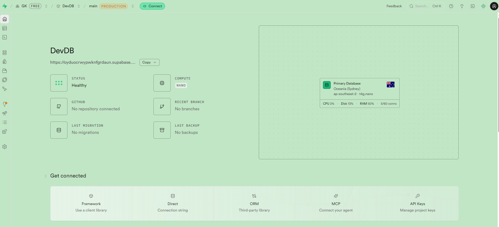

### 顶部导航栏

- 项目名：当前项目
- **Connect**：最关键！获取数据库连接字符串、API地址、密钥
- Settings：项目设置、密钥、数据库配置、计费
- 右上角：账号、退出

### 左侧核心菜单栏（重点）

1. **Home（首页）**：项目概览、资源使用、快速入口
2. **Table Editor（表格编辑器）**：**可视化建表、增删改数据、管理结构**（新手最常用）
3. **SQL Editor（SQL编辑器）**：手写PostgreSQL语句、批量建表、复杂查询、执行脚本
4. **Database**：数据库设置、扩展、连接池、备份
5. **Authentication（Auth）**：用户登录、注册、OAuth、用户列表、RLS权限
6. **Storage**：文件存储桶、上传图片/文件、权限控制
7. **Realtime**：开启表实时监听、WebSocket订阅
8. **Edge Functions**：Serverless边缘函数

### 核心概念说明

每个项目相当于<span style="color: red;">**1 个独立 PostgreSQL 实例**</span>，数据库名固定为 `postgres`。所有表默认建在 **public** 模式（schema）下。

**RLS（Row Level Security，行级安全）**：**必开！** 数据库层控制谁能读写哪行数据，防止数据泄露

### 创建数据库、数据表（两种方式：可视化+SQL）

Supabase 每个项目自带一个 postgres 数据库，**无需手动建库，直接建表即可**。下面以创建一个 **todos（待办）表** 为例。

#### 方式一：可视化创建表（新手首选）

1. 左侧菜单 ->【Table Editor】-> 右上角【Create table】

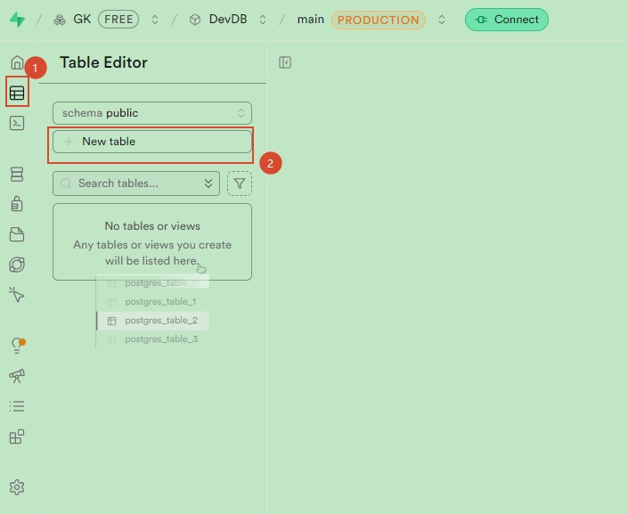

2. 填写基础信息：
   - Name：表名 → **todos**（小写，不要空格）
   - Schema：保持默认 **public**
   - ✅ **Enable Row Level Security（RLS）**：**一定要勾选**，安全必备
4. 添加字段（Columns），点 **Add column**：

| 字段名       | 类型                     | 是否非空 | 默认值 | 说明                          |
| ------------ | ------------------------ | -------- | ------ | ----------------------------- |
| id           | bigint                   | ✅       | 自增   | 主键（Primary Key），自动生成 |
| task         | text                     | ✅       | -      | 待办内容                      |
| is_completed | boolean                  | ❌       | false  | 是否完成                      |
| created_at   | timestamp with time zone | ❌       | now()  | 创建时间，自动赋值            |

4. 设置主键：id 列，勾选 **Primary key**；勾选 **Is identity**（自动自增）
5. 点击 **Save**，表创建完成，直接在页面里看到表格结构

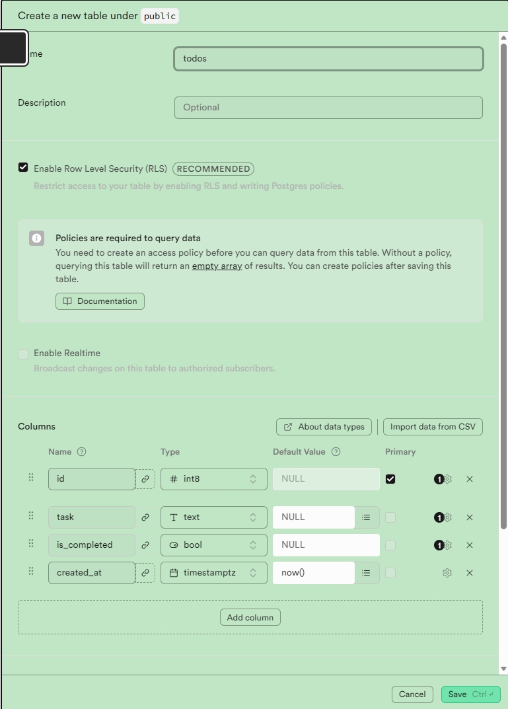  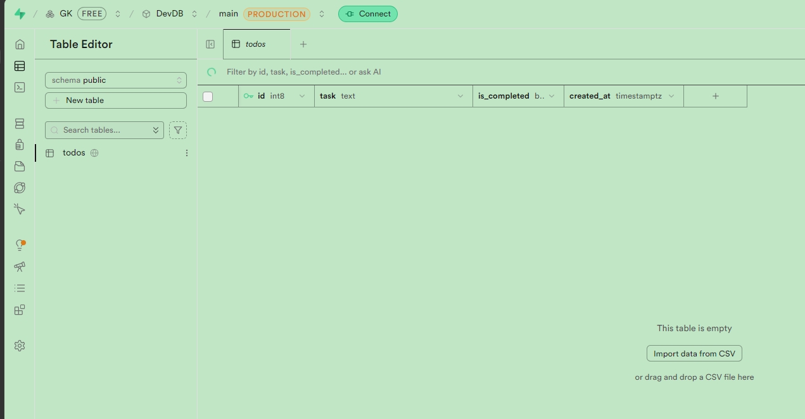

#### 方式二：SQL编辑器建表（批量、复杂表推荐）

1. 左侧【SQL Editor】 -> 【New Query】新建查询窗口
2. 粘贴以下标准 PostgreSQL 建表语句，点击 **Run（▶️）** 执行：

```sql
-- 创建 todos 待办表
CREATE TABLE public.todos (
  id BIGINT GENERATED BY DEFAULT AS IDENTITY PRIMARY KEY,
  task TEXT NOT NULL,
  is_completed BOOLEAN DEFAULT FALSE,
  created_at TIMESTAMPTZ DEFAULT NOW()
);

-- 开启行级安全RLS
ALTER TABLE public.todos ENABLE ROW LEVEL SECURITY;

-- 示例策略：允许所有人查看（生产环境要细化）
CREATE POLICY "Allow public select" ON public.todos
FOR SELECT TO anon, authenticated USING (true);
```

3. 执行成功后，回到 Table Editor 就能看到 todos 表。（效果与前面一样）

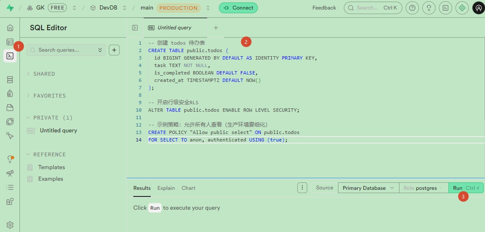  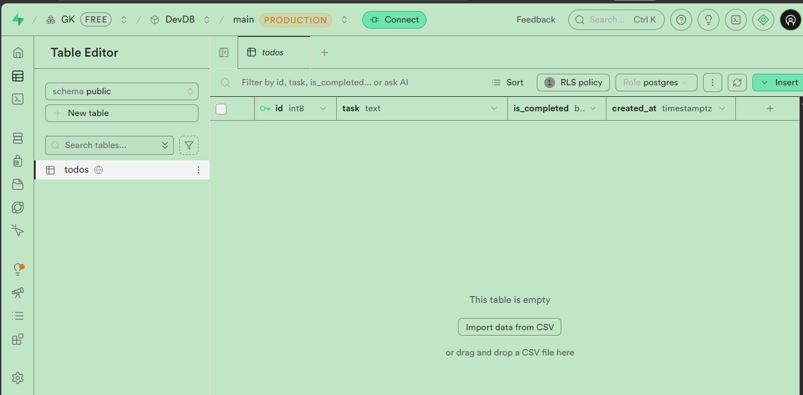

## 图形化客户端连接 Supabase

> [!info] 以下 Navicat 为示例

### 获取连接信息（关键！）

1. 项目页面右上角【Connect】，切换到【Database】标签

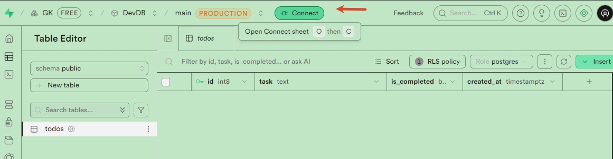

2. 有两种连接方式：**Direct（直连，IPv6）、Session Pooler（连接池，IPv4可用，推荐Navicat用这个）**

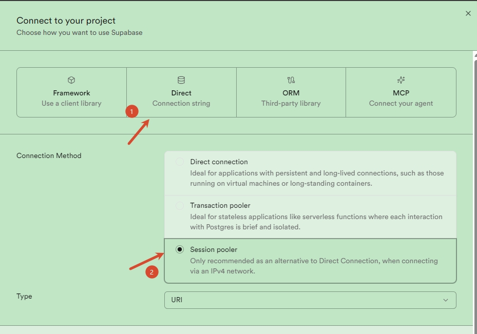

3. 复制 Session Pooler 连接信息：
    - Host/Address：`aws-0-[你的区域].pooler.supabase.com`
    - Port：**5432**
    - Database：**postgres**
    - Username：`postgres.[项目ID]`
    - Password：创建项目时设置的数据库密码

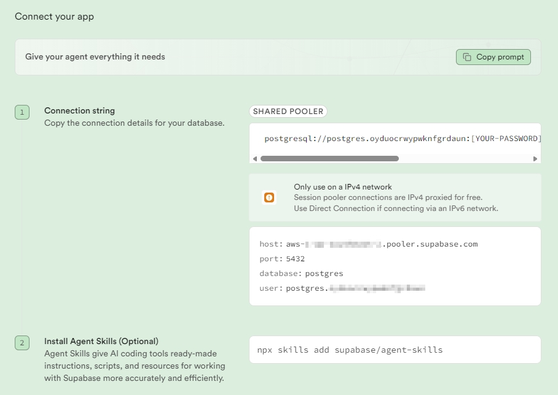

### Navicat 新建 PostgreSQL 连接

- 打开 Navicat，选择【文件】->【新建连接】->【PostgreSQL】
- 常规（General）标签页填写：
    - 连接名：随便写（如 Supabase-devDB）
    - 主机：粘贴上面的 Session Pooler Host
    - 端口：`5432`
    - 初始数据库：`postgres`
    - 用户名：`postgres.[项目ID]` （上面的 Username）
    - 密码：`项目数据库密码`

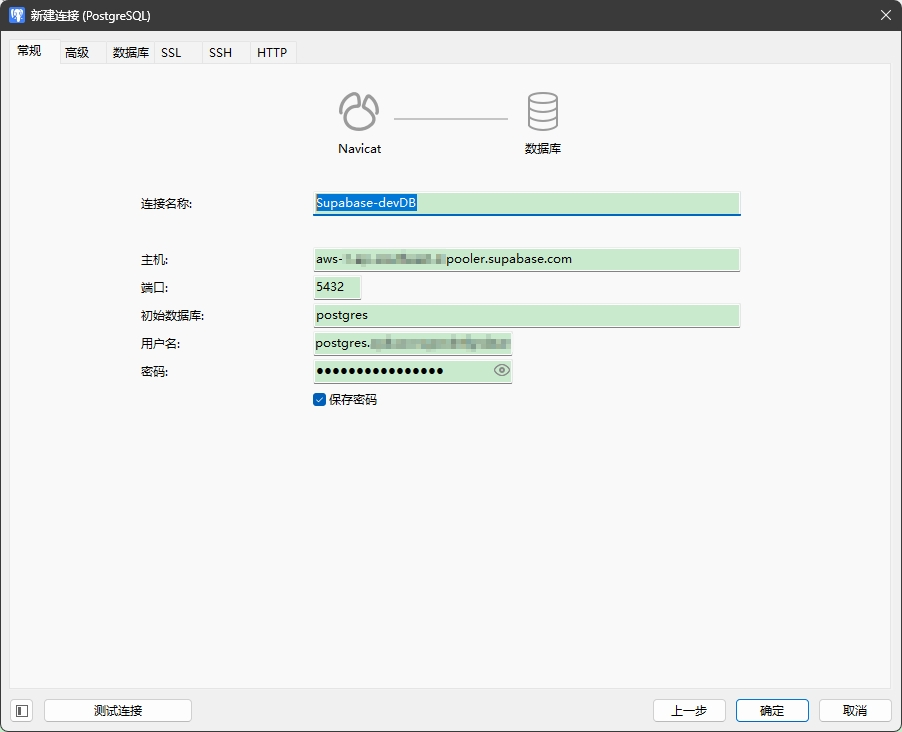

- **SSL 配置（必做！否则连不上）**
    - 切换到【SSL】标签页
    - 勾选【使用 SSL】
    - SSL 模式：`require`
    - 保存设置

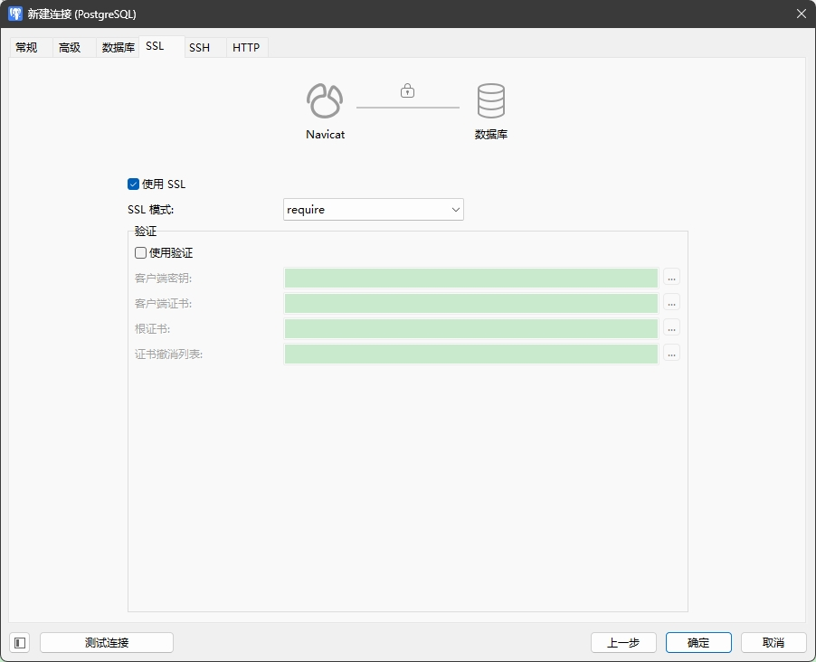

- 点击【测试连接】，提示“连接成功”，确定保存

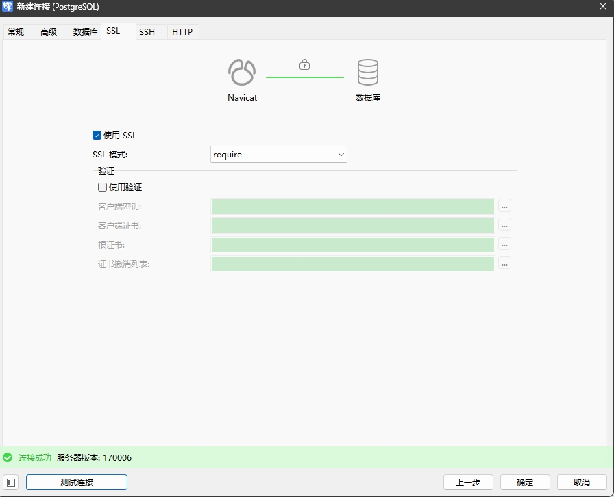

- 连接成功后，就能像本地数据库一样，在 Navicat 里查看 public 下的表、执行SQL、管理数据。

### 常见连接失败排查

- ❌ 密码错误：点击 Supabase -> Settings -> Database -> Reset Password 重置
- ❌ 连接超时：用 Session Pooler（5432），不要用 Direct（默认IPv6，国内网络常不通）
- ❌ SSL错误：必须开启 SSL、模式选 `require`

## 重要补充：RLS 行级安全（必做，安全底线）

免费项目也要做好权限，防止公开数据被篡改。给 todos 表加基础策略示例：

```sql
-- 1. 开启RLS
ALTER TABLE public.todos ENABLE ROW LEVEL SECURITY;

-- 2. 所有人可查看
CREATE POLICY "Public read" ON public.todos
FOR SELECT TO anon, authenticated USING (true);

-- 3. 仅登录用户可增改删
CREATE POLICY "Auth insert" ON public.todos FOR INSERT TO authenticated WITH CHECK (true);
CREATE POLICY "Auth update" ON public.todos FOR UPDATE TO authenticated USING (true);
CREATE POLICY "Auth delete" ON public.todos FOR DELETE TO authenticated USING (true);
```

---

## 七、免费版使用避坑总结
1. 免费项目**7天无请求自动休眠**，用GitHub Actions定时请求一次保活
2. 数据库上限 **500MB**，图片/文件放 Storage（1GB），别存数据库
3. 免费版**无自动备份**，定期用Navicat导出SQL备份

---

要不要我把以上所有步骤整理成一份可直接复制的**完整SQL脚本+Navicat连接参数清单**，你直接粘贴就能用？
