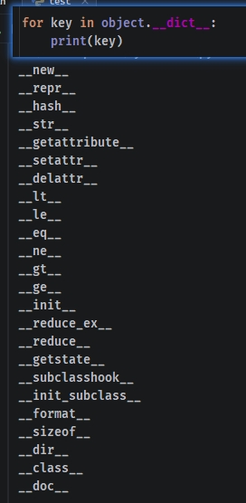
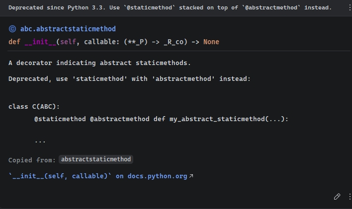

---
tags:
  - Python
---

## 面向对象编程（OOP）概述

面向对象（Object Oriented Programming，OOP）是 Python 主流编程范式，核心是**把现实事物抽象为「类」，把具体个体抽象为「对象」**，用「属性描述特征、方法描述行为」，代码复用性、扩展性极强。

**面向对象核心基础术语**：

- **类（Class）**：事物的**模板/蓝图**，定义通用属性和通用行为，抽象统称
- **属性（Attribute）**：事物的特征、数据变量
- **方法（Method）**：事物的行为、封装在类里的函数
- **实例/对象（Instance/Object）**：根据类模板创建出来的**具体个体**，每个实例相互独立

**面向对象三大核心特性**：

1. 封装：隐藏内部细节，暴露可控对外接口
2. 继承：子类复用父类代码，拓展新能力
3. 多态：不同子类，对同一方法做出不同响应

> 扩展：可以与 [[Java基础-对象与类|Java 对象和类]] 进行比较。

## 类与实例

### 定义类

```python
# 基础类定义
class 类名:
    # 类内容、属性、方法
    ...属性
    ...初始化方法
    ...类方法
    ...实例方法
```

示例：

```python
# 定义人类模板
class Person:
    # 类属性：全局物种标记
    species = "human"

    # 初始化方法（等同于 Java 的构造方法）
    def __init__(self, name, age, height, weight):
        self.name = name
        self.age = age
        self.height = height
        self.weight = weight

    # 定义类方法
    @classmethod
    def change_species(cls, new_name):
        # 修改类属性
        cls.species = new_name

    # 实例方法：打招呼行为
    def say_hello(self):
        print(f"你好，我是{self.name}，今年{self.age}岁")
```

### 实例对象的创建

```python
# 调用类名()，实例化得到对象
对象变量 = 类名()
```

示例：

```python
# 创建2个独立实例对象
p1 = Person()
print(type(p1))  # <class '__main__.Person'>
```

### 对象初始化方法

`__init__(self, *args, **kwargs)` **构造初始化魔术方法**，创建实例时**自动执行**，专门用来给实例绑定专属属性，是 OOP 最核心基础方法。方法说明如下：

- 参数 `self`：固定首位参数，代表**当前正在创建的实例本身**，Python 会自动传入无需手动传参
- 参数自定义：后续可按需定义任意业务参数
- 返回值：固定为 `None`，**禁止手动 return 返回其他内容**
- 异常报错：创建实例传入参数不匹配定义，直接抛出 `TypeError`

```python
class Person:
    # 初始化方法
    def __init__(self, name, age):
        # 给当前实例绑定专属实例属性
        self.name = name
        self.age = age

# 创建实例，参数自动传入__init__
p = Person("小明", 18)
print(p.__dict__)  # {'name': '小明', 'age': 18}
```

### 实例属性

**实例属性**是定义 `__init__` 内部，并绑定通过 `self.xxx = 值` 绑定。实例属性**仅属于当前单个实例**，不同实例之间属性完全独立、互不影响。

```python
class Person:
    # 初始化方法
    def __init__(self, name, age):
        # 给当前实例绑定专属实例属性
        self.name = name
        self.age = age

# 创建实例
p = Person("小明", 18)
# 访问实例属性
print(p.name)  # 小明
print(p.age)  # 18
```

> [!info] 示例中的 `name` 与 `age` 属性就是实例属性，只属于当前实例

### 类属性

定义在**类内部、所有方法外部**的所有属性称为**类属性**。它归属整个类，**所有实例对象全局共享**。关于类属性的核心规则如下：

- 当类属性修改时，所有实例同步变化。
- 实例仅能新增同名实例属性，不会改动原类属性。

```python
class Person:
    # 类属性，定义全局物种标记字段
    species = "human"

    # 初始化方法（等同于 Java 的构造方法）
    def __init__(self, name, age, height, weight):
        self.name = name
        self.age = age
        self.height = height
        self.weight = weight
```

## Python 的方法

### 实例方法

**实例方法**定义在类中，使用 `def` 关键字，定义语法如下：

```python
def 方法名(self, 其他参数):
    方法逻辑...
```

实例方法的核心规则：

- 第一个参数必须为 `self`，它是当前创建的实例对象本身
- 只能通过**实例对象调用**。如：`对象.方法名()`
- 方法内部可自由读写当前实例的所有属性

```python
class Person:
    # 初始化方法
    def __init__(self, name, age):
        # 给当前实例绑定专属实例属性
        self.name = name
        self.age = age

    # 实例方法：打招呼行为
    def say_hello(self):
        print(f"你好，我是{self.name}，今年{self.age}岁")

# 调用
p = Person("MooN", 20)
p.say_hello()  # 你好，我是MooN，今年20岁
```

### 类方法

使用 `@classmethod` 类方法装饰器，将普通方法标记为类方法，方法绑定**类本身**而非实例。

```python
# 定义类方法
@classmethod
def 类方法名(cls, 其他自定义参数):
    方法逻辑...
```

类方法的核心规则说明：

- 参数 `cls`：固定首位参数，代表当前类本身，自动传入
- 调用方式：`类名.方法()` / `实例.方法()` 都支持
- 功能用途：读取/修改类属性、定义工厂创建实例的方法
- 限制：无法直接访问实例专属属性

```python
class Person:
    # 类属性：全局物种标记
    species = "人类"

    # 定义类方法
    @classmethod
    def change_species(cls, new_name):
        # 修改类属性
        cls.species = new_name

# 调用类方法，修改了类属性
Person.change_species("智人")
# 所有实例共享修改后的类属性
p = Person()
print(p.species)  # 智人
```

### 静态方法

使用 `@staticmethod` 静态方法装饰器，将普通方法变为静态方法，**既不绑定实例、也不绑定类**，等价于放在类命名空间里的普通独立函数。

```python
# 定义静态方法
@staticmethod
def 类方法名(自定义参数):
    方法逻辑...
```

静态方法的核心规则说明：

- 参数：无强制默认 `self` / `cls` 参数
- 调用方式：类名、实例对象均可直接调用。但<u>**不推荐使用实例对象的方式调用**</u>
- 特点：无法访问类属性、实例属性，仅做独立工具逻辑
- 使用场景：和类业务弱相关的通用工具、计算、校验函数

```python
class MathTool:
    @staticmethod
    def add(a, b):
        return a + b
# 直接类名调用
print(MathTool.add(10, 20))  # 30
tool = MathTool()
print(tool.add(30, 40))  # 70
```

### 私有方法

与普通实例方法一样，定义在类中，通过命名的方式来控制是否为**私有方法**。命名规则如下：

- **以双下划线开头的 `__方法名` 为<font color=red>真正的</font>私有方法**：类外部无法直接访问，Python 自动做名字重整，仅类内部可正常调用。
- **以单下划线开头的 `_方法名` 为<font color=red>约定的</font>私有方法**：语法上可外部访问，仅开发者约定「不要随意改动」。

```python
class Person:
    def __init__(self, name, money):
        self.name = name  # 公开属性
        self.money = money

    # 私有方法
    def __secret_method(self):
        print("这是内部私密逻辑")

p = Person("小王", 10000)
p.__secret_method(p)  # 外部调用私有方法，报错 AttributeError: 'Person' object has no attribute '__secret_method'
```

### Getter 与 Setter

#### Getter 方法（读取属性）

Getter 方法提供给外部调用，用于安全读取私有/保护属性值，可添加日志、权限校验等逻辑。

- **语法格式**：`def get_attr(self):`
- **参数**：仅需 `self`，无额外参数。
- **返回值**：属性的值，类型与属性一致。

```python
class Person:
    def __init__(self, age):
        self.__age = age

    def get_age(self):
        print("调用了 age 的 Getter 方法")
        return self.__age

p = Person(25)
print(p.get_age())  # 输出：25
```

#### Setter 方法（修改属性）

Setter 方法提供给外部调用，用于安全修改私有/保护属性值，内置参数校验、类型检查。

- **语法格式**：`def set_attr(self, value):`
- **参数**：
    - `self`：实例本身
    - `value`：要设置的新属性值
- **返回值**：无，或返回布尔值表示设置是否成功。

```python
class Person:
    def __init__(self, age):
        self.__age = age

    def set_age(self, value):
        if isinstance(value, int) and 0 < value < 120:
            self.__age = value
            return True
        else:
            return False

p = Person(25)
print(p.set_age(30))  # 输出：True
print(p.set_age(150))  # 输出：False
```

### 属性装饰器

这是 Python 官方推荐的 Getter/Setter 实现方式，将**实例方法伪装成普通属性**，实现无括号的优雅访问调用，实现优雅的只读/可控属性。

`property` 底层实现原理本质是 Python 描述符协议的实现，通过 `__get__` / `__set__` / `__delete__` 方法控制属性访问，自定义描述符可实现通用的属性校验逻辑。

> [!info] 此装饰器方法不限用于私有属性的读写！

#### @property 装饰器（Getter）

使用 `@property` 装饰器实现 Getter 方法，语法格式：

```python
@property
def attr(self):
    return self.__attr
```

- **功能**：将实例方法伪装成只读属性，实现 `obj.attr` 直接读取，无需括号。
- **参数**：无额外参数（被装饰的方法仅需 `self`）。
- **返回值**：被装饰的 `property` 对象，可通过实例直接访问。
- **特点**：默认创建只读属性，外部无法直接赋值。

```python
class Person:
    def __init__(self, age):
        self.__age = age

    @property
    def age(self):
        print("调用了age的Getter")
        return self.__age

p = Person(25)
print(p.age)  # 直接访问，无需括号：25
p.age = 30    # 修改会报错：AttributeError: property 'age' of 'Person' object has no setter（只读属性）
```

#### @attr.setter 装饰器（Setter）

使用 `@属性.setter` 装饰器实现 Setter 方法，语法格式：

```python
@attr.setter
def attr(self, value):
    # 设置值逻辑...
```

- **功能**：为 `@property` 属性添加设置方法，实现 `obj.attr = value` 赋值操作。
- **参数**：
    - `self`：实例本身
    - `value`：要设置的新属性值
- **返回值**：无。
- **注意事项**：<font color=red>**setter 方法名必须与 `@property` 方法名完全一致**</font>。

```python
class Person:
    def __init__(self, age):
        self.__age = age

    @property
    def age(self):
        return self.__age

    @age.setter
    def age(self, value):
        if isinstance(value, int) and 0 < value < 120:
            self.__age = value
        else:
            raise ValueError("年龄必须是0-120之间的整数")

p = Person(25)
p.age = 30  # 输入 150 会报错：ValueError
print(p.age)  # 输出：30
```

#### @attr.deleter 装饰器（Deleter）

使用 `@attr.deleter` 装饰器实现删除属性的方法，语法格式：

```python
@attr.deleter
def age(self):
    del attr.__age  # "删除属性
```

- **功能**：为 `@property` 属性添加删除方法，实现 `del obj.attr` 操作。
- **参数**：仅需 `self`，无额外参数。
- **返回值**：无。
- **使用场景**：需要自定义属性删除逻辑（如释放资源、记录日志）的场景。

```python
class Person:
    def __init__(self, temp_data):
        self.__temp = temp_data

    @property
    def temp(self):
        return self.__temp

    @temp.deleter
    def temp(self):
        print("删除临时数据")
        del self.__temp

p = Person("临时缓存")
print(p.temp)
del p.temp  # 调用deleter
print(p.temp)  # 报错：AttributeError: 'Person' object has no attribute '_Person__temp'
```

> [!info] `@attr.deleter` 必须要和 `@property` 配套使用，否则会报错。

#### 【进阶】手动创建 property 对象

- **语法格式**：`property(fget=None, fset=None, fdel=None, doc=None)`
- **功能**：手动创建 `property` 对象，指定 getter、setter、deleter 方法。
- **参数**：
    - `fget`：getter 方法，读取属性时调用。
    - `fset`：setter 方法，设置属性时调用。
    - `fdel`：deleter 方法，删除属性时调用。
    - `doc`：属性的文档字符串。
- **返回值**：`property` 对象，可通过实例直接访问。

```python
class Person:
    def __init__(self, age):
        self.__age = age

    # 手动定义 getter/setter/deleter
    def get_age(self):
        return self.__age

    def set_age(self, value):
        if 0 < value < 120:
            self.__age = value

    def del_age(self):
        del self.__age

    # 创建property对象
    age = property(fget=get_age, fset=set_age, fdel=del_age, doc="年龄属性")

p = Person(25)
print(p.age)  # 25
p.age = 30
print(p.age)  # 30
del p.age
print(p.__dict__)  # {}
```

#### 要点小结与注意事项

1. **单下划线 `_attr` 仅为约定，无强制限制**：外部依然可以访问，仅靠开发者自觉遵守。
2. **双下划线 `__attr` 仅对当前类生效**：子类无法直接访问父类的双下划线属性，需通过父类的公开接口访问。
3. **`@property` 默认创建只读属性**：未定义 setter 时，直接赋值会抛出 `AttributeError`。
4. **setter 方法必须做参数校验**：避免非法值写入属性，破坏数据一致性。
5. **避免在 getter/setter 中做复杂逻辑**：会导致属性访问性能下降，且难以调试。
6. **继承中重写 `property`**：子类可以通过重新定义同名 `@property` 方法重写父类的属性逻辑。

```python
class Parent:
    @property
    def value(self):
        return self._value

class Child(Parent):
    @property
    def value(self):
        return super().value * 2  # 重写 getter 逻辑

```

#### 场景应用示例

示例 1：利用 `@property` 实现无存储值的**动态计算属性**，每次访问时实时计算。

```python
class Rectangle:
    def __init__(self, width, height):
        self.width = width
        self.height = height

    @property
    def area(self):
        # 动态计算面积，不存储
        return self.width * self.height

r = Rectangle(3, 4)
print(r.area)  # 输出：12
r.width = 5
print(r.area)  # 输出：20
```

示例 2：仅定义 `@property` 不定义 setter，实现**真正的只读属性**。

```python
class Person:
    def __init__(self, id_card):
        self.__id_card = id_card  # 身份证号，只读

    @property
    def id_card(self):
        return self.__id_card

p = Person("110101199001011234")
print(p.id_card)
# p.id_card = "123"  # 报错：AttributeError
```

示例3：`functools.cached_property`（Python 3.8+），用于缓存计算属性的结果，避免重复计算。

```python
from functools import cached_property

class Circle:
    def __init__(self, radius):
        self.radius = radius
    
    @cached_property
    def area(self):
        print("计算面积")
        return 3.14 * self.radius ** 2

c = Circle(2)
print(c.area)  # 第一次计算并缓存
print(c.area)  # 直接读取缓存，不打印"计算面积"
```

### 魔术方法

#### 定义

魔术方法（Magic Methods）是 Python 中**双下划线 `__` 开头和结尾**的内置方法，也叫特殊方法，用于实现对象的特殊行为，会在特定场景下**自动触发调用**，无需手动直接调用。它们是 Python 面向对象的核心，让自定义类可以像内置类型一样，支持运算符、内置函数的操作。

> [!info] 前面的 `__init__` 实例初始化方法其实就是魔术方法。大部分魔术方法都定义在 Object 类中。
> 
> 

#### 常用内置魔术方法

- `__str__(self)`：使用 `print(对象)`、`str(对象)` 时**自动触发调用**，必须返回字符串，用来自定义对象的打印展示文案
    - 参数 `self`：当前实例
    - 返回值：字符串类型

```python
class Person:
    def __init__(self, name):
        self.name = name

    def __str__(self):
        return f"Person实例，姓名：{self.name}"

p = Person("MooN")
print(p)  # Person实例，姓名：MooN
print(str(p))  # 同样触发__str__，输出同上
```

- `__del__(self)`：析构魔术方法，对象被内存回收销毁时自动调用，一般做收尾清理工作

```python
class Demo:
    def __del__(self):
        print("对象被销毁了")

d = Demo()
del d  # 手动销毁，触发__del__
```

- `__len__(self)`：当调用 `len(对象)` 时**自动触发调用**，用于定义对象的“长度”逻辑，比如自定义容器的元素个数。
    - 参数`self`：当前实例对象
    - 返回值：**非负整数（int）**，必须返回int类型，否则会抛出 `TypeError`；如果返回负数，会在部分场景下报错

```python
class MyList:
    def __init__(self, data):
        # 存储自定义列表数据
        self.data = list(data)

    def __len__(self):
        # 返回容器的元素个数
        return len(self.data)

# 测试
ml = MyList([1, 2, 3, 4, 5])
print(len(ml))  # 输出：5
# 空列表测试
empty_ml = MyList([])
print(len(empty_ml))  # 输出：0
```

- `__lt__(self, other)`：当执行 `对象1 < 对象2` 时**自动触发调用**，用于自定义对象的“小于”比较逻辑。
    - 参数`self`：当前实例对象（运算符左侧的对象）
    - 参数`other`：运算符右侧的对象，用于和当前实例比较
    - 返回值：布尔值（`bool`），返回 `True` 表示当前对象小于other，否则返回 `False`；也可返回其他可被解释为布尔值的对象，但不推荐

```python
class Person:
    def __init__(self, name, age):
        self.name = name
        self.age = age

    def __lt__(self, other):
        # 自定义按年龄比较大小：当前对象年龄 < other的年龄
        if isinstance(other, Person):
            return self.age < other.age
        # 处理非Person类型的比较，可抛出异常或返回False
        raise TypeError("只能和Person类型比较")

p1 = Person("Alice", 20)
p2 = Person("Bob", 25)
print(p1 < p2)  # 触发__lt__，输出：True
print(p2 < p1)  # 输出：False
```

- `__gt__(self, other)`：当执行 `对象1 > 对象2` 时**自动触发调用**，用于自定义对象的“大于”比较逻辑。
    - 参数`self`：当前实例对象（运算符左侧的对象）
    - 参数`other`：运算符右侧的对象，用于和当前实例比较
    - 返回值：布尔值（`bool`），返回 `True` 表示当前对象大于other，否则返回 `False`

```python
class Person:
    def __init__(self, name, age):
        self.name = name
        self.age = age

    def __gt__(self, other):
        # 自定义按年龄比较大小：当前对象年龄 > other的年龄
        if isinstance(other, Person):
            return self.age > other.age
        raise TypeError("只能和Person类型比较")

p1 = Person("Alice", 20)
p2 = Person("Bob", 25)
print(p2 > p1)  # 触发__gt__，输出：True
print(p1 > p2)  # 输出：False
```

- `__eq__(self, other)`：当执行 `对象1 == 对象2` 时**自动触发调用**，用于自定义对象的相等性判断逻辑。默认情况下，不定义 `__eq__` 时，Python会比较对象的内存地址，定义后按自定义逻辑比较。
    - 参数`self`：当前实例对象（运算符左侧的对象）
    - 参数`other`：运算符右侧的对象，用于和当前实例比较
    - 返回值：布尔值（`bool`），返回 `True` 表示两个对象相等，否则返回 `False`

```python
class Person:
    def __init__(self, name, age):
        self.name = name
        self.age = age

    def __eq__(self, other):
        # 自定义相等逻辑：姓名和年龄都相同则视为同一个人
        if isinstance(other, Person):
            return self.name == other.name and self.age == other.age
        # 与非Person对象比较，直接返回False
        return False

p1 = Person("Alice", 20)
p2 = Person("Alice", 20)
p3 = Person("Bob", 25)
print(p1 == p2)  # 触发__eq__，输出：True
print(p1 == p3)  # 输出：False
print(p1 == "Alice")  # 输出：False
```

- `__getattr__(self, name)`：当访问**不存在的实例属性**时**自动触发调用**，用于处理不存在的属性访问请求。注意：如果属性存在，不会触发此方法；仅当属性不存在时才会调用。
    - 参数`self`：当前实例对象
    - 参数`name`：字符串类型，代表要访问的不存在的属性名
    - 返回值：任意类型，返回给调用者的属性值；如果不想处理，可以抛出 `AttributeError`

```python
class Person:
    def __init__(self, name):
        self.name = name  # 存在的属性

    def __getattr__(self, name):
        # 处理不存在的属性访问
        print(f"警告：访问了不存在的属性 `{name}`")
        # 可以返回默认值，也可以抛出异常
        return None

p = Person("MooN")
print(p.name)  # 访问存在的属性，直接返回，不触发__getattr__，输出：MooN
print(p.age)  # 访问不存在的属性，触发__getattr__，打印警告并返回None
print(p.gender)  # 同样触发__getattr__
```

#### 使用要点与注意事项

1. ** `__str__` vs `__repr__` **：`__str__` 是给用户看的友好描述，`__repr__` 是给开发者看的官方表示，当 `__str__` 未定义时，`print(对象)` 会调用 `__repr__`。
2. **比较方法的对称性**：定义了 `__lt__` 和 `__eq__` 后，可以通过 `functools.total_ordering` 装饰器自动生成其他比较方法（`__le__` / `__ge__` / `__ne__` 等），减少重复代码。
3. ** `__eq__` 与 `__hash__` **：如果定义了 `__eq__` 但没有定义 `__hash__`，对象会变成不可哈希的（无法作为字典的 key、集合的元素），需要同时定义 `__hash__` 方法（基于不变属性计算哈希值）。
4. ** `__getattr__` 的触发条件**：仅当属性不存在时触发，属性存在时不会调用；如果需要拦截所有属性访问（包括存在的），需要使用 `__getattribute__`（但更危险，容易导致递归）。
5. ** `__len__` 的限制**：必须返回非负整数，否则会抛出 `ValueError`；如果类不支持长度操作，不要定义 `__len__`。

## 继承

### 继承核心概念

继承是 Python 面向对象编程**三大核心支柱（封装、继承、多态）** 之一，是实现代码复用、层级抽象、功能拓展的核心语法。

- **父类（基类/超类）**：通用公共模板，定义通用的属性、通用行为逻辑。
- **子类（派生类）**：继承父类的全部**非私有**的属性、实例方法、类方法与静态方法，同时可新增专属属性、重写原有方法。
- 继承的核心本质：子类自动获得父类能力，不需要重复编写相同代码

继承的优点：

- 消除大量重复冗余代码，开发效率大幅提升
- 代码层级清晰，和现实事物分类逻辑匹配
- 维护成本低：父类统一修改，所有子类同步生效
- 扩展性强：子类可按需自由拓展专属差异化能力

### 继承的基础语法

#### 单继承（90%场景推荐使用）

```python
# 父类定义
class 父类名称:
    # 公共属性、公共方法

# 子类继承父类
class 子类名称(父类名称):
    # 子类专属新增、重写内容
```

示例：

```python
# 通用父类
class Animal:
    def eat(self):
        print("所有动物都需要进食")

# 子类：猫 继承 动物
class Cat(Animal):
    pass

# 实例化子类
my_cat = Cat()
# 直接调用父类继承的方法
my_cat.eat()  # 输出：所有动物都需要进食
```

#### 多继承

Python 支持**一个子类同时继承多个独立父类**，一次性复用多方能力。

```python
class 子类名(父类1, 父类2, 父类3):
    子类内容
```

> [!note] 这里扩展一下，与 Java 对比，Java 只支持单个继承。

```python
class RunAbility:
    def run(self):
        print("可以快速奔跑")

class SwimAbility:
    def swim(self):
        print("可以下水游泳")

# 同时继承2个能力父类
class Duck(RunAbility, SwimAbility):
    pass

duck = Duck()
duck.run()  # 可以快速奔跑
duck.swim() # 可以下水游泳
```

#### super() 父类调用

在子类中，可以通过 `super()` 来调用父类的初始化、方法逻辑，保留父类原有能力，再做拓展。

```python
# 父类
class Animal:
    def __init__(self, name):
        self.name = name

    def eat(self):
        print("动物会吃东西")

# 子类
class Dog(Animal):
    # 重写初始化
    def __init__(self, name, breed):
        # 调用父类初始化
        super().__init__(name)
        self.breed = breed

    # 重写父类方法
    def eat(self):
        print(f"{self.name}啃骨头")

dog = Dog("旺财", "柯基")
dog.eat() # 旺财啃骨头
```

### 类初始化方法的继承

子类初始化构造方法 `__init__` 继承规则：

1. 子类**未定义**自己的 `__init__`：实例化子类时，自动执行父类的初始化构造。
2. 子类**重写**自定义 `__init__`：会完全覆盖父类初始化，父类逻辑不会默认运行。
3. 想要「保留父类初始化 + 子类拓展」，必须在自己的初始化方法中手动调用 `super().__init__()`。

#### 初始化方法继承的实现

多继承场景下，子类想要初始化时**执行所有父类的 `__init__` **，有两种官方推荐写法，适用不同场景：

方式 1：**直接显式调用父类构造方法（最直观、最常用、推荐新手）**。在子类 `__init__` 中，**逐个手动调用**每个父类的初始化方法，并且注意<font color=red>**必须手动传入 `self` 作为第一个参数**</font>。

```python
class 子类(父类1, 父类2, 父类3):
    def __init__(self, 参数1, 参数2, ...):
        # 调用第一个父类的初始化
        父类1.__init__(self, 父类1所需参数)
        # 调用第二个父类的初始化
        父类2.__init__(self, 父类2所需参数)
        # 调用第三个父类的初始化
        父类3.__init__(self, 父类3所需参数)
        
        # 子类自身初始化逻辑
        self.属性 = xxx
```

方式 1 示例：

```python
# 定义第一个父类
class Father:
    def __init__(self, name):
        print("=== Father 初始化执行 ===")
        self.name = name

# 定义第二个父类
class Mother:
    def __init__(self, age):
        print("=== Mother 初始化执行 ===")
        self.age = age

# 子类多继承
class Child(Father, Mother):
    def __init__(self, name, age, gender):
        # 1. 调用第一个父类 __init__
        Father.__init__(self, name)
        # 2. 调用第二个父类 __init__
        Mother.__init__(self, age)

        # 3. 子类自身初始化
        print("=== Child 初始化执行 ===")
        self.gender = gender

# 实例化子类（自动执行所有父类 + 子类初始化）
child = Child("小明", 18, "男")

# 验证所有属性都被成功初始化
print(f"姓名：{child.name}")
print(f"年龄：{child.age}")
print(f"性别：{child.gender}")

"""
执行输出:
=== Father 初始化执行 ===
=== Mother 初始化执行 ===
=== Child 初始化执行 ===
姓名：小明
年龄：18
性别：男
"""

```

方式 2：通过** `super()` 链式调用（遵循 MRO 方法解析顺序）**，此方式的优点是，无需手动传 `self`，Python 自动处理。但其缺点很明显，`super()` 只做一件事：按照当前类的 MRO 顺序，找到下一个类，调用其同名方法 -> 想要所有父类都执行初始化，因些必须满足两个硬性条件：

- ✅ 所有层级的类都必须调用 super()
- ✅ 所有类的 `__init__` 参数必须完全兼容（无参数 / 统一参数 / `**kwargs`）

```python
class 子类(父类1, 父类2):
    def __init__(self, 子类参数1, 子类参数2, **kwargs):
        # 修正说明：super() 仅调用当前类MRO顺序中的「下一个类」的__init__
        # 想要链式调用所有父类，必须满足：
        # 1. 所有父类都调用super() 2. 参数兼容
        # 推荐用「关键字参数+**kwargs」传递，避免参数不匹配断裂
        super().__init__(子类参数1, **kwargs)
        
        # 子类自身专属逻辑
        self.属性 = xxx
```

方式 2 示例：

```python
# 顶层基类
class Person:
    def __init__(self, name, **kwargs):
        self.name = name
        print(f"✅ Person 初始化: {self.name}")
        # 必须调用super，完成链式收尾
        super().__init__(**kwargs)


# 父类1
class Student(Person):
    def __init__(self, score, **kwargs):
        self.score = score
        print(f"✅ Student 初始化: {self.score}")
        # 调用MRO下一个类：Teacher
        super().__init__(**kwargs)


# 父类2
class Teacher(Person):
    def __init__(self, subject, **kwargs):
        self.subject = subject
        print(f"✅ Teacher 初始化: {self.subject}")
        # 调用MRO下一个类：Person
        super().__init__(**kwargs)


# 多继承子类（菱形继承）
class Assistant(Student, Teacher):
    def __init__(self, name, score, subject):
        print("✅ Assistant 初始化开始")
        # 关键字参数传递，兼容所有父类参数
        super().__init__(name=name, score=score, subject=subject)
        print("✅ Assistant 初始化完成")


# 查看MRO顺序（核心依据）
print("MRO 顺序:", Assistant.mro())
print("-" * 50)

# 测试实例化
a = Assistant(name="张三", score=100, subject="Python")
print("-" * 50)
print(f"最终属性: 姓名={a.name}, 分数={a.score}, 科目={a.subject}")
```

> [!note] 因此推荐使用**显式调用方案**（最稳妥，业务开发首选），彻底抛弃 `super()` 不确定性，手动调用所有父类，100% 按预想地执行

#### 初始化方法继承的注意事项

- **直接调用父类 `__init__` 必须传 `self`**
    - 错误：`Father.__init__(name)`
    - 正确：`Father.__init__(self, name)`
    - 原因：父类初始化需要绑定到当前子类实例
- **执行顺序 = 代码书写顺序 / MRO 顺序**
    - 直接调用：按你写的顺序执行父类初始化
    - super()：严格按照 `类.mro()` 的顺序执行
- **参数必须严格匹配**
    - 调用哪个父类的 `__init__`，就必须传入该父类需要的参数
    - 参数不匹配会直接抛出 `TypeError`
- **禁止重复初始化**
    - 菱形继承（多个父类继承同一个祖先）时，直接调用会导致祖先类被多次初始化
    - 解决方案：统一使用 `super()` 链式调用
- **多继承优先用「直接调用」**
    - 父类数量多、参数不同时，直接调用更清晰、更容易调试
    - `super()` 更适合单继承或参数一致的多继承
- **私有属性/方法无法被初始化继承**：父类 `__xxx` 私有成员，子类即使调用了 `__init__` 也无法访问

### mro 属性

#### 核心概念

`__mro__` 全称 **Method Resolution Order（方法解析顺序）**，是 Python 所有**新式类的内置只读类属性**。其核心作用是，**定义类的继承链查找优先级**，在调用属性、方法时，会严格按照 `__mro__` 给出的顺序**从左到右**查找，找到第一个匹配项就执行。

> [!info] `__mro__` 是**类的属性**，**实例对象本身没有此属性**，只能通过 `类名.__mro__` 直接获取或者 `type(实例对象).__mro__` 间接获取所属类的方法解析顺序。

1. **排查多继承情况下的方法冲突**：快速定位方法到底来自哪个父类
2. **调试继承关系**：清晰查看复杂类的完整继承链
3. **理解 `super()` 调用原理**：`super()` 严格按照 `__mro__` 顺序查找父类，明确方法/属性的查找优先级

#### 标准语法格式

方式一：`类名.__mro__` 获取当前类的方法解析顺序，是 Python 内置的类专属属性。

- `__mro__` 属性归属: **类本身**，实例对象无法直接调用。
- 返回值：**元组（tuple）**，元素为继承链上的所有类对象，按查找优先级从高到低排列。
- 异常：若实例对象直接调用会抛出 `AttributeError`。
- 关联方法：`类名.mro()` 功能与 `__mro__` 完全一致，区别是方法返回值为**列表**类型。

方式二：`type(实例对象).__mro__` 全局函数传入相应的实例对象去间接获取 MRO 属性

```python
# 父类
class Animal:
    pass

# 子类
class Dog(Animal):
    pass

# 1. 类直接调用 __mro__（推荐）
print(Dog.__mro__)  # 输出：(<class '__main__.Dog'>, <class '__main__.Animal'>, <class 'object'>)
# 2. 类方法获取
print(Dog.mro())  # 输出：[<class '__main__.Dog'>, <class '__main__.Animal'>, <class 'object'>]
# 3. 实例间接调用（实例无__mro__，通过 type 获取）
dog = Dog()
print(type(dog).__mro__)  # 正确输出：(<class '__main__.Dog'>, <class '__main__.Animal'>, <class 'object'>)
```

#### 各分场景示例

示例1：单继承场景（最简单）

```python
# 父类
class Animal:
    pass

# 子类
class Dog(Animal):
    pass

# 1. 类直接调用 __mro__
print(Dog.__mro__)  # 输出：(<class '__main__.Dog'>, <class '__main__.Animal'>, <class 'object'>)

# 2. 实例间接调用（实例无__mro__）
dog = Dog()
print(type(dog).__mro__)  # 正确输出：(<class '__main__.Dog'>, <class '__main__.Animal'>, <class 'object'>)
# print(dog.__mro__)  # 错误！AttributeError: 'Dog' object has no attribute '__mro__'
```

示例2：多继承场景（核心用途）

```python
class Father:
    def say(self):
        print("我是父亲")

class Mother:
    def say(self):
        print("我是母亲")

# 多继承子类
class Child(Father, Mother):
    pass

# 查看MRO顺序（决定调用哪个父类的say方法）
print(Child.__mro__)  # 输出：(<class '__main__.Child'>, <class '__main__.Father'>, <class '__main__.Mother'>, <class 'object'>)

# 验证：按照MRO顺序，优先调用Father的say()
child = Child()
child.say()  # 输出：我是父亲
```

示例3：菱形继承（钻石继承）场景

```python
# 顶层基类
class Person:
    pass

class Student(Person):
    pass

class Teacher(Person):
    pass

# 菱形多继承
class Assistant(Student, Teacher):
    pass

# 查看 MRO 顺序（Python3 C3算法保证无重复、无歧义）
print(Assistant.__mro__)
# 输出：(<class '__main__.Assistant'>, <class '__main__.Student'>, <class '__main__.Teacher'>, <class '__main__.Person'>, <class 'object'>)
```

#### mro 属性总结

`__mro__` 与 `mro()` 方法对比：

| 写法           | 返回值类型 | 用法                 |
| -------------- | ---------- | ----------------- |
| `类名.__mro__` | 元组       | 类属性，只读         |
| `类名.mro()`   | 列表       | 内置方法，可遍历操作 |

```python
print(Child.__mro__)   # 元组
print(Child.mro())     # 列表
```

**使用要点 & 注意事项**：

1. **实例对象无 `__mro__` 属性**：直接用 `实例.__mro__` 会报错，必须用 `type(实例).__mro__`。
2. ** `__mro__` 是只读属性**：无法修改、赋值，强行修改会抛出 `AttributeError`。
3. **多继承顺序决定 `__mro__` 结果**：子类定义时 `(父类1, 父类2)` 的顺序，直接改变方法查找优先级。
4. **所有类最终都继承 `object` **：Python3 新式类的 `__mro__` 最后一个元素永远是顶级基类 `object`。
5. **解决多继承冲突的核心依据**：当多个父类有同名方法时，**以 `__mro__` 顺序第一个为准**

### 方法重写（Override）

**方法重写**：子类定义**和父类完全同名**的方法，子类实例调用时，会**完全覆盖父类原有逻辑**，优先执行子类自定义代码。

```python
class Animal:
    def speak(self):
        print("动物发出声音")

# 子类重写父类同名方法
class Dog(Animal):
    def speak(self):
        print("小狗汪汪汪~")

dog = Dog()
dog.speak()  # 输出：小狗汪汪汪~
```

重写时想保留父类原有逻辑，再叠加子类新功能，搭配 `super()` 实现

```python
class Dog(Animal):
    def speak(self):
        # 先执行父类原有逻辑
        super().speak()
        # 子类新增拓展
        print("小狗汪汪汪~")

dog = Dog()
dog.speak()
# 动物发出声音
# 小狗汪汪汪~
```

### 继承相关的内置函数

- `super().__init__(*args, **kwargs)`：子类中主动调用并执行**父类的构造初始化方法**，完整保留父类原有初始化逻辑，再拓展子类专属逻辑，是继承最核心高频语法
    - 参数 `*args`：父类 `__init__` 所需的位置参数
    - 参数 `**kwargs`：父类 `__init__` 所需的关键字参数
    - 返回值：`None`，仅执行父类构造，无返回数据
    - 细节与避坑：
        - Python3 中 `super()` 可省略类名与 `self`，写法极简
        - 不调用则父类必需属性丢失，极易引发后续报错
        - 无需硬编码父类名称，父类改名时代码无需批量修改

```python
# 父类
class Person:
    def __init__(self, name):
        self.name = name

# 子类
class Student(Person):
    def __init__(self, name, student_id):
        # 调用父类初始化，继承name属性
        super().__init__(name)
        # 子类新增专属属性
        self.student_id = student_id

stu = Student("小明", "NO.001")
print(stu.name)       # 继承父类：小明
print(stu.student_id) # 子类专属：NO.001
```

- `issubclass(subclass, superclass)`：判断一个类是否为另一个类的直系/链式子类，抽象基类同样适用。
    - 参数`subclass`：需要判断的子类
    - 参数`superclass`：对比的父类，也可传入父类元组匹配多个
    - 返回值：布尔值，满足继承关系返回`True`，反之返回`False`

```python
print(issubclass(Student, Person)) # True
print(issubclass(Person, Student)) # False
```

- `isinstance(object, classinfo)`：判断实例对象归属，会自动向上识别全部继承父类，会自动识别抽象基类的继承关系。
    - 参数`object`：实例化对象
    - 参数 `classinfo`：目标类/类元组/抽象基类
    - 返回值：布尔值，匹配返回`True`

```python
stu = Student("小红", "NO.002")
print(isinstance(stu, Student)) # True
print(isinstance(stu, Person))  # True 父类也判定匹配
```

- `类名.__bases__`：内置类只读属性，查看当前类**直接继承的所有父类**
    - 无参数
    - 返回值：父类对象组成的元组

```python
print(Student.__bases__)
# 输出：(<class '__main__.Person'>,)
```

- `类名.mro()`：查看当前类**方法解析查找顺序**，彻底理清多继承时方法调用优先级
    - 无参数
    - 返回值：按查找优先级从高到低排列的类列表

```python
print(Student.mro())
# 输出：[<class '__main__.Student'>, <class '__main__.Person'>, <class 'object'>]
```

### 继承知识点总结

**继承的使用注意事项**：

1. **MRO 查找规则**：子类自身 -> 括号内父类(**从左到右**) -> 逐级向上祖先类。Python3 统一使用 `C3线性化算法`，保证顺序稳定、无循环歧义
2. **私有成员不会被继承**：
    - 双下划线 `__xxx` 真正私有属性/方法：仅当前类内部可用，子类完全无法访问继承。
    - 单下划线 `_xxx` 约定私有：语法上可继承，行业约定外部不要随意修改。
3. **可变类属性继承陷阱**：父类列表/字典等可变类属性，子类修改时会全局联动所有子类，建议子类在 `__init__` 单独定义专属可变属性。
4. **层级不要过深**：继承层级建议 ≤ 3 层，过深可读性极差，维护排查困难，**优先用「组合」代替深度继承**。
5. **菱形继承重复初始化**：多个父类继承同一公共祖先，Python MRO 会保证公共祖先仅初始化一次
6. **重写参数兼容**：子类重写父类方法，参数数量、格式尽量保持一致，避免调用报错

**继承的进阶扩展**：

1. **链式多层继承**：支持 A -> B -> C 逐级向下传递，C 可继承全部上层公开能力。
2. **禁止重写/继承**：可通过装饰器、元类模拟 Java 的 `final` 效果。
3. **抽象基类规范**：搭配 `abc` 模块，强制子类必须实现指定方法，统一接口规范。

## 属性访问控制

### 什么是属性访问控制？

属性访问控制是面向对象编程中「封装」的核心实现，通过限制类属性的直接读写权限，隐藏内部实现细节，仅暴露安全的访问接口，避免外部非法修改数据。Python 没有强制的私有/公有关键字，只通过**命名约定 + 名字重整**实现访问控制。

### 核心术语定义

- **公有属性**：无下划线开头，类内外均可直接访问，无访问限制。
- **保护属性**：单下划线 `_attr` 开头，Python 约定性私有，仅推荐类内部和子类访问，外部不应该直接访问。
- **私有属性**：双下划线 `__attr` 开头，Python 会自动进行**名字重整**，外部无法直接通过原名称访问，实现强访问控制。
- **Getter 方法**：对外部提供的安全读取属性值的接口，可添加日志、校验、动态计算等额外逻辑。
- **Setter 方法**：对外部提供的安全修改属性值的接口，可添加参数校验、类型转换、业务规则验证。
- ** `@property` 装饰器**：Python 推荐的 Getter/Setter 实现方式，将方法伪装成属性，实现无括号的优雅读写。

为什么要使用 Getter/Setter？

- **数据校验**：在修改属性时自动验证值的合法性，避免非法数据写入。
- **封装细节**：隐藏属性的内部实现，未来修改实现时不影响外部调用。
- **动态计算**：Getter 中返回动态计算的值，无需额外存储。
- **安全控制**：限制属性的访问权限，实现只读/只写属性。

### 属性访问权限的分类

#### 公有属性（Public）

在类中直接定义，无下划线开头的属性为**公有属性**。其特点是，类内外均可直接读写，无任何访问限制。

```python
class Person:
    def __init__(self, name):
        self.name = name  # 公有属性

p = Person("Alice")
print(p.name)    # 直接读取：Alice
p.name = "Bob"   # 直接修改
print(p.name)    # 输出：Bob
```

> **使用场景**：无敏感数据、不需要控制访问的简单属性。

#### 保护属性（Protected）

**以单下划线开头的 `_属性名` 为<font color=red>约定的</font>私有属性**，又称“保护属性”，特点是：

- 在语法上可被外部访问，仅行业开发者约定不应该直接读写「不要随意改动」。
- 主要供类内部和子类使用，外部应通过公开接口访问。

```python
class Person:
    def __init__(self, gender):
        self._gender = gender  # 保护属性

p = Person("male")
print(p._gender)  # 语法上可访问，但不推荐
```

> **使用场景**：需要子类访问，但不希望外部直接修改的属性。

#### 私有属性（Private）

**以双下划线开头的 `__属性名` 为<font color=red>真正的</font>私有属性**，Python 会自动对双下划线属性进行**名字重整**格式为 `_类名__attr`，让外部无法通过原名称直接访问，仅类内部可正常调用。其特点是：

- 类外部无法直接通过 `obj.__attr` 访问，只能通过重整后的名称 `obj._类名__attr` 强制访问（不推荐）。
- 子类无法直接继承访问父类的双下划线属性，必须通过父类的公开接口访问。

```python
class Person:
    def __init__(self, age):
        self.__age = age  # 私有属性

    # 公开对外接口，安全访问私有内容
    def get_age(self):
        return self.__age

p = Person(25)
# print(p.__age)       # 报错：AttributeError
print(p._Person__age)  # 可强制访问（不推荐）
print(p.get_age())     # 可以通过其他接口方法安全读取私人方法
```

> **使用场景**：敏感数据（如密码、年龄），需要强访问控制。

## Object 类

### 概述

Object 类是 Python 3 中**所有类的顶层基类（根类）**，所有自定义类默认隐式继承 `object`（Python 2 需显式声明 `class A(object):`）。其核心作用是，提供 Python 对象的通用基础行为和默认实现，如打印、比较、哈希、实例创建等魔术方法，是所有对象的“共同模板”。

关键特性：

- 隐式继承：Python 3 中定义的所有类，父类默认都是 `object`
- 可重写性：子类可重写 `object` 的魔术方法，自定义对象行为
- 无耦合性：所有 Python 对象共享 `object` 的方法，无需额外依赖

### Object 核心内置方法

- `object.__str__(self)`：调用 `print(obj)` 或 `str(obj)` 时自动触发，返回对象的**用户友好字符串表示**，用于自定义对象的打印文案，默认返回对象内存地址与类名。
    - 参数`self`：当前实例对象
    - 返回值：字符串类型（`str`），必须返回字符串，否则抛出`TypeError`

```python
class Person:
    def __init__(self, name):
        self.name = name

    # 重写__str__自定义打印格式
    def __str__(self):
        return f"Person实例：姓名={self.name}"

p = Person("Alice")
print(p)       # 触发__str__，输出：Person实例：姓名=Alice
print(str(p))  # 同样触发__str__，输出同上
```

- `object.__repr__(self)`：调用 `repr(obj)` 或交互式环境直接输入对象时自动触发，返回对象的**开发者友好字符串表示**，默认与 `__str__` 类似，子类可重写。
    - 参数`self`：当前实例对象
    - 返回值：字符串类型（`str`）

```python
class Person:
    def __init__(self, name):
        self.name = name

    # 重写__repr__，用于调试场景
    def __repr__(self):
        return f"Person('{self.name}')"

p = Person("Alice")
print(repr(p))  # 输出：Person('Alice')
# 交互式环境中直接输入p，会调用__repr__
```

- `object.__eq__(self, other)`：执行 `obj1 == obj2` 时自动触发，定义对象的相等性判断逻辑，默认比较对象的内存地址（与 `is` 行为一致），子类可重写自定义相等规则。
    - 参数`self`：当前实例（运算符左侧对象）
    - 参数`other`：运算符右侧的对比对象
    - 返回值：布尔值（`bool`），`True` 表示对象相等，`False` 表示不等

```python
class Person:
    def __init__(self, name, age):
        self.name = name
        self.age = age

    # 重写：姓名+年龄相同则视为相等
    def __eq__(self, other):
        if isinstance(other, Person):
            return self.name == other.name and self.age == other.age
        return False

p1 = Person("Alice", 20)
p2 = Person("Alice", 20)
p3 = Person("Bob", 25)
print(p1 == p2)  # 输出：True（按属性判断，而非内存地址）
print(p1 == p3)  # 输出：False
print(p1 is p2)  # 输出：False（内存地址不同，`is`仍为False）
```

- `object.__hash__(self)`：调用 `hash(obj)` 时自动触发，返回对象的哈希值，用于字典键、集合元素等可哈希场景，默认基于对象内存地址生成。
    - 参数`self`：当前实例对象
    - 返回值：整数（`int`），对象的哈希值
    - 注意：重写 `__eq__` 时必须同步重写 `__hash__`，否则对象会变为不可哈希

```python
class Person:
    def __init__(self, name, age):
        self.name = name
        self.age = age

    def __eq__(self, other):
        if isinstance(other, Person):
            return self.name == other.name and self.age == other.age
        return False

    # 同步重写__hash__，基于不可变属性生成哈希值
    def __hash__(self):
        return hash((self.name, self.age))

p1 = Person("Alice", 20)
p2 = Person("Alice", 20)
print(hash(p1) == hash(p2))  # 输出：True
# 可作为字典键使用
user_dict = {p1: "user_info"}
print(user_dict[p2])  # 输出：user_info
```

- `object.__bool__(self)`：执行 `bool(obj)` 或在 `if/while` 条件中使用对象时自动触发，定义对象的布尔值判断逻辑，默认返回 `True`（非None/非空对象）。
    - 参数`self`：当前实例对象
    - 返回值：布尔值（`bool`）

```python
class User:
    def __init__(self, name, is_active):
        self.name = name
        self.is_active = is_active

    # 重写：仅激活用户返回True
    def __bool__(self):
        return self.is_active

user1 = User("Alice", True)
user2 = User("Bob", False)
print(bool(user1))  # 输出：True
print(bool(user2))  # 输出：False
if user1:
    print("用户已激活")  # 会执行
```

## 多态

### 概念

多态，面向对象三大核心特性之一，指**不同对象对同一消息（方法调用）做出不同响应的能力**，通过统一接口调用不同实现，实现代码解耦与扩展。两种实现方式：

1. **标准多态（继承多态）**：基于继承+方法重写实现，依赖统一父类
2. **鸭子多态（Duck Typing）**：Python 特有实现，不依赖继承，仅关注对象的行为/方法

### 标准多态

#### 标准多态的概念

基于**继承 + 方法重写**实现的多态，子类继承父类并重写同名方法，通过父类引用指向子类对象，调用方法时自动执行子类的重写逻辑（类似 Java / C++ 的强类型多态）。

实现多态的核心前提：

1. 存在明确的继承关系（子类继承父类）
2. 子类重写父类的同名方法（方法签名一致）
3. 父类引用指向子类实例

#### 标准多态的语法

```python
# 父类（定义通用接口）
# 父类（定义通用接口）
class 父类:
    def 通用方法(self):
        raise NotImplementedError("子类必须实现该方法")

# 子类继承并实现方法
class 子类1(父类):
    def 通用方法(self):
        # 子类1专属逻辑

class 子类2(父类):
    def 通用方法(self):
        # 子类2专属逻辑

# 多态调用：统一父类类型，传入不同子类实例
def 通用函数(父类对象: 父类):
    父类对象.通用方法()
```

示例：

```python
# 父类：定义支付通用接口
class Payment:
    def pay(self, amount):
        raise NotImplementedError("子类必须实现支付方法")

# 子类1：微信支付
class WeChatPay(Payment):
    def pay(self, amount):
        print(f"微信支付：{amount}元")

# 子类2：支付宝支付
class Alipay(Payment):
    def pay(self, amount):
        print(f"支付宝支付：{amount}元")

# 多态通用函数：统一调用支付接口
def process_payment(payment: Payment, amount):
    payment.pay(amount)


# 调用：传入不同子类实例，执行不同支付逻辑
wechat = WeChatPay()
alipay = Alipay()
process_payment(wechat, 100)  # 输出：微信支付：100元
process_payment(alipay, 200)  # 输出：支付宝支付：200元
```

#### 使用场景与注意事项

- 适用场景：层级清晰、强类型约束的业务场景（如支付方式、图形绘制、数据存储）
- 注意事项：
    1. 方法签名必须一致：子类重写的方法，参数列表需与父类完全一致，否则会变成重载而非重写（Python 不支持方法重载）
    2. 强制子类实现：可使用 `abc` 模块的抽象基类，避免子类漏实现方法
    3. 耦合度较高：依赖父类，新增子类需继承父类，无法脱离继承关系使用

### 鸭子多态（Duck Typing，Python 特有）

#### 鸭子多态的概念

不关注对象的**类型/继承关系**，仅关注对象是否具备**所需的方法/行为**，即“走路像鸭子、叫起来像鸭子，那它就是鸭子”，无需显式继承同一父类。

核心前提：对象实现了通用函数所需的同名方法，无需继承任何父类。

#### 鸭子多态的语法

```python
# 无需统一父类，只要有同名方法即可
class 类1:
    def 通用方法(self):
        # 类1的实现

class 类2:
    def 通用方法(self):
        # 类2的实现

# 通用函数：不限制参数类型，只要对象有通用方法即可
def 通用函数(obj):
    obj.通用方法()
```

示例：

```python
# 类1：本地文件（无父类）
class LocalFile:
    def read(self):
        print("读取本地文件数据")

# 类2：网络文件（无父类）
class NetworkFile:
    def read(self):
        print("读取网络文件数据")

# 类3：内存文件（无父类，完全无关的类）
class MemoryFile:
    def read(self):
        print("读取内存文件数据")

# 通用函数：仅要求对象有read方法，不限制类型
def read_file(file_obj):
    file_obj.read()

# 鸭子多态调用：不同类型对象，只要有read方法即可传入
local = LocalFile()
network = NetworkFile()
memory = MemoryFile()
read_file(local)  # 输出：读取本地文件数据
read_file(network)  # 输出：读取网络文件数据
read_file(memory)  # 输出：读取内存文件数据
```

#### 扩展：结构化鸭子类型（typing.Protocol）

Python 3.8+ 支持 `Protocol`，定义鸭子类型接口，实现静态类型检查：

```python
from typing import Protocol

# 定义鸭子类型接口：只要有read方法，就视为FileLike对象
class FileLike(Protocol):
    def read(self) -> None:
        ...

class LocalFile:
    def read(self):
        print("读取本地文件")

# 类型提示：参数为FileLike类型，IDE会自动验证是否有read方法
def read_file(file: FileLike):
    file.read()

read_file(LocalFile())  # 合法，通过静态检查
```

#### 使用场景与注意事项

- 适用场景：需要通用接口、弱耦合的工具类场景（如文件读写、日志输出、数据序列化）
- 注意事项：
    - 运行时检查：Python 不会在编译时验证对象是否有对应方法，运行时不存在方法会抛出 `AttributeError`，可使用 `hasattr(obj, "method")` 提前检查
    - 接口一致性：不同类的同名方法需保持行为一致（如都叫 `read`，但一个返回字符串、一个返回数字会导致逻辑混乱）
    - 静态类型提示：可使用 `typing.Protocol`（Python 3.8+）定义结构化鸭子类型接口，实现静态检查

### 多态总结

**标准多态 vs 鸭子多态对比表**

| 对比维度 | 标准多态（继承多态）       | 鸭子多态（Python特有）      |
| -------- | -------------------------- | -------------------- |
| 核心依赖 | 继承关系 + 方法重写        | 对象的方法/行为，无继承要求 |
| 类型检查 | 静态检查（依赖父类）       | 动态检查（运行时验证）      |
| 耦合度   | 高（与父类强绑定）         | 低（无继承耦合）            |
| 灵活性   | 较低，必须继承父类         | 极高，只要有方法即可        |
| 适用场景 | 强类型约束、层级清晰的业务 | 通用接口、弱耦合的工具类    |

## 抽象类（Abstract Base Classes）

### 抽象类核心概念

- **抽象类**：是**无法直接实例化**的特殊类，主要用于定义**通用接口规范**，强制其子类必须实现指定的抽象方法，是面向对象中“接口定义”的 Python 实现。它就像一份“行为契约”，所有继承它的子类都必须遵循这份契约，保证多态的一致性。
- **抽象方法**：只有方法声明、没有具体实现（或仅提供默认实现）的方法，被装饰为抽象方法后，子类必须重写并实现该方法，否则子类仍是抽象类，无法实例化。

核心特性：

- **不可实例化**：直接创建包含未实现抽象方法的抽象类实例，会抛出 `TypeError`。
- **强制规范**：子类必须实现所有抽象方法，否则无法实例化。
- **可混合内容**：抽象类中可以包含普通方法、实例属性、类属性，也可以有具体实现。
- **支持多继承**：抽象类可以继承多个基类，也可以被多个子类继承。

### 抽象类基础语法

Python 通过标准库 `abc`（Abstract Base Classes）实现抽象类，核心组件：

- `abc.ABC`：抽象基类的辅助父类，继承它的类会被标记为**抽象基类**。
- `@abc.abstractmethod`：装饰器，标记方法为**抽象方法**，强制子类实现。

#### 完整抽象类定义步骤

1. 导入 `abc` 模块
2. 定义抽象基类（继承 `abc.ABC`）
3. 定义抽象方法（用 `@abc.abstractmethod` 装饰）
4. 定义子类，继承抽象基类并实现所有抽象方法
5. 实例化子类

#### 抽象基类辅助类

Python 3.4+ 提供 `abc.ABC` 抽象基类辅助类，继承它的类会被标记为抽象基类，并使其支持抽象方法 `@abstractmethod` 装饰器。

- 如果仅继承 `ABC` 但**无抽象方法**的类仍可实例化。

```python
from abc import ABC

# 抽象基类，继承ABC
class Animal(ABC):
    pass

# 无抽象方法时，抽象基类可实例化
a = Animal()
print(type(a))  # <class '__main__.Animal'>
```

- 如果不继承 `abc.ABC`，会导致类中 `@abstractmethod` 标记无效，此类（其实本身并非抽象类）可以正常被实例化。

```python
from abc import ABC, abstractmethod

# 错误示例：未继承ABC，抽象方法标记无效
class Animal:
    @abstractmethod
    def speak(self):
        pass

a = Animal()  # 不会报错，抽象方法标记无效
```

- 抽象类可以包含普通方法和属性：子类可以直接继承使用这些非抽象成员。

```python
from abc import ABC, abstractmethod

class Animal(ABC):
    species = "动物"  # 类属性，子类直接继承

    @abstractmethod
    def speak(self):
        pass

    # 普通方法，子类直接继承
    def info(self):
        print(f"这是一个{self.species}")

class Dog(Animal):
    def speak(self):
        print("汪汪汪！")

d = Dog()
d.info()  # 输出：这是一个动物
```

#### 抽象方法装饰器

`@abc.abstractmethod` 抽象方法装饰器，标记方法为抽象方法，强制子类必须重写并实现该方法，否则子类无法实例化。有以下使用要点：

- 子类必须实现**所有抽象方法**：只要有一个抽象方法未实现，子类仍是抽象类，**无法直接实例化**，会抛出 `TypeError`。

```python
from abc import ABC, abstractmethod

class Animal(ABC):
    # 抽象方法：子类必须实现
    @abstractmethod
    def speak(self):
        pass
    @abstractmethod
    def move(self):
        pass

# 错误示例：未实现全部的抽象方法，子类仍是抽象类，无法实例化
# class Cat(Animal):
#     def speak(self):
#        print("喵喵喵！")
# c = Cat()  # 报错：TypeError: Can't instantiate abstract class Cat with abstract method speak

# 正确示例：实现所有抽象方法的子类
class Dog(Animal):
    def speak(self):
        print("汪汪汪！")
    def move(self):
        print("跑得快！")

d = Dog()
d.speak()  # 输出：汪汪汪！
```

- 抽象方法可以提供默认实现，子类可通过 `super().方法名()` 调用父类的默认实现。

```python
from abc import ABC, abstractmethod

class Animal(ABC):
    @abstractmethod
    def speak(self):
        print("动物发出声音（默认实现）")

class Cat(Animal):
    def speak(self):
        # 调用父类抽象方法的默认实现
        super().speak()
        print("喵喵喵！")

c = Cat()
c.speak()
# 输出：
# 动物发出声音（默认实现）
# 喵喵喵！
```

- 抽象方法定义了参数，子类实现时参数不匹配，导致调用时报错。

```python
class Animal(ABC):
    @abstractmethod
    def eat(self, food):
        pass

class Cat(Animal):
    # 错误：未接收food参数
    def eat(self):
        print("猫吃东西")

c = Cat()
c.eat()  # 报错：eat() takes 1 positional argument but 2 were given
```

#### 抽象属性的标准实现方式

`@property + @abc.abstractmethod` 抽象属性的标准实现方式，替代旧版 `abc.abstractproperty`，支持 getter/setter 规范。标记属性为**抽象属性**，强制子类实现该属性。

用法：`@property` 装饰后，再叠加 `@abstractmethod`。

```python
from abc import ABC, abstractmethod

class Person(ABC):
    @property
    @abstractmethod
    def age(self):
        """年龄属性，子类必须实现"""
        pass

class Student(Person):
    def __init__(self, age):
        self._age = age

    @property
    def age(self):
        return self._age

s = Student(18)
print(s.age)  # 输出：18

```

### 抽象基类的其他装饰器

- `@abc.abstractstaticmethod` 抽象静态方法装饰器，标记静态方法为抽象方法，子类必须实现。

```python
from abc import ABC, abstractstaticmethod

class Math(ABC):
    @abstractstaticmethod
    def add(a, b):
        pass

class BasicMath(Math):
    @staticmethod
    def add(a, b):
        return a + b

print(BasicMath.add(1, 2))  # 输出：3
```

> [!warning] Python 3.3 开始废弃 `@abstractstaticmethod`，推荐直接使用 `@staticmethod`



### 【了解】元类方式定义抽象类（旧版兼容）

Python 2 中没有 `ABC` 辅助类，需要通过 `ABCMeta` 元类定义抽象基类，Python 3 中已**不推荐**，但可作为了解：

```python
from abc import ABCMeta, abstractmethod

# 旧版方式：设置metaclass
class Animal(metaclass=ABCMeta):
    @abstractmethod
    def speak(self):
        pass
```

### 抽象类对比总结

| 对比维度 | 抽象类                 | 普通类            | 鸭子类型            |
| -------- | ---------------------- | ----------------- | ------------- |
| 实例化   | 不可直接实例化         | 可直接实例化      | 无限制                 |
| 接口约束 | 编译/实例化时强制检查  | 无强制约束        | 运行时动态检查         |
| 耦合度   | 与子类强绑定           | 无绑定            | 低耦合，仅依赖方法行为 |
| 适用场景 | 强规范、层级清晰的业务 | 通用数据/逻辑封装 | 灵活通用的工具类       |


