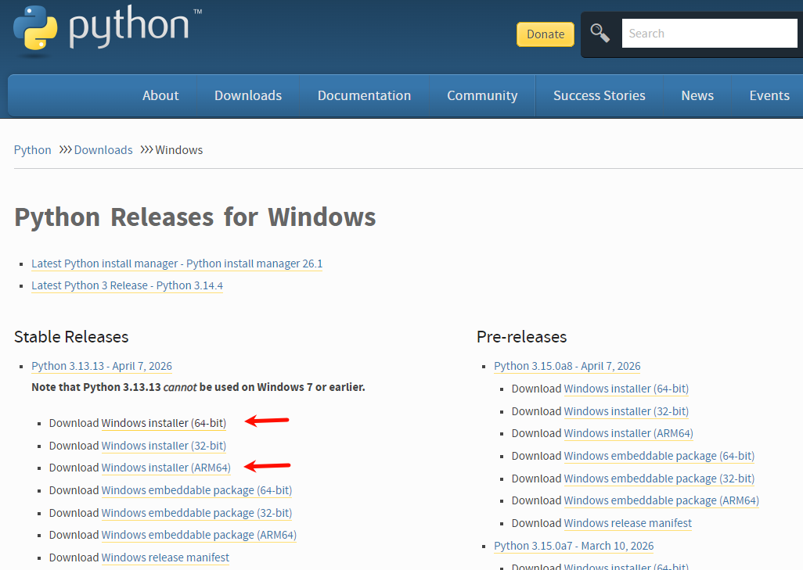
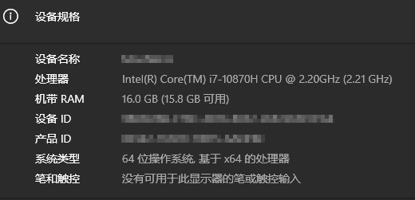
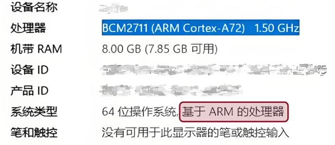
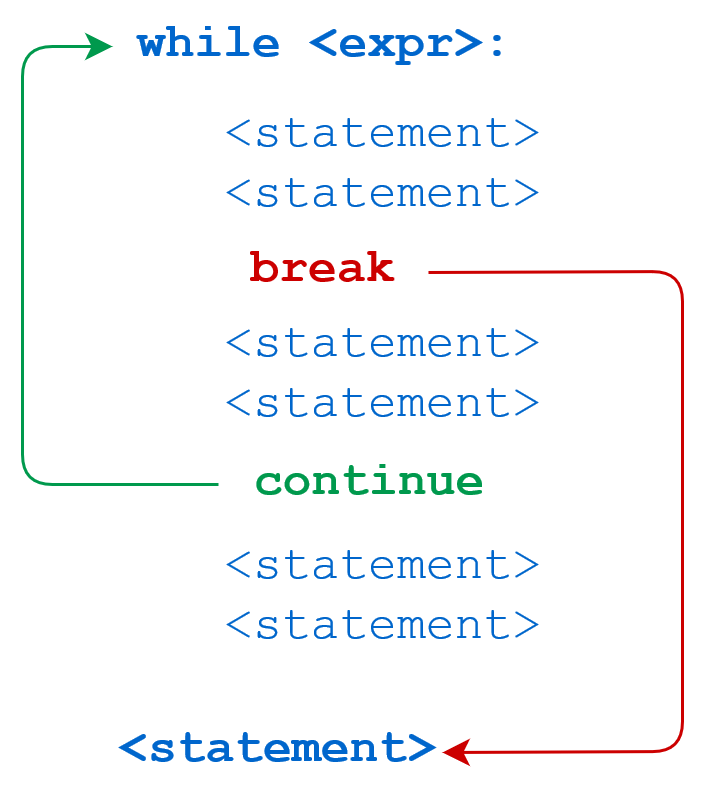
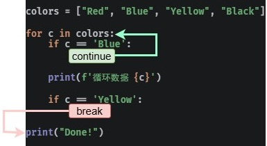
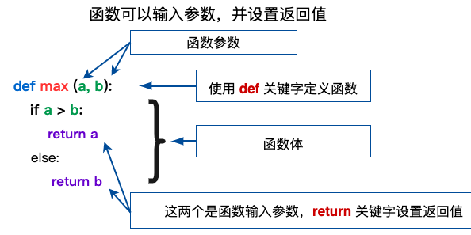

---
tags:
  - AI
  - Python
---

## Python 简介

### 概述

Python 是一个高层次的结合了解释性、编译性、互动性和面向对象的脚本语言。Python 的设计具有很强的可读性，相比其他语言经常使用英文关键字，其他语言的一些标点符号，它具有比其他语言更有特色语法结构。

- **平台语言**：可以运行在不同的操作系统上。
- **Python 是一种解释型语言**：这意味着开发过程中没有了编译这个环节，类似于 PHP 和 Perl 语言。
- **Python 是交互式语言**：这意味着，可以在一个 Python 提示符 `>>>` 后直接执行代码。
- **Python 是面向对象语言**：这意味着 Python 支持面向对象的风格或代码封装在对象的编程技术。
    - 函数、模块、数字、字符串都是对象，在 Python 中一切皆对象。
    - 完全支持继承、重载、多重继承。
    - 支持重载运算符，也支持泛型设计
- **Python 是初学者的语言**：Python 对初级程序员而言，是一种伟大的语言，它支持广泛的应用程序开发，从简单的文字处理到 WWW 浏览器再到游戏。

### 官方资源

- 官网：https://www.python.org/
- Python 官方文档：https://docs.python.org/zh-cn/3/

### Python 的版本

#### 概述

Python 有两个主要版本：**Python 2** 和 **Python 3**。

- **Python 2.x**：是过去的版本（**官方已经停止维护**）。
  - 解释器名称是 `python`。
- **Python 3.x**：现在是主流版本，并且是未来发展的方向。
  - 解释器名称是 `python3`。
  - 相对于 Python 的早期版本，Python 3.x 是一个较大的升级。
  - 在设计时没有考虑向下兼容，以避免带入过多累赘。许多基于早期 Python 版本设计的程序无法在 Python 3.0 上正常执行。

> Tips: <font color=red>**Python 3.0 与 Python 2.0 不兼容的**</font>。新的 Python 程序建议使用 Python 3.x 版本的语法

#### Python 的 3.x 版本

Python 的 3.0 版本，常被称为 Python 3000，或简称 Py3k。相对于 Python 的早期版本，这是一个较大的升级。为了不带入过多的累赘，Python 3.0 在设计的时候没有考虑向下兼容。

> 以下笔记主要针对 Python 3.x 版本的学习。*官方宣布，2020 年 1 月 1 日， 停止 Python 2 的更新。Python 2.7 被确定为最后一个 Python 2.x 版本。*

#### Python 3.x 发展历史

- Python 3.0 发布于 2008 年。
- Python 3.3 发布于 2012 年。
- Python 3.4 发布于 2014 年。
- Python 3.5 发布于 2015 年。
- Python 3.6 发布于 2016 年。

#### Python 3.x 特点

1. Python 3.x 的使用越来越广泛，大部分新项目开始使用 Python 3。
2. 大部分第三方库已经支持 Python 3.x。
3. Python 3.x 起初比 Python 2.x 效率低，但有极大的优化空间，效率正在不断提升。
4. 使用 Python 3，开发者可以完全理解并维护使用 Python 2.x 开发的项目。
5. Python 3.x 已经成为编程语言发展的趋势。

### 语言的区别

#### 解释型语言

解释型语言是在运行的时候将程序翻译成机器语言，所以运行速度相对于编译型语言要慢。比如 PHP、Python

- 优点：可移植性较好，只要有解释环境，可在不同的操作系统上运行
- 缺点：运行需要解释环境，运行起来比编译的要慢，占用资源也要多一些，代码效率低，代码修改后就可运行，不需要编译过程

#### 编译型语言

编译型语言在程序执行之前，有一个单独的编译过程，将程序翻译成机器语言，以后执行这个程序的时候，就不用再进行翻译了。比如 C、C++、Java

- 优点：运行速度快，代码效率高，编译后的程序不可修改，保密性较好
- 缺点：代码需要经过编译方可运行，可移植性差，只能在兼容的操作系统上运行

### Python 应用

- **Web后端开发**：Python 在构建网站后端服务中发挥着重要作用。
- **网络爬虫**：Python 被广泛用于编写网络爬虫，进行数据抓取和处理。
- **人工智能**：Python 是人工智能领域的主要编程语言之一，用于机器学习和深度学习。
- **自动化运维**：Python 在自动化运维中用于编写脚本，提高运维效率。
- **网络编程**：Python 支持网络编程，用于开发网络应用和工具。
- **国内应用情况**：国内许多知名公司，如豆瓣、百度、阿里巴巴、新浪等，都在其技术栈中使用 Python。
- **国外应用情况**：国际上，Google、Facebook、Twitter 等大型科技公司也广泛使用 Python。
- **就业优势**：即使不是程序员，Python 在日常工作中的应用也越来越广泛。掌握 Python 技能的求职者在投简历时可能会被优先考虑。
- **教育支持**：
    - 大学生和在校的学生可以参加与 Python 相关的考试和课程。
    - 国务院印发了《新一代人工智能发展规划》。
    - 教育部出台了《高等学校人工智能创新行动计划》，这些政策都表明了 Python 在教育领域的重视和推广。

### Python 解释器

- cpython 官方默认的解释器，使用最广泛
- jypython 运行于 java 平台上的解释器
- ironpython 运行于 .net 平台上的解释器
- Pypy 使用 Python 编写的解释器，支持 JIT 技术(即时编译）

### Python 的优缺点

**优点**：

- 易于学习：python 有相对较少的关键字，结构简单，和一个明确定义的语法，学习起来更加简单
- 易于阅读：python 代码定义的更清晰
- 易于维护：python的成功在于它的源代码是相当容易维护的
- Python 拥有一个强大的标准库：python 的最大的优势之一是丰富的库，跨平台的，在 UNIX，Windows 和 Macintosh 兼容很好。Python 语言的核心只包含**数字、字符串、列表、字典、文件**等常见类型和函数，而由 Python 标准库提供了**系统管理、网络通信、文本处理、数据库接口、图形系统、XML 处理**等额外的功能
- Python 社区提供了大量的第三方模块，使用方式与标准库类似。它们的功能覆盖**科学计算、人工智能、机器学习、Web开发、数据库接口、图形系统**多个领域。
- 互动模式：互动模式的支持，可以从终端输入执行代码并获得结果的语言，互动的测试和调试代码片断
- 可移植：基于其开放源代码的特性，Python已经被移植（也就是使其工作）到许多平台
- 可扩展：如果需要一段运行很快的关键代码，或者是想要编写一些不愿开放的算法，可以使用 C 或 C++ 完成那部分程序，然后从 Python 程序中调用
- 数据库：python 提供所有主要的商业数据库的接口
- GUI 编程：python支持 GUI 可以创建和移植到许多系统调用。
- 可嵌入：可以将 python 嵌入到 C/C++ 程序，让程序的用户获得"脚本化"的能力
- 免费、开源
- 面向对象

**缺点**：

- 运行速度慢：和 C 程序相比非常慢，因为 Python 是解释型语言，代码在执行时会一行一行地翻译成 CPU 能理解的机器码，这个翻译过程非常耗时，所以很慢。而 C 程序是运行前直接编译成 CPU 能执行的机器码，所以非常快。
- 代码不能加密：如果要发布 Python 程序，实际上就是发布源代码，这一点跟 C 语言不同，C 语言不用发布源代码，只需要把编译后的机器码（也就是在 Windows 上常见的 exe 文件）发布出去。要从机器码反推出 C 代码是不可能的，所以，凡是编译型的语言，都没有这个问题，而解释型的语言，则必须把源码发布出去。
- 内存消耗略大：相比 C、C++ 这种紧凑型语言，Python 会更“吃内存”，不太适合资源受限设备，比如一些微控制器等。

## Python 环境搭建

想要使用 Python 语言编写程序，必须下载 Python 安装包并配置Python环境。最新安装包[下载地址](https://www.python.org/downloads/)。*更新笔记时 Python 最新版本是：3.14.4（发布于2024年6月6日）*



如果是系统信息中显示是『基于 x64 的处理器』，选择第1个安装包即可。



如果是系统信息中显示是『基于 ARM 的处理器』，则选择第3个（ARM64）安装包。



### 安装步骤（Windows）

1. **建议使用管理员身份**去打开下载的安装包。勾选相关选项，并选择自定义安装


2. 选择安装位置，其他默认即可

 

3. 安装完成


4. 运行 cmd 打开“命令提示符”程序，输入 `python` 并回车


### 安装步骤（MacOS）

> 基于 MacOS 12.4。下载地址：https://www.python.org/downloads/macos/


1. 双击打开下载好的 python-3.10.4-macos11.pkg 文件，开始安装。


2. 找到 mac 中的“终端”程序并打开：


3. 直接在终端中输入命令：`python3`


> 如上图，最新版 3.10.4 已经安装成功。

4. 如果想要使用 python 命令，而非 python3 命令执行 python。那么可以设置环境变量来解决，在终端中执行如下代码：

```python
echo 'alias python=python3' >> .bash_profile
```

退出且重新打开终端，然后执行：


### 安装步骤（Linux）

> Tips: 在 Linux 上安装 Python 需要相关前置技能。有过 Linux 系统的使用经验，熟悉 Linux 操作系统的常见命令，如：yum、cd、wget、vi 编辑器、软链接等。

1. 在 Linux 上安装 Python 需要先安装前置依赖程序。登陆到 Linux 中，使用 yum 程序进行依赖程序安装，执行如下命令：

```shell
yum install wget zlib-devel bzip2-devel openssl-devel ncurses-devel sqlite-devel readline-devel tk-devel gcc make zlib zlib-devel libffi-devel -y
```

2. Linux 版本下载地址 https://www.python.org/downloads/source/

拖动网页到最下方，如下图


找到 Gzipped source tarball 按钮，点击右键，选择复制链接


3. 进入到 Linux 系统内，使用 `wget` 命令，粘贴复制的下载链接，执行下载：

```shell
cd ~
wget https://www.python.org/ftp/python/3.10.4/Python-3.10.4.tgz
```


4. 下载完成后，即可看到已下载好的安装包文件：


5. 解压安装包，执行：

```shell
tar -xvf Python-3.10.4.tgz
```


6. 切换目录到解压后的 Python 安装文件夹：

```shell
# 切换目录
cd Python-3.10.4
```

- 配置

```shell
./configure --prefix=/usr/local/python3.10.4
```

- 编译

```shell
make && make install
```

- 编译完成后，可以配置软链接，方便快速使用 python：

```shell
# 删除系统自带的老版本(python2)的软链接
rm -f /usr/bin/python

# 创建软链接
ln -s /usr/local/python3.10.4/bin/python3.10 /usr/bin/python
```

7. 创建软链接后，会破坏 yum 程序的正常使用（只能使用系统自带的 python2）。修改如下2个文件：

```shell
/usr/bin/yum
/usr/libexec/urlgrabber-ext-down
```

使用 vi 编辑器，将这 2 个文件的第一行，从

```shell
#!/usr/bin/python
```

修改为：

```shell
#!/usr/bin/python2
```

8. 在 Linux 系统命令行窗口内，直接执行 `python` 并回车：


如图，看到 Python 3.10.4 字样，即表明安装成功。

### 环境变量配置

程序和可执行文件可以在许多目录，而这些路径很可能不在操作系统提供可执行文件的搜索路径中。

path(路径)存储在环境变量中，这是由操作系统维护的一个命名的字符串。这些变量包含可用的命令行解释器和其他程序的信息。

- Unix 或 Windows 中路径变量为 `PATH`（UNIX区分大小写，Windows不区分大小写）。
- 在 Mac OS 中，安装程序过程中改变了 python 的安装路径。如果你需要在其他目录引用 Python，你必须在 path 中添加 Python 目录。

#### 在 Unix/Linux 设置环境变量

- 在 csh shell: 输入以下命令后回车

```shell
setenv PATH "$PATH:/usr/local/bin/python"
```

- 在 bash shell (Linux): 输入以下命令后回车

```shell
export PATH="$PATH:/usr/local/bin/python"
```

- 在 sh 或者 ksh shell: 输入以下命令后回车

```shell
PATH="$PATH:/usr/local/bin/python" 
```

> Notes: `/usr/local/bin/python` 是 Python 的安装目录。

#### 在 Windows 设置环境变量

可以在命令提示框中(cmd)，环境变量中添加 Python 目录：

```shell
path=%path%;C:\Python 
```

> Notes: C:\Python 是 Python 的安装目录。

也可以通过控制面板来设置。

1. 右键点击"计算机"，然后点击"属性"
2. 然后点击"高级系统设置"
3. 选择"系统变量"窗口下面的"Path",双击即可！
4. 然后在"Path"行，添加 python 安装路径即可。**ps：记住，路径直接用分号`;`隔开！**
5. 最后设置成功以后，在 cmd 命令行，输入命令 `python`，就可以有相关显示。


#### Python 重要的环境变量

- `PYTHONPATH`：是 Python 搜索路径，默认 import 的模块都会从此路径中寻找。
- `PYTHONSTARTUP`：Python 启动后，先寻找此环境变量，然后执行此变量指定的文件中的代码。
- `PYTHONCASEOK`：加入此环境变量，就会使 Python 导入模块的时候不区分大小写.
- `PYTHONHOME`：另一种模块搜索路径。它通常内嵌于的 `PYTHONSTARTUP` 或 `PYTHONPATH` 目录中，使得两个模块库更容易切换。

### 运行 Python

有三种方式可以运行 Python。

#### 交互式解释器

可以通过命令行窗口进入 Python，并在交互式解释器中开始编写 Python 代码。即在 Unix、DOS 或任何其他提供了命令行或者 shell 的系统进行 Python 编码工作。

```shell
$ python # Unix/Linux
# 或者
C:>python # Windows/DOS
```

Python 命令行参数：

- `-d`：在解析时显示调试信息
- `-O`：生成优化代码（`.pyo` 文件）
- `-S`：启动时不引入查找 Python 路径的位置
- `-V`：输出 Python 版本号
- `-X`：从 1.6 版本之后基于内建的异常（仅仅用于字符串）已过时。
- `-c cmd`：执行 Python 脚本，并将运行结果作为 cmd 字符串
- `file`：在给定的 python 文件执行 python 脚本。

输入 `exit()` 可以退出解释器

```python
>>> exit()
```

或者在 python 解释器中，按热键 `ctrl + d` 也可以退出解释器。

#### 命令行脚本

在应用程序中通过引入解释器可以在命令行中执行 Python 脚本，如下所示：

```shell
$ python script.py # Unix/Linux
# 或者
C:>python script.py # Windows/DOS
```

> Notes: 在执行脚本时，请检查脚本是否有可执行权限。

#### 集成开发环境（IDE：Integrated Development Environment）

Python 最常见的开发环境是 PyCharm。此集成开发工具（IDE），是当下全球 Python 开发者，使用最频繁的工具软件

#### Python AI 编程助手

AI 是一个可靠的编程助手，可以提供实时的建议和解决方案，无论是快速修复错误、提升代码质量，或者查找关键文档和资源，AI 作为编程助手都能让事半功倍。

推荐一款适配了 Viusal Studio，VS Code(本文使用)，JetBrains 系列(本文使用)以及Vim等多种编译器环境的插件 Fitten Code，Fitten Code 是由非十大模型驱动的 AI 编程助手，它可以自动生成代码，提升开发效率，帮助调试 Bug，另外还可以对话聊天，解决编程的问题。Fitten Code 免费且支持 80 多种语言：Python、C++、Javascript、Typescript、Java等。

### 查看 Python 版本

可以在命令窗口(Windows 使用 win+R 调出 cmd 运行框)使用以下命令查看当前使用的 Python 版本：

```python
python -V
# 或
python --version
```

> Note: 需要注意 `-V` 参数是<font color=red>**大写字母**</font>

## Python 基础语法

### 标识符

标示符就是在程序中定义的**变量名**、**函数名**。在 Python 里，所有标识符可以包括英文字母、数字以及下划线(`_`)，但不能以数字开头，不能使用保留字符（关键字）。值得注意的是：Python 中的标识符是<font color=red>**区分大小写**</font>的。如果标识符中包含多个名词，Python 官方推荐使用蛇形命名法（即 `user_name`）。

以下划线开头的标识符是有特殊意义的。

- **以单下划线开头（如 `_foo`）**：代表不能直接访问的类属性，需通过类提供的接口进行访问，不能用 `from xxx import *` 而导入。
- **以双下划线开头（如 `__foo`）**：代表类的私有成员。
- **以双下划线开头和结尾（如 `__foo__`）**：代表 Python 里特殊方法专用的标识，如 `__init__()` 代表类的构造函数。

### 字面量

在代码中，被写下来的的固定的值，称之为字面量

### 变量

#### 概念

变量是用于存储数据。Python 中的变量不需要声明。每个变量在使用前都必须赋值（定义变量的同时就要赋值），变量赋值以后该变量才会被创建。变量必须先定义后使用，变量定义之后，后续就可以直接使用。

在 Python 中，变量就是变量，它没有类型，所谓的"类型"是变量所指的内存中对象的类型。

#### 语法格式

```python
变量名 = 变量值
```

等号（`=`）用来给变量赋值。等号（`=`）运算符左边是变量名，等号（`=`）运算符右边是存储在变量中的值。<font color=red>**`=` 两边要留一个空格**</font>。示例如下：

```python
counter = 100   # 整型变量  
miles = 1000.0  # 浮点型变量  
name = "runoob" # 字符串
```

#### 多个变量赋值

Python 允许同时为多个变量赋值。具体语法如下：

```python
变量1 = 变量2 = 变量3 = ... = 变量值
```

以上实例，创建多个变量，从后向前赋值，每个变量被赋予相同的数值。

也为多个变量指定多个不同的值。语法如下：

```python
变量1, 变量2, 变量3, ... = 变量值1, 变量值2, 变量值3, ...
```

以上实例，创建多个变量，每个变量赋予相应位置上的数值。

#### 变量的修改

创建变量后，可以在代码中重新赋值。

```python
year = 2023
print(year)
year = 2024
print(year)
```

<font color=red>**不同类型的变量也可以进行修改、重新赋值，与类型无关**</font>。

```python
money = 10
money = '10元'
print(money)
```

#### 常量

程序在运行的过程中，值永远不会发生改变的变量称之为**常量**。Python 没有专门的常量类型，一般约定<font color=red>**使用大写表示常量**</font>。

### 保留字符（关键字）

保留字符（关键字）是在 Python 内部已经使用的标识符，具有特殊的功能和含义。

开发者不允许使用（定义）保留字作为常量或变量，或任何其他标识符名称。所有 Python 的关键字只包含小写字母。下表是 Python 中的保留字：

|    -     |    -    |   -    |
| -------- | ------- | ------ |
| and      | exec    | not    |
| assert   | finally | or     |
| break    | for     | pass   |
| class    | from    | print  |
| continue | global  | raise  |
| def      | if      | return |
| del      | import  | try    |
| elif     | in      | while  |
| else     | is      | with   |
| except   | lambda  | yield  |

Python 的标准库提供了一个 keyword 模块，可以输出当前版本的所有关键字：

```python
>>> import keyword
>>> keyword.kwlist
['False', 'None', 'True', 'and', 'as', 'assert', 'async', 'await', 'break', 'class', 'continue', 'def', 'del', 'elif', 'else', 'except', 'finally', 'for', 'from', 'global', 'if', 'import', 'in', 'is', 'lambda', 'nonlocal', 'not', 'or', 'pass', 'raise', 'return', 'try', 'while', 'with', 'yield']
```

### 行和缩进

Python 与其他语言最大的区别就是，**Python 的代码块不使用大括号 `{}` 来控制类，函数以及其他逻辑判断**。python 最具特色的就是<font color=red>**用缩进来写模块**</font>。

<font color=red>**缩进的空白数量是可变的，但是所有代码块语句必须包含相同的缩进空白数量，这个必须严格执行**</font>。以下实例缩进为四个空格:

```python
if True:
    print ("True")
else:
    print ("False")
```

以下代码将会执行错误：

```python
#!/usr/bin/python
# -*- coding: UTF-8 -*-
# 文件名：test.py

if True:
    print ("Answer")
    print ("True")
else:
    print ("Answer")
    # 没有严格缩进，在执行时会报错
  print ("False")
```

执行以上代码，会出现如下错误提醒：

```
  File "test.py", line 11
    print ("False")
                  ^
IndentationError: unindent does not match any outer indentation level
```

- `IndentationError: unindent does not match any outer indentation level` 错误表明，使用的缩进方式不一致，有的是 tab 键缩进，有的是空格缩进，改为一致即可。
- `IndentationError: unexpected indent` 错误，则 python 编译器提示可能是 tab 和空格没对齐的问题，所以 python 对格式要求非常严格。

Python 的代码块中必须使用相同数目的行首缩进空格数，建议在每个缩进层次使用**单个制表符**或**两个空格**或**四个空格**，切记不能混用

### 多行语句

Python 语句中<font color=red>**一般以新行作为语句的结束符**</font>。但是也可以使用斜杠（`\`）将一行的语句分为多行显示，如下所示：

```python
total = item_one + \
        item_two + \
        item_three
```

语句中包含 `[]`, `{}` 或 `()` 括号就不需要使用多行连接符。如下实例：

```python
days = ['Monday', 'Tuesday', 'Wednesday',
        'Thursday', 'Friday']
```

#### 同一行显示多条语句

Python 可以同一行显示多条语句，语句之间是用分号 `;` 分割，如：

```python
>>> print ('hello');print ('runoob');
hello
runoob

>>> import sys; x = 'runoob'; sys.stdout.write(x + '\n')
runoob
```

#### 多个语句构成代码块

缩进相同的一组语句构成一个代码块。

像 if、while、def 和 class 这样的复合语句，首行以关键字开始，以冒号(`:`)结束，该行之后的一行或多行代码构成代码块。这种首行及后面的代码块称为一个子句(clause)。

```python
if expression :
   suite
elif expression :
   suite
else :
   suite
```

### 引号

Python 可以使用引号( `'` )、双引号( `"` )、三引号( `'''` 或 `"""` ) 来表示字符串，引号的开始与结束必须是相同类型的。

其中三引号可以由多行组成，编写多行文本的快捷语法，常用于文档字符串，在文件的特定地点，被当做注释。

```python
word = 'word'
sentence = "这是一个句子。"
paragraph = """这是一个段落。
包含了多个语句"""
```

### 注释

**注释**：是指在程序代码中对程序代码进行解释说明的文字。

注释不是程序，<font color=red>**不能被执行**</font>，其作用只是对程序代码进行解释说明，让别人可以看懂程序代码的作用，能够大大增强程序的可读性。

#### 单行注释

单行注释：以 `#` 开头，`#`右边的所有文字都属于注释的内容，此部分内容不是真正要执行的程序，只是起辅助说明作用。**注释可以在语句或表达式行末**。

```python
# 第一个单行注释
print ("Hello, Python!")  # 第二个单行注释
```

> Tips: 为了保证代码的可读性，建议 `#` 后面先添加一个空格，然后再编写相应的说明文字

#### 多行注释

python 中多行注释使用一对三个单引号 `'''` 或三个双引号 `"""` 包裹起来，用来解释说明一段代码的作用使用方法。

```python
'''
这是多行注释，使用单引号。
这是多行注释，使用单引号。
这是多行注释，使用单引号。
'''
print ("This is a multi-line comment, using single quotes.")
"""
这是多行注释，使用双引号。
这是多行注释，使用双引号。
这是多行注释，使用双引号。
"""
print ("This is a multi-line comment, using double quotes.")
```

> Tips: 其实所谓的“多行注释”就是字符串，只是定义时没有被变量引用，后续程序没有使用而被忽略，因此可以当成注释来使用。

#### DocStrings(文档字符串)

DocStrings (文档字符串)，是一个重要工具，用于解释文档程序，帮助程序文档更加简单易懂。

在函数体的第一行使用一对三个单引号 `'''` 或者一对三个双引号号 `"""` 来定义文档字符串。一般编写的**规范**是：**首行简述函数功能，第二行空行，第三行为函数的具体描述**。

**输出文档说明的内容**：可以使用 `__doc__`（<font color=red>**注意双下划线**</font>）调用函数中的文档字符串属性。

```python
def add(num1, num2):
    """ 完成传入的两个数之和
    :paramnuml: 加数1
    :paramnum2: 加数2
    :return: 和
    """
    return num1 + num2

print(add.__doc__)
```

#### Python 中文编码声明注释（了解）

语法中的编码，指的是编写程序所用的字符编码类型，比如 UTF-8、GBK 编码等。而 **Python 2.x 版本中会出现中文编码问题**。例如在 Python 2.0+ 的情况，使用 Python 输出 "Hello, World!"，英文没有问题，但是如果你输出中文字符 "你好，世界"，而 Python 文件中未指定编码，在执行过程会出现报错：

```python
#!/usr/bin/python
print ("你好，世界")
```

以上程序执行输出结果为：

```
File "test.py", line 2
SyntaxError: Non-ASCII character '\xe4' in file test.py on line 2, but no encoding declared; see http://www.python.org/peps/pep-0263.html for details
```

这是因为 Python 中默认的编码格式是 ASCII 格式，在没修改编码格式时无法正确打印汉字，所以在读取中文时会报错。

为此 Python 提供了一种**特殊的中文编码声明注释**，其主要用来解决 Python2.x 中不支持直接写中文的问题。虽然此问题在 Python3.x 中已经不存在啦，但为了规范编码，增强代码的可执行性，方便其他程序员及时了解程序所用的编码，建议初学者在程序开头处加上中文编码声明注释。

中文编码声明注释的语法有如下2种：在文件开头加入 `# -*- coding:编码 -*-` 或者 `# coding=编码` 即可。

```python
#!/usr/bin/python
# -*- coding: UTF-8 -*-
# coding:utf-8
# coding=utf-8
print( "你好，世界" )
```

> Notes: <font color=red>**`# coding=utf-8` 的 `=` 号两边不要空格**</font>。另外，在第一种语法中，`-*-` 并没有实际意义，只是为了美观才加上去了，因此，第一种语法格式中也可以直接将前后的 `-*-` 去掉（即示例中第三种写法）。

<font color=red>**注意：Python3.X 源码文件默认使用 utf-8 编码，所以可以正常解析中文，无需指定 UTF-8 编码**</font>。但如果使用编辑器(IDE)，同时需要设置 py 文件存储的格式为 UTF-8，否则会出现类似以下错误信息：

```
SyntaxError: (unicode error) ‘utf-8’ codec can’t decode byte 0xc4 in position 0:
invalid continuation byte
```

#### 使用注释的场景

- 注释不是越多越好，对于一目了然的代码，不需要添加注释。
- 对于复杂的操作，应该在操作开始前写上若干行注释。
- 对于不是一目了然的代码，应在其行尾添加注释。
- 绝不要描述代码，假设阅读代码的人比你更懂 Python，他只是不知道你的代码要做什么。

> 在一些正规的开发团队，通常会有代码审核的惯例，就是一个团队中彼此阅读对方的代码。

### 空行

函数之间或类的方法之间用空行分隔，表示一段新的代码的开始。类和函数入口之间也用一行空行分隔，以突出函数入口的开始。

> Notes: <font color=red>**空行与代码缩进不同，空行并不是 Python 语法的一部分，却是程序代码的一部分。书写时不插入空行，Python 解释器运行也不会出错。但是空行的作用在于分隔两段不同功能或含义的代码，便于日后代码的维护或重构。**</font>

### import 与 from...import

在 python 用 `import` 或者 `from...import` 来导入相应的模块。

- 将整个模块(somemodule)导入，格式为：`import somemodule`
- 从某个模块中导入某个函数，格式为：`from somemodule import somefunction`
- 从某个模块中导入多个函数，格式为：`from somemodule import firstfunc, secondfunc, thirdfunc`
- 将某个模块中的全部函数导入，格式为：`from somemodule import *`

导入 sys 模块：

```python
import sys
print('================Python import mode==========================')
print ('命令行参数为:')
for i in sys.argv:
    print (i)
print ('\n python 路径为',sys.path)
```

导入 sys 模块的 argv,path 成员：

```python
from sys import argv,path  #  导入特定的成员
 
print('================python from import===================================')
print('path:',path) # 因为已经导入path成员，所以此处引用时不需要加sys.path
```

## Python 基本数据类型

Python3 中有 6 种标准数据类型，以及 bool 布尔类型（bool 是 int 的子类，有时单独列出）：

- Number（数字）
- String（字符串）
- bool（布尔类型）
- List（列表）
- Tuple（元组）
- Set（集合）
- Dictionary（字典）

```python
a, b, c, d = 20, 5.5, True, 4+3j
# 内置的 `type()` 函数可以用来查询变量所指的对象类型。
print(type(a), type(b), type(c), type(d))
```

输出结果：

```
<class 'int'> <class 'float'> <class 'bool'> <class 'complex'>
```

> [!note] 内置的 type() 函数可以用来查询变量所指的对象类型。

### Number（数字）

Python 3.x 的 Number 类型包含 **int、float、bool、complex（复数）**。

> [!Note] 值得注意：Python 3.x <font color=red>**只有一种整数类型 int**</font>，表示为长整型，没有 Python 2.x 中的 Long 类型。

#### int(整型)

**整型(int)**，通常被称为是整型或整数，是正或负整数，不带小数点。Python3 整型是没有限制大小的（取决于当前运行环境的硬件的配置的限制），可以当作 Long 类型使用，所以 Python3 没有 Python2 的 Long 类型。

> [!note] 布尔(bool)是整型的子类型。

#### bool(布尔)

Python3 中，bool 是 int 的子类，True 和 False 可以和数字相加，`True==1`、`False==0` 会返回 **True**，但可以通过 `is` 来判断对象身份。

```python
print(b == 1)  # 结果：True  
print(c == 0)  # 结果：True  
print(b + 1)  # 结果：2  
print(c + 1)  # 结果：1  
print(1 is True)  # 结果：False  
print(0 is False)  # 结果：False
```

> [!info] `1 is True` 可能会出现 SyntaxWarning。
> 
> Python 检测到在用 `is` 比较一个字面量整数（如 1）和 True，这通常是代码错误。因为 `is` 比较的是对象身份（是否同一个对象），而不是值是否相等。所有Python 建议使用 `==` 来比较值，除非确实需要检查是否是同一个对象。
> 
> 在 Python 2.x 中是没有布尔型的，它用数字 0 表示 False，用 1 表示 True。

#### float(浮点型)

浮点型由整数部分与小数部分组成，浮点型也可以使用科学计数法表示。

### String（字符串）

#### 格式化输出语法格式

如果希望输出文字信息的同时，一起输出数据，就需要使用到格式化操作符。类似于 C 中的 `printf`，可以格式化输出的内容。

```python
print("格式化字符串" % 变量1)
print("格式化字符串" % (变量1, 变量2, ...))
```

示例：

```python
>>> s = 'Hello'  
>>> x = len(s)  
>>> print("The length of %s is %d" % (s, x))
The length of Hello is 5
```

**格式化输出参数说明**：

1. `%`字符：称为格式化操作符，专门用于处理字符串中的格式。
    - 标记转换说明符的开始。
    - 包含`%`的字符串，被称为格式化字符串。
    - `%`和不同的字符连用，不同类型的数据需要使用不同的格式化字符。
2. 转换标志：`-`表示左对齐；`+`表示在转换值之前要加上正负号；`""（空白字符）`表示正数之前保留空格；`0`表示转换值若位数不够则用 0 填充。示例：

```python
# 指定占位符宽度（左对齐）
>>> print("Name:%-10s Age:%-8d Height:%-8.2f" % ("Aviad", 25, 1.83))
Name:Aviad      Age:25       Height:1.83
# 指定占位符（若位数不够则用0填充）
>>> print("Name:%-10s Age:%08d Height:%08.2f" % ("Aviad", 25, 1.83))
Name:Aviad      Age:00000025 Height:00001.83
```

3. 最小字段宽度：转换后的字符串至少应该具有该值指定的宽度。如果是`*`，则宽度会从值元组中读出。

```python
# 指定占位符宽度
>>> print("Name:%10s Age:%8d Height:%8.2f" % ("Aviad", 25, 1.83))
Name:     Aviad Age:      25 Height:    1.83
```

4. 点(`.`)后跟精度值：如果转换的是实数，精度值就表示出现在小数点后的位数。如果转换的是字符串，那么该数字就表示最大字段宽度。如果是`*`，则从后面的元组中读取字段宽度或精度。

```python
>>> print("His height is %f m" % (1.83))
His height is 1.830000 m
>>> print("His height is %.2f m" % (1.83))
His height is 1.83 m
>>> print("The String is %.2s" % ("abcd"))
The String is ab
# 用*从后面的元组中读取字段宽度或精度，第1个参数是精度
>>> print("His height is %.*f m" % (2, 1.83))
His height is 1.83 m
```

#### 字符串格式化转换类型

|  转换类型   |                            含义                            |
| :-------: | --------------------------------------------------------- |
| `%d`,`%i` | 带符号的十进制整数，`%06d`表示输出的整数显示位数，不足的地方使用0补全 |
|   `%o`    | 不带符号的八进制                                             |
|   `%u`    | 不带符号的十进制                                             |
|   `%x`    | 不带符号的十六进制（小写）                                     |
|   `%X`    | 不带符号的十六进制（大写）                                     |
|   `%e`    | 科学计数法表示的浮点数（小写）                                  |
|   `%E`    | 科学计数法表示的浮点数（大写）                                  |
| `%f`,`%F` | 十进制浮点数，`%.2f`表示小数点后只显示两位                       |
|   `%g`    | 如果指数大于 -4 或者小于精度值则和 e 相同，其他情况和 f 相同        |
|   `%G`    | 如果指数大于 -4 或者小于精度值则和 E 相同，其他情况和 F 相同        |
|   `%C`    | 单字符（接受整数或者单字符字符串）                               |
|   `%r`    | 字符串（使用 repr 转换任意 python 对象)                        |
|   `%s`    | 字符串（使用 str 转换任意 python 对象），适配所有类型的变量        |
|   `%%`    | 输出`%`                                                    |

#### 格式化操作符辅助指令

|  符号   |                                  功能                                  |
| ------ | --------------------------------------------------------------------- |
| `*`    | 定义宽度或者小数点精度                                                     |
| `-`    | 用做左对齐                                                              |
| `+`    | 在正数前面显示加号( + )                                                   |
| `<sp>` | 在正数前面显示空格                                                        |
| `#`    | 在八进制数前面显示零('0')，在十六进制前面显示'0x'或者'0X'(取决于用的是'x'还是'X') |
| `0`    | 显示的数字前面填充'0'而不是默认的空格                                        |
| `%`    | `%%`输出一个单一的`%`                                                    |
| (var)  | 映射变量(字典参数)                                                        |
| `m.n.` | m 是显示的最小总宽度,n 是小数点后的位数(如果可用的话)                           |

#### f-string (推荐的格式化方式)

f-string 是 python3.6 之后版本添加的，称之为**字面量格式化字符串**，是新的格式化字符串的语法。**f-string** 格式化字符串以 `f` 开头，后面跟着字符串，字符串中的表达式用大括号 `{}` 包起来，它会将变量或表达式计算后的值替换到相应位置。*此方式更简单，不用判断变量类型选择使用 `%s` 还是 `%d`。*

```python
name = 'MooN'  
age = 23  
print(f"My name is {name} and I'm {age} years old")
```

在 Python 3.8 的版本可以使用 `=` 符号来拼接运算表达式与结果：

```python
x = 1  
print(f'{x + 1}')  # Python 3.6 结果：2  
y = 1  
print(f'{y + 1 = }')  # Python 3.8 结果：y + 1 = 2
```

#### 字符串常用内建函数

##### 字符串查找函数

- `index(str, beg=0, end=len(string))`：检测字符串中是否包含子字符串 `str`，返回子串第一次出现的下标；若不存在则抛出异常
    - 参数`str`：需要查找的目标子字符串
    - 参数`beg`：可选，查找的起始下标，默认为 0
    - 参数`end`：可选，查找的结束下标，默认为字符串总长度

```python
s = "hello python"
# 查找子串第一次出现的下标
print(s.index("python"))  # 输出：6
# 指定起始下标查找
print(s.index("l", 3))    # 输出：3
```

- `find(str, beg=0, end=len(string))`：检测字符串中是否包含子字符串 `str`，返回子串第一次出现的下标；若不存在则返回 -1（不会报错）
    - 参数`str`：需要查找的目标子字符串
    - 参数`beg`：可选，查找的起始下标，默认为 0
    - 参数`end`：可选，查找的结束下标，默认为字符串总长度

```python
s = "hello python"
print(s.find("python"))  # 输出：6
print(s.find("java"))    # 输出：-1（不存在返回-1，不报错）
```

- `count(str, beg=0, end=len(string))`：统计子字符串 `str` 在目标字符串中出现的次数
    - 参数`str`：需要统计的子字符串
    - 参数`beg`：可选，统计的起始下标，默认为 0
    - 参数`end`：可选，统计的结束下标，默认为字符串总长度

```python
s = "hello hello python"
print(s.count("hello"))  # 输出：2
# 指定范围统计
print(s.count("l", 0, 5)) # 输出：2
```

##### 字符串替换/分割/拼接函数

- `replace(old, new, count=-1)`：将字符串中的旧子串替换为新子串，返回新字符串。（**此方法会改变原字符串**）
    - 参数`old`：需要被替换的旧子字符串
    - 参数`new`：替换后的新子字符串
    - 参数`count`：可选，替换的最大次数，默认为 -1（替换所有匹配项）

```python
s = "hello python python"
# 替换所有匹配项
print(s.replace("python", "java"))  # 输出：hello java java
# 仅替换1次
print(s.replace("python", "java", 1)) # 输出：hello java python
```

- `split(sep=None, maxsplit=-1)`：按照指定分隔符分割字符串，返回分割后的列表
    - 参数`sep`：可选，分隔符，默认为任意空白字符（空格、换行、制表符）
    - 参数`maxsplit`：可选，最大分割次数，默认为 -1（分割所有）

```python
s = "apple,banana,orange"
# 按逗号分割
print(s.split(","))  # 输出：['apple', 'banana', 'orange']
# 按空格分割
s2 = "hello python world"
print(s2.split())    # 输出：['hello', 'python', 'world']
```

- `join(iterable)`：将可迭代对象（列表、元组等）中的元素，通过字符串连接成一个新字符串
    - 参数`iterable`：可迭代对象，元素必须是字符串类型

```python
# 列表拼接
list1 = ["hello", "python", "world"]
print("-".join(list1))  # 输出：hello-python-world
# 元组拼接
tuple1 = ("a", "b", "c")
print("".join(tuple1))  # 输出：abc
```

##### 字符串空白处理函数

- `strip(chars=None)`：去除字符串**首尾**指定的字符，默认去除空白字符（空格、换行、制表符）
    - 参数`chars`：可选，需要去除的字符集合，默认为空白字符

```python
s = "  hello python  "
print(s.strip())  # 输出：hello python

s2 = "@@@python@@@"
print(s2.strip("@")) # 输出：python
```

- `lstrip(chars=None)`：去除字符串**左侧**指定的字符，默认去除空白字符
    - 参数`chars`：可选，需要去除的字符集合，默认为空白字符

```python
s = "  hello python  "
print(s.lstrip()) # 输出：hello python  
```

- `rstrip(chars=None)`：去除字符串**右侧**指定的字符，默认去除空白字符
    - 参数`chars`：可选，需要去除的字符集合，默认为空白字符

```python
s = "  hello python  "
print(s.rstrip()) # 输出：  hello python
```

##### 字符串大小写转换函数

- `upper()`：将字符串中的所有小写字母转换为大写字母，返回新字符串

```python
s = "hello python"
print(s.upper()) # 输出：HELLO PYTHON
```

- `lower()`：将字符串中的所有大写字母转换为小写字母，返回新字符串

```python
s = "HELLO PYTHON"
print(s.lower()) # 输出：hello python
```

##### 字符串判断类函数

- `startswith(prefix, beg=0, end=len(string))`：判断字符串是否以指定前缀开头，返回布尔值（True/False）
    - 参数`prefix`：需要判断的前缀字符串
    - 参数`beg`：可选，起始下标
    - 参数`end`：可选，结束下标

```python
s = "hello python"
print(s.startswith("hello")) # 输出：True
print(s.startswith("python", 6)) # 输出：True
```

- `endswith(suffix, beg=0, end=len(string))`：判断字符串是否以指定后缀结尾，返回布尔值（True/False）
    - 参数`suffix`：需要判断的后缀字符串
    - 参数`beg`：可选，起始下标
    - 参数`end`：可选，结束下标

```python
s = "hello python"
print(s.endswith("python")) # 输出：True
```

- `isdigit()`：判断字符串是否**全部由数字组成**，返回布尔值

```python
s1 = "123456"
s2 = "123abc"
print(s1.isdigit()) # 输出：True
print(s2.isdigit()) # 输出：False
```

- `isalpha()`：判断字符串是否**全部由字母组成**，返回布尔值

```python
s1 = "python"
s2 = "python123"
print(s1.isalpha()) # 输出：True
print(s2.isalpha()) # 输出：False
```

#### 转义字符

在字符中使用特殊字符时，需要用反斜杠 `\` 转义字符。如下表：

|  转义字符   |                                              描述                                              |
| ---------- | --------------------------------------------------------------------------------------------- |
| `\`        | (在行尾时)续行符                                                                                |
| `\\`       | 反斜杠符号                                                                                      |
| `\'`       | 单引号                                                                                         |
| `\"`	     | 双引号	                                                                                     |
| `\a`	     | 执行后电脑有响声                                                                                |
| `\b`       | 退格(Backspace)	                                                                             |
| `\000`     | 空	                                                                                         |
| `\n	`    | 换行	                                                                                         |
| `\v`	     | 纵向制表符	                                                                                     |
| `\t`	     | 横向制表符	                                                                                     |
| `\r`	     | 回车，将 `\r` 后面的内容移到字符串开头，并逐一替换开头部分的字符，直至将 `\r` 后面的内容完全替换完成。	 |
| `\f	`    | 换页	                                                                                         |
| `\yyy`	 | 八进制数，y 代表 0~7 的字符，例如：`\012 `代表换行。	                                             |
| `\xyy`     | 十六进制数，以` \x` 开头，`y` 代表的字符，例如：`\x0a` 代表换行	                                 |
| `\other`   | 其它的字符以普通格式输出	                                                                     |

### 判断类型的方法

程序中想确定某个变量的数据类型，可以使用以下两个内置函数：

- `type()` 函数：查询变量所指的对象类型。
- `isinstance()` 函数：判断变量是否为指定的对象类型。

```python
a = 20  
print(type(a))  # 结果：<class 'int'>  
print(isinstance(a, int))  # 结果：True
```

从上面的结果对比可知 `isinstance` 和 `type` 的区别在于：

- `type()` 不会判断子类是一种父类类型，只输出类型是什么。
- `isinstance()` 会判断子类是一种父类类型，返回布尔值。

### 数据类型转换

对数据内置的类型进行转换，一般情况下只需要用到以数据类型作为名称的函数。Python 数据类型转换可以分为两种：

- **隐式类型转换**：自动完成
- **显式类型转换**：需要使用类型函数来转换

#### 隐式类型转换

在**隐式类型转换**中，Python 会自动将一种数据类型转换为另一种数据类型，不需要人为干预。例如：

```python
num_int = 123  
num_flo = 1.23  
  
num_new = num_int + num_flo  
  
print("num_int 数据类型为:", type(num_int)) # <class 'int'>  
print("num_flo 数据类型为:", type(num_flo)) # <class 'float'>  
print("num_new 值为:", num_new) # 124.23  
print("num_new 数据类型为:", type(num_new)) # <class 'float'>
```

> [!note] 代码解析：
> 
> - 上面示例对两个不同数据类型的变量 `num_int` 和 `num_flo` 进行相加运算，并存储在变量 `num_new` 中。
> - 然后查看三个变量的数据类型。在输出结果中，分别 `num_int` 是 `整型（integer）` ， `num_flo` 是 `浮点型（float）`。
> - 而新的变量 `num_new` 是 `浮点型（float）`，这是因为 Python 会将较小的数据类型转换为较大的数据类型，以避免数据丢失。

会出现报错的示例：整型数据与字符串类型的数据进行相加。

```python
num_int = 123  
num_str = "456"  
  
print("num_int 数据类型为:", type(num_int))  # <class 'int'>
print("num_str 数据类型为:", type(num_str))  # <class 'str'>
print(num_int + num_str) 
```

程序执行会报以下的异常：

```console
Traceback (most recent call last):
  File "D:\code\python-demo\test.py", line 7, in <module>
    print(num_int + num_str)
          ~~~~~~~~^~~~~~~~~
TypeError: unsupported operand type(s) for +: 'int' and 'str'
```

从输出中可以看出，整型和字符串类型运算结果会报错，输出 TypeError。 Python 在这种情况下无法使用隐式转换。但是，Python 为这些类型的情况提供了一种解决方案，称为**显式转换**。

#### 显式类型转换

在显式类型转换中，用户将对象的数据类型转换为所需的数据类型。 需要使用 `int()`、`float()`、`str()` 等预定义函数来执行显式类型转换。例如：

```python
num_int = 123
num_str = "456"
  
print("num_int 数据类型为:", type(num_int)) # <class 'int'>
print("类型转换前，num_str 数据类型为:", type(num_str)) # <class 'str'>

num_str = int(num_str)  # 强制转换为整型
print("类型转换后，num_str 数据类型为:", type(num_str)) # <class 'int'>
  
num_sum = num_int + num_str
print("num_int 与 num_str 相加结果为:", num_sum) # 579
print("sum 数据类型为:", type(num_sum)) # <class 'int'>
print("测试第2个参数", int('101', 2)) # 5
```

#### 类型转换函数

|                    函数                     |                    描述                     |
| ------------------------------------------ | ------------------------------------------- |
| `int(x [, base])`                          | 将x转换为一个整数                              |
| `float(x)`                                 | 将x转换到一个浮点数                            |
| `complex(real [, imag])`                   | 创建一个复数                                  |
| `str(x)`                                   | 将对象 x 转换为字符串                          |
| `repr(x)`                                  | 将对象 x 转换为表达式字符串                     |
| `eval(str)`                                | 用来计算在字符串中的有效Python表达式,并返回一个对象 |
| `tuple(s)`                                 | 将序列 s 转换为一个元组                         |
| `list(s)`                                  | 将序列 s 转换为一个列表                         |
| `set(s)`                                   | 转换为可变集合                                |
| `dict(d)`                                  | 创建一个字典。d 必须是一个 (key, value)元组序列。 |
| `frozenset(s)`                             | 转换为不可变集合                               |
| `chr(x)`                                   | 将一个整数转换为一个字符                        |
| `ord(x)`                                   | 将一个字符转换为它的整数值                       |
| `hex(x)`                                   | 将一个整数转换为一个十六进制字符串                |
| `oct(x)`                                   | 将一个整数转换为一个八进制字符串                  |
| `bool(x)`                                  | 将对象 x 转换为布尔值（True 或 False）          |
| `bytes(source[._encoding[.errors]])`       | 将对象转换为不可变字节序列                       |
| `bytearray([source[._encoding[.errors]]])` | 将对象转换为可变字节数组                        |
| `memoryview(obj)`                          | 返回给定参数的内存视图对象（不复制数据）            |
| `bin(x)`                                   | 将一个整数转换为一个二进制字符串                  |
| `ascii(x)`                                 | 返回对象的 ASCII 表示，非 ASCII 字符会被转义      |

> [!tip] `bool(x)` 类型转换，对于整数类型 `0` 则为 False，其他的整数都为 True；对于空字符串则为 False，其他均为 True。

```python
print("整数 12.5 转 bool:", bool(12.5))  # True
print("整数 2 转 bool:", bool(2))  # True
print("整数 0 转 bool:", bool(0))  # False
print("整数 -3 转 bool:", bool(-3))  # True

print("字符类型 '0' 转 bool:", bool('0'))  # True
print("字符类型 'abc' 转 bool:", bool('abc'))  # True
print("空字符 转 bool:", bool(''))  # False
```

### 运算符

Python 包含以下类型的运算符:

- 算术运算符
- 比较（关系）运算符
- 赋值运算符
- 逻辑运算符
- 位运算符
- 成员运算符
- 身份运算符
- 运算符优先级

#### 算术运算符

| 运算符 |                  描述                  |
| ----- | ------------------------------------- |
| `+`   | 加：两个对象相加                         |
| `-`   | 减：得到负数或是一个数减去另一个数           |
| `*`   | 乘：两个数相乘或是返回一个被重复若干次的字符串 |
| `/`   | 除：x 除以 y                            |
| `%`   | 取模：返回除法的余数                      |
| `**`  | 幂：返回 x 的 y 次幂                     |
| `//`  | 取整除：往小的方向取整数                   |

```python
print("21 % 10 取模：", 21 % 10)  # 1
print("2 ** 3 幂为：", 2 ** 3)  # 8
print("10 // 5 取整除：", 10 // 5)  # 2
```

#### 比较运算符

| 运算符 |           描述            |
| :---: | ------------------------ |
| `==`  | 等于：比较对象是否相等        |
| `!=`  | 不等于：比较两个对象是否不相等 |
|  `>`  | 大于：返回 x 是否大于 y      |
|  `<`  | 小于：返回 x 是否小于 y      |
| `>=`  | 大于等于：返回x是否大于等于y   |
| `<=`  | 小于等于：返回x是否小于等于y   |

> [!info] 所有比较运算符返回 1 表示 True，返回 0 表示 False。

#### 赋值运算符

| 运算符 |                                描述                                |
| :---: | ----------------------------------------------------------------- |
|  `=`  | 简单的赋值运算符                                                     |
| `+=`  | 加法赋值运算符                                                       |
| `-=`  | 减法赋值运算符                                                       |
| `*=`  | 乘法赋值运算符                                                       |
| `/=`  | 除法赋值运算符                                                       |
| `%=`  | 取模赋值运算符                                                       |
| `**=` | 幂赋值运算符                                                        |
| `//=` | 取整除赋值运算符                                                     |
| `:=`  | 海象运算符，作用是在表达式中，同时进行赋值和返回赋值的值（Python3.8 版本新增） |

```python
a = 21
b = 10

c = a + b
print("c = a + b 的值为：", c)  # 31
c += a
print("c += a 的值为：", c)  # 52
c *= a
print("c *= a 的值为：", c)  # 1092
c /= a
print("c /= a 的值为：", c)  # 52.0
c = 2
c %= a
print("c %= a 的值为：", c)  # 2
c **= a
print("c **= a 的值为：", c)  # 2097152
c //= a
print("c //= a 的值为：", c)  # 99864

# 传统写法
n = 10
if n > 5:
    print(n)  # 10

# 使用海象运算符
if (n := 10) > 5:
    print(n)  # 10
```

> [!tip] 海象运算符 `:=` 的优点，允许在表达式内部进行赋值，这可以减少代码的重复，提高代码的可读性和简洁性。

#### 位运算符

| 运算符 |                                     描述                                      |
| :---: | ---------------------------------------------------------------------------- |
|  `&`  | 按位与运算符：参与运算的两个值,如果两个相应位都为1,则该位的结果为1,否则为0                |
|  \|   | 按位或运算符：只要对应的二个二进位有一个为1时，结果位就为1。                            |
|  `^`  | 按位异或运算符：当两对应的二进位相异时，结果为1                                       |
|  `~`  | 按位取反运算符：对数据的每个二进制位取反,即把1变为0,把0变为1。`~x` 类似于 `-x-1`         |
| `<<`  | 左移动运算符：运算数的各二进位全部左移若干位，由`<<`右边的数指定移动的位数，高位丢弃，低位补0 |
| `>>`  | 右移动运算符：把`>>`左边的运算数的各二进位全部右移若干位，`>>`右边的数指定移动的位数        |

```python
a = 60  # 60 = 0011 1100
b = 13  # 13 = 0000 1101

c = a & b  # 12 = 0000 1100
print("a & b 的值为：", c)  # 12

c = a | b  # 61 = 0011 1101
print("a | b 的值为：", c)  # 61

c = a ^ b  # 49 = 0011 0001
print("a ^ b 的值为：", c)  # 49

c = ~a  # -61 = 1100 0011
print("~a 的值为：", c)  # -61

c = a << 2  # 240 = 1111 0000
print("a << 2 的值为：", c)  # 240

c = a >> 2  # 15 = 0000 1111
print("a >> 2 的值为：", c)  # 15
```

#### 逻辑运算符

| 运算符 | 逻辑表达式  |                             描述                              |
| :---: | --------- | ------------------------------------------------------------ |
| `and` | `x and y` | 逻辑"与"：如果 x 为 False，x and y 返回 x 的值，否则返回 y 的计算值   |
| `or`  | `x or y`  | 逻辑"或"：如果 x 是 True，它返回 x 的值，否则它返回 y 的计算值        |
| `not` | `not x`   | 逻辑"非"：如果 x 为 True，返回 False 。如果 x 为 False，它返回 True |

```python
a = 10
b = 20

if (a and b):
    print("1 - 变量 a 和 b 都为 true")
else:
    print("1 - 变量 a 和 b 有一个不为 true")

if (a or b):
    print("2 - 变量 a 和 b 都为 true，或其中一个变量为 true")
else:
    print("2 - 变量 a 和 b 都不为 true")

# 修改变量 a 的值
a = 0
if (a and b):
    print("3 - 变量 a 和 b 都为 true")
else:
    print("3 - 变量 a 和 b 有一个不为 true")

if (a or b):
    print("4 - 变量 a 和 b 都为 true，或其中一个变量为 true")
else:
    print("4 - 变量 a 和 b 都不为 true")

if not (a and b):
    print("5 - 变量 a 和 b 都为 false，或其中一个变量为 false")
else:
    print("5 - 变量 a 和 b 都为 true")
```

> [!note] `and` 和 `or` 都具备“逻辑短路”的功能。*类似 Java 中的 `&&` 和 `||` *

需要注意：<font color=red>**`and` 和 `or` 运算符返回值是某个参与计算的值本身！**</font>。具体处理规则如下：

1. `and` 运算符先对左边的表达式或者值进行处理，若参与运算的值不是布尔值，那 Python 会自动转为布尔值，然后再进行逻辑操作。如果左边的结果是“假”，则直接返回<font color=red>**左边的值**</font>，否则返回<font color=red>**右边的值**</font>。
2. `or` 运算符先对左边的表达式或者值进行处理，若参与运算的值不是布尔值，那 Python 会自动转为布尔值，然后再进行逻辑操作。如果左边的结果是“真”，则直接返回<font color=red>**左边的值**</font>，否则返回<font color=red>**右边的值**</font>。

```python
print(2 - 2 and True)  # 0
print('' and True)  # ''
print(True and 8 / 2)  # 4.0
print(3 + 3 and 3 * 4)  # 12

print(7 - 2 or False)  # 5
print('Hello' or 'MooN')  # Hello
print(False or 8 / 2)  # 4.0
print(2 - 2 or 3 * 4)  # 12
```

<font color=red>**`not` 运算符返回值一定是布尔值！**</font>。若参与 `not` 运算的值不是布尔值，那 Python 会自动转为布尔值，然后再进行逻辑操作。

```python
print(not 0)  # True
print(not 3 > 2)  # False
print(not 9 // 4)  # False
print(not 'abc')  # False
```

#### 成员运算符

|   运算符   |                      描述                      |
| -------- | --------------------------------------------- |
| `in`     | 如果在指定的序列中找到值返回 True，否则返回 False     |
| `not in` | 如果在指定的序列中没有找到值返回 True，否则返回 False |

```python
myList = [1, 2, 3, 4, 5]
print("整数 10 包含在 list 中：", 10 in myList)  # False
print("整数 b 包含在 list 中：", 20 in myList)  # False
print("整数 2 包含在 list 中：", 2 in myList)  # True
```

#### 身份运算符

|   运算符   |             描述             |
| -------- | ---------------------------- |
| `is`     | 判断两个标识符是不是引用自一个对象 |
| `is not` | 判断两个标识符是不是引用自不同对象 |

```python
a = 20
b = 20
print("a is b：", a is b)  # True
print("id(a) == id(b)：", id(a) == id(b))  # True

# 修改变量 b 的值
b = 30
print("a(20) is b(30)：", a is b)  # False
print("a(20) is not b(30)：", a is not b)  # True
```

#### 运算符优先级

以下列表是从最高到最低优先级的所有运算符，同一级的运算符具有相同优先级，运算符从左至右分组（除了幂运算是从右至左分组）。运算符均指二元运算，除非特别指出。：

- `(expressions...)`, `[expressions...]`, `{key: value...}`, `{expressions...}` ： 圆括号的表达式
- `x[index]`, `x[index:index]`, `x(arguments...)`, `x.attribute` ： 读取，切片，调用，属性引用
- `await x` ： await 表达式
- `**` ： 乘方(指数)
- `+x`, `-x`, `~x` ： 正，负，按位非 NOT
- `*`, `@`, `/`, `//`, `%` ： 乘，矩阵乘，除，整除，取余
- `+`, `-` ： 加和减
- `<<`, `>>` ： 移位
- `&` ： 按位与 AND
- `^` ： 按位异或 XOR
- `|` ： 按位或 OR
- `in`, `not in`, `is`, `is not`, `<`, `<=`, `>`, `>=`, `!=`, `==` ： 比较运算，包括成员检测和标识号检测
- `not x` ： 逻辑非 NOT
- `and` ： 逻辑与 AND
- `or` ： 逻辑或 OR
- `if else` ： 条件表达式
- `lambda` ： lambda 表达式
- `:=` ： 赋值表达式

### None (特殊的字面量)

`None` 是特殊的字面量。

1. `None` 是一个特殊的字面量，表示：空值∕无值／无意义
2. `None` 的类型是 `NoneType`
3. `None` 转为布尔值是 `False`
4. `None` 不能参与数学运算，也不能与字符串拼接
5. 若不给函数设置返回值，函数会默认返回 `None`

```python
# None 是一个特殊的字面量，它表示：空值 / 无值 / 无意义
msg = None

# None 的类型是 NoneType
print(type(msg))  # <class 'NoneType'>

# None 转为布尔值是 False
print(bool(msg))  # False

if not msg:
    print('not None 为 True')

# None 不能参与数学运算，也不能与字符串拼接
result1 = msg + 1  # 报错：TypeError: unsupported operand type(s) for +: 'NoneType' and 'int'
result1 = msg + 'hello'  # 报错：TypeError: unsupported operand type(s) for +: 'NoneType' and 'str'
```

### List（列表）

#### 创建列表

List（列表）是 Python 中最基本的数据结构，用于存储多个数据的容器，列表的数据项不需要具有相同的类型。

创建一个列表，只要把逗号分隔的不同的数据项使用方括号括起来。或者使用内置函数 `list()` 创建

```python
list1 = ['red', 'green', 'blue', 'yellow', 'white', 'black']
list2 = list()
```

#### 嵌套列表元素

嵌套列表即在列表中包含其它列表

```python
myList = [['a', 'b', 'c'], [1, 2, 3]]
```

#### 读取列表

与字符串的索引一样，列表索引从 0 开始，第二个索引是 1，依此类推。通过索引列表可以进行截取、组合等操作。

- 通过 `列表[下标]` 直接获取列表中对应位置的元素(值)，其中正数下标是顺序位置，负数下标是倒序位置。

```python
colorList = ['red', 'green', 'blue', 'yellow', 'white', 'black']
print(colorList[0])
print(colorList[1])
print(colorList[2])

print(colorList[-1])
print(colorList[-2])
print(colorList[-3])
```

- 通过 `列表[开始下标, 结束下标]` 的形式读取列表从“开始下标”到“结束下标”**以前**范围内的元素。如果“结束下标”为空，则读取“开始下标”往后的全部元素。

```python
colorList = ['red', 'green', 'blue', 'yellow', 'white', 'black']
# 读取第二位
print("list[1]: ", colorList[1])  # list[1]:  green
# 从第一位开始（包含）截取到第5位（不包含）
print(colorList[0:4])  # ['red', 'green', 'blue', 'yellow']
# 从第二位开始（包含）截取到倒数第二位（不包含）
print("list[1:-2]: ", colorList[1:-2])  # list[1:-2]:  ['green', 'blue', 'yellow']
```

> [!info] <font color=red>**值得注意，读取的范围包含开始下标的元素，但不包含结束下标的元素**</font>

#### 修改列表元素

`列表[下标] = 值` 通过下标，修改指定位置的元素内容

#### 插入列表元素

- `列表对象.append(元素)`：在列表尾部追加一个元素
- `列表对象.insert(下标, 元素)`：在列表指定下标位置插入一个元素
- `列表对象.extend(可迭代对象)`：将可迭代对象拆分后，全部追加到列表尾部

#### 删除列表元素

- `列表对象.pop(下标)`：删除指定位置元素，同时返回被删掉的元素
- `列表对象.remove(值)`：删除列表中第一次出现的匹配目标值
- `列表对象.clear()`：清空列表，移除列表里的全部元素
- `del 列表[下标]`：直接删除指定下标位置的元素

#### 列表内置函数

- `len(list)`：列表元素个数
- `max(list)`：返回列表元素最大值
- `min(list)`：返回列表元素最小值
- `list(seq)`：将元组转换为列表
- `sum(list)`：对列表中所有元素进行求和，将返回计算值。<font color=red>**注意：列表中存在字符串则不能使用 sum 函数**</font>
- `sorted(list, reverse=布尔值)`：对列表排序(默认从小到大)，不会改变原列表
    - 参数 `reverse` 用于控制排序方式。默认为 `False` 正序，`True` 倒序
    - 返回值：经过排序后的新的列表

#### 列表对象方法

- `list.append(obj)`：在列表末尾添加新的对象
- `list.count(obj)`：统计某个元素在列表中出现的次数
- `list.extend(seq)`：在列表末尾一次性追加另一个序列中的多个值（用新列表扩展原来的列表）
- `list.index(obj)`：从列表中找出某个值第一个匹配项的索引位置(下标)。若列表没有该，会报异常
- `list.insert(index, obj)`：将对象插入列表
- `list.pop([index=-1])`：移除列表中的一个元素（默认最后一个元素），并且返回该元素的值
- `list.remove(obj)`：移除列表中某个值的第一个匹配项
- `list.reverse()`：反转列表中元素顺序，会改变原列表
- `list.sort(key=None, reverse=False)`：对原列表进行排序
- `list.clear()`：清空列表
- `list.copy()`：复制列表

> [!note] 所有的列表方法，都只作用于“当前层”的元素（浅层操作），不会自动进入嵌套的“多层”结构中。

```python
# 1.使用 index 方法，查找指定元素在列表中第一次出现的下标，返回值是：元素下标。
fruits = ['香蕉', '苹果', '橙子', '香蕉']
result = fruits.index('香蕉')
print(result)  # 0

# 2.使用 count 方法，统计某个元素在列表中出现的次数，返回值是：元素出现的次数。
nums = [10, 20, 10, 30, 10, 40, [10, 10, 10]]
result = nums.count(10)
print(result)  # 3

# 3.使用 reverse 方法，对列表进行反转（会改变原列表）。
nums = [23, 11, 32, 30, 17]
nums.reverse()  # [17, 30, 32, 11, 23]
print(nums)

# 4.使用 sort 方法，对列表排序（默认从小到大），若想从大到小，可以将 reverse 参数设为True。
# 4.1 若列表中的元素：都是数字，则按照数字的大小顺序进行排序。
nums = [23, 11, 32, 30, 17]
nums.sort(reverse=True)  # [32, 30, 23, 17, 11]
print(nums)

# 4.2 若列表中的元素：既有数字，又有字符串，那就会报错。
# 运行此段代码会触发类型排序报错
nums = [23, 11, 32, 30, 17, 'MooN']
# nums.sort()
# print(nums)

# 4.3 若列表中的元素：都是字符串，则按照字符串的 Unicode 编码大小进行排序
msg_list = ['MooN', 'KirA', 'abc']
msg_list.sort()
print(msg_list)  # ['KirA', 'MooN', 'abc']
```

#### 列表比较

列表比较需要引入 `operator` 模块的 `eq` 方法

```python
import operator

a = [1, 2]
b = [2, 3]
c = [2, 3]
print("operator.eq(a,b): ", operator.eq(a, b))  # operator.eq(a,b):  False
print("operator.eq(c,b): ", operator.eq(c, b))  # operator.eq(c,b):  True
```

### tuple（元组）

#### 元组的概述

元组（Tuple）是 Python 中**不可变的有序序列数据类型**，与列表类似，但**元组的元素一旦定义就无法修改、添加、删除**。核心特点如下：

1. 使用小括号 `()` 定义，元素之间用逗号分隔。
2. 单元素元组也必须加**逗号**，否则不是元组
3. 有序性：元素支持下标索引、切片等查询操作（和列表一致）
4. 可存储任意数据类型（数字、字符串、列表、元组（嵌套）等），并且**元素允许重复**
5. 元组是**不可变序列**。元组创建后，内部元素不能被修改。其核心价值是保护数据不被修改
6. 正常情况上，元组一旦创建，元素的个数不能增减。因此元组的**长度固定**
7. 不能修改/删除单个元素，但可以连接生成新元组、删除整个元组

元组适用场景：用于存储**不需要修改的固定数据**。如配置信息、常量、函数多返回值等。

#### 创建元组

- 创建空元组：`元组名 = ()` 或 `元组名 = tuple()`

```python
# 方式1：直接定义空元组
t1 = ()
# 方式2：使用 tuple() 函数定义空元组
t2 = tuple()

print(type(t1))  # 输出：<class 'tuple'>
print(type(t2))  # 输出：<class 'tuple'>
```

- 创建普通多元素元组：`元组名 = (元素1, 元素2, 元素3, ...)`

```python
# 可以存储不同数据类型
t3 = (1, "Python", 3.14, True)
# 省略小括号（Python支持，推荐保留括号）
t4 = 10, 20, 30

print(t3)
print(t4)
```

- 创建单元素元组：`元组名 = (元素,)`。需要注意核心细节，<font color=red>**⚠️ 必须在元素后加逗号(`,`)，否则括号会被当作数学运算符，不是元组！**</font>

```python
# 单元素元组正确的创建方式
t5 = (10,)
# 错误：不是元组，是整数
t6 = (10)

print(type(t5))  # 输出：<class 'tuple'>
print(type(t6))  # 输出：<class 'int'>
```

#### 查询元组

元组支持查询元素，用法与列表完全一致。

- 下标查询单个元素：`元组名[下标]`。下标从 `0` 开始，支持负下标（-1表示最后一个元素）

```python
t = ("苹果", "香蕉", "橙子", "葡萄")

# 正下标查询
print(t[0])  # 输出：苹果
print(t[2])  # 输出：橙子
# 负下标查询
print(t[-1])  # 输出：葡萄
```

- 切片截取范围元素：`元组名[起始下标:结束下标:步长]`
    - 起始下标：包含，默认0
    - 结束下标：不包含，默认元组长度
    - 步长：默认1，可省略

```python
t = (1, 2, 3, 4, 5, 6, 7, 8)

# 截取下标1~4的元素（不包含5）
print(t[1:5])  # 输出：(2, 3, 4, 5)
# 截取从开头到下标3的元素
print(t[:4])  # 输出：(1, 2, 3, 4)
# 截取全部元素
print(t[:])  # 输出：(1, 2, 3, 4, 5, 6, 7, 8)
# 步长为2，隔一个取一个
print(t[::2])  # 输出：(1, 3, 5, 7)
```

#### 修改元组

元组中的元素值是**不允许修改、添加、删除**，直接修改会报错！

```python
t = (1, 2, 3)
t[0] = 100  # 报错：元组对象不支持元素赋值
```

可以通过**元组连接组合**生成一个**新的元组**（原元组不变）。语法：`新元组 = 元组1 + 元组2`

```python
t1 = (1, 2, 3)
t2 = (4, 5, 6)
# 连接生成新元组
t3 = t1 + t2

print(t1)  # 原元组不变：(1, 2, 3)
print(t3)  # 新元组：(1, 2, 3, 4, 5, 6)
```

#### 删除元组

元组中的**单个元素不允许删除**。

```python
t = (1, 2, 3)
del t[0]  # 报错：不支持删除元组元素
```

可以使用 `del` 语句**删除整个元组**，删除后元组变量会被销毁。语法：`del 元组名`

```python
t = (1, 2, 3)
print(t)  # 输出：(1, 2, 3)

# 删除整个元组
del t
print(t)  # 报错：name 't' is not defined（元组已被销毁）
```

### 序列切片

序列切片的作用是，在不修改原序列的前提下，**截取序列中的一部分元素**，生成新的序列。适用的对象包括：所有**有序不可变/可变序列**。

- 可变序列：列表 `list`
- 不可变序列：元组 `tuple`、字符串 `string`

#### 切片标准语法

```python
序列[起始索引:结束索引:步长]
```

参数说明：

| 参数     | 含义           | 默认值                  | 规则                           |
| -------- | -------------- | ----------------------- | ------------------------- |
| 起始索引 | 切片开始的位置 | `0`（序列开头）         | 包含该位置元素                 |
| 结束索引 | 切片结束的位置 | `len(序列)`（序列末尾） | **不包含**该位置元素           |
| 步长     | 切片的跳跃间隔 | `1`（逐个截取）         | 正数：从左往右；负数：从右往左 |

一些简化写法：

1. 省略步长：`序列[起始索引:结束索引]`
2. 省略起始/结束索引：`序列[:结束索引]` / `序列[起始索引:]`
3. 全省略：`序列[:]`（相当于复制整个序列）

#### 切片基础用法

示例测试数据：

```python
# 测试数据
my_list = [0, 1, 2, 3, 4, 5, 6, 7, 8, 9]   # 列表
my_tuple = (0, 1, 2, 3, 4, 5, 6, 7, 8, 9)  # 元组
my_str = "0123456789"                      # 字符串
```

1. `序列[:]` 或 `序列[::]` 截取完整序列（相当于复制序列），生成一个和原序列完全相同的**新序列**。

```python
# 列表切片
print(my_list[:])   # [0, 1, 2, 3, 4, 5, 6, 7, 8, 9]
# 元组切片
print(my_tuple[:])  # (0, 1, 2, 3, 4, 5, 6, 7, 8, 9)
# 字符串切片
print(my_str[:])    # 0123456789
```

2. `序列[起始索引:]` 从指定起始索引截取到末尾。从起始位置开始，截取到序列最后一个元素

```python
# 从索引3开始截取
print(my_list[3:])   # [3, 4, 5, 6, 7, 8, 9]
print(my_tuple[3:])  # (3, 4, 5, 6, 7, 8, 9)
print(my_str[3:])    # 3456789
```

3. `序列[:结束索引]` 从开头截取到指定结束索引，值得注意：**不包含**结束索引位置的元素

```python
# 截取到索引5（不含5）
print(my_list[:5])   # [0, 1, 2, 3, 4]
print(my_tuple[:5])  # (0, 1, 2, 3, 4)
print(my_str[:5])    # 01234
```

4. `序列[起始索引:结束索引]` 截取指定区间元素，`[起始, 结束)` 左闭右开区间的元素

```python
# 截取下标2~7（不含7）
print(my_list[2:7])   # [2, 3, 4, 5, 6]
print(my_tuple[2:7])  # (2, 3, 4, 5, 6)
print(my_str[2:7])    # 23456
```

5. `序列[起始索引:结束索引:步长]` 带步长的切片（跳跃截取），按照指定间隔截取元素

```python
# 步长2，隔一个取一个
print(my_list[::2])   # [0, 2, 4, 6, 8]
print(my_tuple[::2])  # (0, 2, 4, 6, 8)
print(my_str[::2])    # 02468

# 区间+步长：下标1~8，步长2
print(my_list[1:8:2]) # [1, 3, 5, 7]
```

6. 负索引切片（从右往左定位）。规则：`-1` 表示最后一个元素，`-2` 表示倒数第二个，以此类推

```python
# 截取最后3个元素
print(my_list[-3:])   # [7, 8, 9]
print(my_tuple[-3:])  # (7, 8, 9)
print(my_str[-3:])    # 789

# 截取倒数第5个 ~ 倒数第2个
print(my_list[-5:-1]) # [5, 6, 7, 8]
```

7. 负步长切片（反转序列）。规则：步长为负数时，**从右往左截取**，最常用场景：反转序列

```python
# 反转整个序列
print(my_list[::-1])   # [9, 8, 7, 6, 5, 4, 3, 2, 1, 0]
print(my_tuple[::-1])  # (9, 8, 7, 6, 5, 4, 3, 2, 1, 0)
print(my_str[::-1])    # 9876543210

# 反转+区间截取
print(my_list[7:1:-1]) # [7, 6, 5, 4, 3, 2]
```

#### 切片高级用法

1. 列表是可变序列，可利用切片批量修改列表元素（**仅列表支持**）。

```python
lst = [1, 2, 3, 4]
lst[1:3] = [99, 88]
print(lst)  # [1, 99, 88, 4]
```

2. 利用切片删除列表部分元素（仅列表支持）

```python
lst = [0,1,2,3,4]
lst[1:3] = []
print(lst) # [0, 3, 4]
```

3. 越界索引不报错。切片索引超出序列范围时，**不会抛出异常**，自动截取有效范围：

```python
print(my_list[0:100])  # [0,1,2,3,4,5,6,7,8,9]
print(my_str[-100:])   # 0123456789
```

## 输入与输出

### print 输出

Python 两种输出值的方式：表达式语句和 `print()` 函数。（还有一种方式是使用文件对象的 `write()` 方法，标准输出文件可以用 `sys.stdout` 引用。）

#### 语法格式

官方文档定义：

```python
print(*objects, sep=' ', end='\n', file=None, flush=False)
```

将 `objects` 打印输出至 file 指定的文本流，以 sep 分隔并在末尾加上 end。sep、end、file 和 flush 必须以关键字参数的形式给出。

所有非关键字参数都会被转换为字符串，就像是执行了 `str()` 一样，并会被写入到流，以 sep 分隔并在末尾加上 end。 sep 和 end 都必须为字符串；它们也可以为 `None`，这意味着使用默认值。如果没有给出 `objects`，则 `print()` 将只写入 end。

file 参数必须是一个具有 `write(string)` 方法的对象；如果参数不存在或为 `None`，则将使用 `sys.stdout`。 由于要打印的参数会被转换为文本字符串，因此 `print()` 不能用于二进制模式的文件对象。 对于这些对象，应改用 `file.write(...)`。

输出缓冲通常由 file 确定。 但是，如果 flush 为真值，流将被强制刷新。

#### 字符串和数值类型直接输出

```python
>>> print(1)  
1  
>>> print("Hello World")  
Hello World
```

#### 变量输出

无论什么类型，数值，布尔，列表，字典等，均可直接输出：

```python
>>> x = 12  
>>> print(x)  
12  
>>> s = 'Hello'  
>>> print(s)  
Hello  
>>> L = [1,2,'a']  
>>> print(L)  
[1, 2, 'a']  
>>> t = (1,2,'a')  
>>> print(t)  
(1, 2, 'a')  
>>> d = {'a':1, 'b':2}  
>>> print(d)  
{'a': 1, 'b': 2}
```

#### 设置分隔符

`sep` 参数，用于设置多个内容之间的分隔符。默认情况下，每个`,`逗号的内容之间都会增加空格进行分隔。

```python
# sep：设置多个内容之间的分隔符，默认是空格
year = 2024
print(year, '年，我要成功')
print(year, '年，我要减肥', sep="")
print(year, '年，我要读100本书', sep="-")
print(year, '年，我要去10个城市旅游', sep="*")
```

输出结果：

```
2024 年，我要成功
2024年，我要减肥
2024-年，我要读100本书
2024*年，我要去10个城市旅游
```

#### 设置结束符

`end` 参数，用于设置结束符，默认结束符 `\n`。

```python
year = 2024
print(year, '年，我要减肥', end="\n\n")
print(year, '年，我要读100本书', end="\t")
print(year, '年，我要去10个城市旅游', end=" ")
print("前面的内容不换行了！")
```

输出结果：

```
2024 年，我要减肥

2024 年，我要读100本书	2024 年，我要去10个城市旅游 前面的内容不换行了！
```

##### 不换行输出

print 默认输出是换行的，如果要实现不换行，只需要在变量末尾加上逗号，增加参数 `end=""`，替换了默认结束符 `\n`。

```python
x = "a"
y = "b"
# 换行输出
print(x)
print(y)

print('---------')
# 不换行输出
print(x, end=" ")
print(y, end=" ")
print(1)
```

以上实例执行结果为：

```
a
b
---------
a b 1
```

### 数据输入

在 Python 中，`print` 语句（函数），可以完成将内容（字面量、变量等）输出到屏幕上。与之对应的还有一个 `input` 语句，用来获取键盘输入。

> Notes: 输入的任何内容，都认为是**字符串类型**。

#### 语法格式

```python
字符串变量 = input("提示信息：")
```

示例：

```python
name = input("请输入你的名字：")
print(name)

age = input("请输入你的年龄：")
# 类型转换
age = int(age)
# print(type(age))
year = 2024
# print(type(year))
birth = year - age
print("你的出生年份是", birth)
```

## 条件控制

Python 条件语句是通过一条或多条语句的执行结果（True 或者 False）来决定执行的代码块。

### 条件判断关键字

- `if`：条件判断语句，当条件为 True 时执行代码块
- `elif`：多条件判断分支（else if）
- `else`：所有条件不满足时执行
- `pass`：空语句，占位用，保证语法完整
- `match`：结构化模式匹配（Python 3.10+，类似 switch）

### if 语句

if 语句基础语法：

```python
if condition_1:
    statement_block_1
elif condition_2:
    statement_block_2
else:
    statement_block_3
```

> [!note] 注意事项：
> 
> 1. Python 中用 `elif` 代替了 `else if`，所以 `if` 语句的关键字为：`if – elif – else`。
> 2. 每个条件后面要使用冒号 `:`，表示接下来是满足条件后要执行的语句块。
> 3. 使用缩进来划分语句块，相同缩进数的语句组成一个语句块。
> 4. 在 Python 中没有类似 `switch...case` 语句，但在 Python3.10 版本后添加了 `match...case` 的功能也类似。（详见 [[Python-基础#match...case]]）

### if 语句嵌套

嵌套 if 语句，可以简单理解为将一个或者多个 `if...elif...else` 结构放在另外一组 `if...elif...else` 结构中。语法如下：

```python
if 表达式1:
    语句
    if 表达式2:
        语句
    elif 表达式3:
        语句
    else:
        语句
elif 表达式4:
    语句
else:
    语句
```

### match...case

Python 3.10 增加了 `match...case` 的条件判断，替代使用多层 if-else 的判断。

`match` 后的对象会依次与 `case` 后的内容进行匹配，如果匹配成功，则执行匹配到的表达式，否则直接跳过，符号 `_` 可以匹配一切（类似最后的 `else`）。

#### 语法格式

```python
match subject:
    case <pattern_1>:
        <action_1>
    case <pattern_2>:
        <action_2>
    case <pattern_3>:
        <action_3>
    case _:
        <action_wildcard>
```

参数说明：

- `match` 语句后跟一个表达式，然后使用 `case` 语句来定义不同的模式。
- `case` 后跟一个模式，可以是具体值、变量、通配符等。
- 可以使用 `if` 关键字在 `case` 中添加条件。
- `_` 通常用作通配符，匹配任何值。

> [!info] 其中 `case _`: 类似于 C 和 Java 中的 `default:`，当其他 `case` 条件都无法匹配时，则匹配此分支，保证永远会匹配成功。

#### 简单的值匹配

```python
def match_example(value):
    match value:
        case 1:
            print("匹配到值为1")
        case 2:
            print("匹配到值为2")
        case _:
            print("匹配到其他值")

match_example(1)  # 输出: 匹配到值为1
match_example(2)  # 输出: 匹配到值为2
match_example(3)  # 输出: 匹配到其他值
```

示例代码 `match` 语句用于匹配 `value` 的不同情况，每个 `case` 语句表示一种可能的匹配情况，`_` 通配符表示其他情况。

#### 使用变量

```python
def match_example(item):
    match item:
        case (x, y) if x == y:
            print(f"匹配到相等的元组: {item}")
        case (x, y):
            print(f"匹配到元组: {item}")
        case _:
            print("匹配到其他情况")

match_example((1, 1))  # 输出: 匹配到相等的元组: (1, 1)
match_example((1, 2))  # 输出: 匹配到元组: (1, 2)
match_example("other")  # 输出: 匹配到其他情况
```

#### 类型匹配

```python
class Circle:
    def __init__(self, radius):
        self.radius = radius

class Rectangle:
    def __init__(self, width, height):
        self.width = width
        self.height = height

def match_shape(shape):
    match shape:
        case Circle(radius=1):
            print("匹配到半径为1的圆")
        case Rectangle(width=1, height=2):
            print("匹配到宽度为1，高度为2的矩形")
        case _:
            print("匹配到其他形状")

match_shape(Circle(radius=1))  # 输出: 匹配到半径为1的圆
match_shape(Rectangle(width=1, height=2))  # 输出: 匹配到宽度为1，高度为2的矩形
match_shape("other")  # 输出: 匹配到其他形状
```

#### 多个匹配条件

一个 case 也可以设置多个匹配条件，条件使用 `|` 隔开。示例：

```python
def check_permission(status):
    match status:
        case 200:
            return "OK - 请求成功"
        case 301 | 302:
            return "Redirect - 重定向"
        case 401 | 403 | 404:
            return "Not allowed - 无权限或未找到"
        case 500 | 502 | 503:
            return "Server Error - 服务器错误"
        case _:
            return "Unknown status - 未知状态码"

for code in [200, 301, 403, 500, 418]:
    print(f"状态码 {code}: {check_permission(code)}")
```

## 循环语句

Python 中的循环语句有 `for` 和 `while`。

### 循环控制关键字与方法

- `for`：迭代循环，用于遍历序列或可迭代对象
- `while`：条件循环，条件为 True 时持续执行
- `break`：立即终止当前循环
- `continue`：跳过本次循环剩余代码，进入下一次迭代
- `else (循环)`：循环正常结束（未被 break）时执行
- `pass`：循环中的占位语句（空操作）
- `range()`：生成整数序列，常与 for 循环配合使用
- `enumerate()`：遍历时同时获取索引和值

### while 循环

while 循环需要注意**冒号和缩进**。另外，在 Python 中没有 `do..while` 循环。

#### 基础语法格式

```python
while 判断条件(condition)：
    执行语句(statements)……
```

#### while 循环使用 else 语句

在 while 语句中增加 else 语句，则当条件语句为 false 时，执行 else 的语句块。语法格式如下：

```python
while <expr>:
    <statement(s)>
else:
    <additional_statement(s)>
```

expr 条件语句为 true 则执行 `statement(s)` 语句块，如果为 `false`，则执行 `additional_statement(s)`。

```python
count = 0
while count < 5:
   print (count, " 小于 5")
   count = count + 1
else:
   print (count, " 大于或等于 5")
```

#### 简单语句组

类似 `if` 语句的语法，如果 `while` 循环体中只有一条语句，可以将该语句与 `while` 写在同一行中。

```python
flag = 1
while (flag): print ('Hello world.')
print ("Good bye!")
```

### for 语句
#### for 基础语句

for 循环可以遍历任何可迭代对象，如列表或者字符串。

```python
for <variable> in <sequence>:
    <statements>
```

示例：

```python
# 循环列表
colors = ["Red", "Blue", "Yellow", "Black"]
for c in colors:
    print(c)

# 用于遍历字符串中的每个字符
word = 'MooNkirA'
for letter in word:
    print(letter)

#  整数范围值可以配合 range() 函数使用
for number in range(1, 6):
    print(number)
```

#### for...else 语句

`for...else` 语句用于当循环执行完毕（即遍历完 iterable 中的所有元素）后，会执行 `else` 子句中的代码。但如果在循环过程中使用 `break` 关键字中断循环，此时不会执行 `else` 子句。

```python
for item in iterable:
    # 循环主体
else:
    # 循环结束后执行的代码
```

示例：

```python
for x in range(6):
    print(x)
else:
    print("Finally finished!")

# for 循环中使用了 break 跳出当前循环体，不会执行 else 子句：
colors = ["Red", "Blue", "Yellow", "Black"]
for c in colors:
    if c == 'Yellow':
        print(f'break after printing {c}')
        break
    print("循环数据 " + c)
else:
    print("没有循环数据!")
print("完成循环!")
```

### break 和 continue 关键字及循环中的 else 子句

- `break` 关键字用于跳出当前 `for` 和 `while` 的循环体。如果从 `for` 或 `while` 循环中终止，任何对应的循环 `else` 块将不执行。
- `continue` 关键字用于跳过当前循环块中的剩余语句，然后继续进行下一轮循环。

`while` 语句代码执行过程：



`for` 语句代码执行过程：



示例：

```python
# continue 示例
n = 5
while n > 0:
    n -= 1
    if n == 2:
        continue
    print(n)
print('循环结束。')

for letter in 'MooNkirA':
    if letter == 'i':  # 字母为 i 时跳过输出
        continue
    print('当前字母 :', letter)

var = 10
while var > 0:
    var = var - 1
    if var == 5:  # 变量为 5 时跳过输出
        continue
    print('当前变量值 :', var)
print("Good bye!")

# break 示例
for letter in 'MooNkirA':
    if letter == 'i':
        break
    print('当前字母为 :', letter)

var = 10
while var > 0:
    print('当前变量值为 :', var)
    var = var - 1
    if var == 5:
        break
print("Good bye!")
```

循环语句可以有 `else` 子句，它在穷尽列表(以 `for` 循环)或条件变为 `false` (以 `while` 循环)导致循环终止时被执行，但循环被 `break` 终止时不执行。

```python
for n in range(2, 10):
    for x in range(2, n):
        if n % x == 0:
            print(n, '等于', x, '*', n // x)
            break
    else:
        # 循环中没有找到元素
        print(n, ' 是质数')
```

### pass 语句

`pass` 是空语句，不做任何事情，一般用做占位语句，是为了保持程序结构的完整性。

```python
while True:
    pass  # 等待键盘中断 (Ctrl+C)
```

空的类：

```python
class MyEmptyClass:
    pass
```

循环在字母为 i 时 执行 pass 语句块:

```python
for letter in 'MooNkirA':
    if letter == 'i':
        pass
        print('执行 pass 块')
    print('当前字母 :', letter)
print("Good bye!")

"""
当前字母 : M
当前字母 : o
当前字母 : o
当前字母 : N
当前字母 : k
执行 pass 块
当前字母 : i
当前字母 : r
当前字母 : A
Good bye!
"""
```

## Function（函数）

函数是组织好的，可重复使用的，用来实现单一，或相关联功能的代码段。函数能提高应用的模块性，和代码的重复利用率。Python 提供了许多内建函数，也可以创建自定义函数。

### 函数的定义语法

定义函数使用 `def` 关键字，默认情况下，参数值和参数名称是按函数声明中定义的顺序匹配起来的。一般格式如下：

```python
def 函数名（参数列表）:
    函数体
```

示例：

```python
def max(a, b):
    if a > b:
        return a
    else:
        return b
# 调用函数
print(max(4, 5))
```

### 函数的定义规则



用户自定义函数，有以下基本的规则：

- 函数代码块以 `def` 关键词开头，后接函数标识符名称和圆括号 `()`。
- 任何传入参数和自变量必须放在圆括号中间，圆括号之间可以用于定义参数。
- 函数的第一行语句可以选择性地使用文档字符串—用于存放函数说明。
- 函数内容以冒号 `:` 起始，并且缩进。
- `return [表达式]` 结束函数，选择性地返回一个值给调用方，不带表达式的 `return` 相当于返回 `None`。

### 函数的调用

在定义函数的基本结构（名称、函数里包含的参数和代码块结构）完成以后，可以通过另一个函数调用执行，也可以直接从 Python 命令提示符执行。

```python
# 定义函数
def max(a, b):
    if a > b:
        return a
    else:
        return b
# 调用函数
print(max(4, 5))
```

### 函数的参数

调用函数时可使用几种参数方式：

- 必需参数
- 关键字参数
- 默认参数
- 不定长参数

#### 必需参数

**必需参数**须以正确的顺序传入函数。调用时的数量必须和声明时的一样，否则会出现语法错误。

```python
def printme(str):
    print(str)
    return

# 调用 printme 函数，不加参数会报错
printme()
# TypeError: printme() missing 1 required positional argument: 'str'
```

#### 关键字参数

关键字参数和函数调用关系紧密，函数调用使用关键字参数来确定传入的参数值，允许函数调用时参数的顺序与声明时不一致，因为 Python 解释器能够用参数名匹配参数值。

```python
def printinfo(name, age):
    print("名字: ", name)
    print("年龄: ", age)
    return
# 使用关键字参数方式调用函数
printinfo(age=50, name="MooN")
```

#### 参数默认值 (可选参数)

默认参数：定义函数时，通过 `形参名=值` 的形式，为参数指定一个默认值。调用函数时，如果没有传递参数，则会使用默认参数；如果传递了参数，则用**传入的值覆盖默认值**。以下实例中如果没有传入 age 参数，则使用默认值：

```python
def printinfo(name, age=25):
    print("名字: ", name)
    print("年龄: ", age)
    return

printinfo(age=23, name="MooNkirA")
# 调用函数，使用默认参数
printinfo(name="N") # 年龄: 25
```

> [!Important] 注意：<font color=red>**默认参数必须要放在必选参数的后面。或者某个形参，一旦设置了默认值，那它后面的所有形参，也必须要写默认值！**</font>

#### 可变参数

> [!note] 有时可能需要一个函数能处理比当初声明时更多的参数，这些参数叫做**可变参数**。声明时不会命名

##### 元组类型的可变参数

**元组类型的不定长参数**：定义函数时，在形参名前加星号 `*`，会以元组(tuple)的形式导入，可以接收<font color=red>**任意数量的位置参数**</font>。如果在函数调用时没有指定参数，它就是一个空元组。也可以不向函数传递未命名的变量。

```python
def functionname([formal_args,] *var_args_tuple ):
    "函数_文档字符串"
    function_suite
    return [expression]
```

示例：

```python
def printinfo(arg1, *vartuple):
    print("输出: ")
    print(arg1)
    for var in vartuple:
        print(var)
    return

# 函数调用时没有指定参数，它就是一个空元组。
printinfo(10)
printinfo(70, 60, 50)
```

##### 字典类型的可变参数

**字典类型的不定长参数**：定义函数时，在形参名前加两个星号 `**`，会以字典(dict)的形式导入，可以接收<font color=red>**任意数量的关键字参数**</font>。

```python
def functionname([formal_args,] **var_args_dict ):
    "函数_文档字符串"
    function_suite
    return [expression]
```

示例：

```python
def printinfo(arg1, **vardict):
    print("输出: ")
    print(arg1)
    print(vardict)

# 元组类型的不定长参数
printinfo(1, a=2, b=3)

'''
输出: 
1
{'a': 2, 'b': 3}
'''
```

##### 混合类型的可变参数

> [!Important] 注意事项
> 
> - <font color=red>**可变位置参数、可变关键字参数，可以同时使用，但必须先写可变位置参数!!**</font>
> - 可变位置参数、可变关键字参数，也能<font color=red>**与其他类型的参数一起使用**</font>。

示例：

```python
# 定义函数（使用*args去接收：可变位置参数）
def test1(*args):
    print(args)
# 调用
test1('张三', '男', 18, 172)  # ('张三', '男', 18, 172)

# 定义函数（使用**kwargs去接收：可变关键字参数）
def test2(**kwargs):
    print(kwargs)
# 调用
test2(name='张三', gender='男', age=18, height=172)  # {'name': '张三', 'gender': '男', 'age': 18, 'height': 172}

# 定义函数（同时使用：可变位置参数、可变关键字参数）
def test3(*args, **kwargs):
    print(args, end='  ')
    print(kwargs)
# 调用
test3('MooN', '男', age=23, height=180)  # ('MooN', '男')  {'age': 23, 'height': 180}

# 定义函数（同时使用：可变位置参数、可变关键字参数 和 其他类型）
def test4(a, b, *args, c='镜花水月', **kwargs):
    print(f'a: {a}, b: {b}, c: {c}', end='  ')
    print(args, end='  ')
    print(kwargs)
# 调用
test4('MooNkirA', '男', '运动', '摄影', c='天锁斩月', age=24, height=183)  # a: MooNkirA, b: 男, c: 天锁斩月  ('运动', '摄影')  {'age': 24, 'height': 183}

```

### 参数传递

在 python 中，类型属于对象，对象有不同类型的区分，变量是没有类型的：

#### 可变(mutable)与不可变(immutable)对象

在 python 中，strings, tuples, 和 numbers 是不可更改的对象，而 list, dict 等则是可以修改的对象。

- **不可变类型**：变量赋值 `a = 5` 后再赋值 `a = 10`，这里实际是新生成一个 int 值对象 10，再让 a 指向它所在的内存地址，而 5 被丢弃，不是改变 a 的值，相当于新生成了 a。
- **可变类型**：变量赋值 `myList = [1,2,3,4]` 后再赋值 `myList[2]=5` 则是将 myList 的第三个元素值更改，但本身 myList 没有动，只是其内部的一部分值被修改了。

python 函数的参数传递：

- **不可变类型**：类似 C++ 的值传递，如整数、字符串、元组。如 fun(a)，传递的只是 a 的值，没有影响 a 对象本身。如果在 fun(a) 内部修改 a 的值，则是新生成一个 a 的对象。
- **可变类型**：类似 C++ 的引用传递，如 列表，字典。如 fun(la)，则是将 la 真正的传过去，修改后 fun 外部的 la 也会受影响

#### 传不可变对象实例

通过 `id()` 函数来查看内存地址变化。以下示例的形参和实参指向的是同一个对象（对象 id 相同），在函数内部修改形参后，形参指向的是不同的 id。

```python
def change(a):
    print(id(a))  # 指向的是同一个对象
    a = 10
    print(id(a))  # 一个新对象

a = 1
print(id(a))
change(a)

'''
以上实例输出结果为：
4379369136
4379369136
4379369424
'''
```

#### 传可变对象实例

可变对象在函数里修改了参数，那么在调用这个函数里，原始的参数也被改变了。例如，“传入函数的形参”和“在函数里对参数末尾添加新内容的对象”用的是同一个引用。故输出结果如下：

```python
def changeme(mylist):
    "修改传入的列表"
    mylist.append([1, 2, 3, 4])
    print("函数内取值: ", mylist)
    return

mylist = [10, 20, 30]
changeme(mylist)  # 函数内取值:  [10, 20, 30, [1, 2, 3, 4]]
print("函数外取值: ", mylist)  # 函数外取值:  [10, 20, 30, [1, 2, 3, 4]]
```

### return 语句

函数返回值：函数执行完毕后，会把执行结果返回给调用者，这个执行结果就是返回值。`return [表达式]` 语句来实现返回的功能，其有以下几种作用：

- 用于退出函数
- 选择性地向调用方返回一个表达式
- 不带参数值的 `return` 语句默认返回 `None`。

```python
def sum(arg1, arg2):
    total = arg1 + arg2
    print("函数内 : ", total)
    return total

# 调用 sum 函数
total = sum(10, 20)
print("函数外 : ", total)
```

### 全局作用域 vs 局部作用域

作用域是指：**变量能起作用的范围**。即规定「变量在代码里的哪个位置可以正常调用、哪个位置无法使用」。

- **全局作用域**：整个 `.py` 代码文件**最外层**的代码范围。
- **局部作用域**：`def` 定义的**函数内部**的代码范围。

全局变量 VS 局部变量

- **全局变量**：定义在文件最外层（全局作用域），在当前整个 Python 文件的任意位置，都可以正常使用。
- **局部变量**：定义在函数内部（局部作用域），仅能在定义它的当前函数内部使用，函数外部无法访问。

```python
# 全局变量（全局作用域）
a = 100
b = 200

def test():
    # 局部变量（局部作用域）
    c = 'Hello'
    d = 'MooN'
```

`global` 关键字，允许在函数**内部修改全局变量的值**。

```python
count = 100
def modify_demo():
    # 先声明：要操作的是全局变量count
    global count
    print(f"修改前：{count}")
    # 真正修改全局变量本身
    count = 999

modify_demo()
# 全局变量本身被永久改变
print(f"函数执行后全局count：{count}")  # 输出 999
```

** `global` 使用场景**：

- 函数内需要**修改**全局变量的值
- 需要在函数内部，向外层全局作用域新增变量

**全局变量与局部变量注意事项**：

1. 函数**外部永远无法访问**函数内的局部变量，强行调用直接报 `NameError`
2. 仅读取全局变量，**不用加 `global` **；只要要修改，**必须加 `global` **
3. 开发建议：尽量少定义全局变量，容易造成数据污染、代码可读性变差
4. 函数的形参、函数内直接赋值的变量，天生就是局部变量

### 匿名函数

可以使用 lambda 来创建匿名函数。所谓匿名，即不再使用 `def` 语句这样标准的形式定义一个函数。

- lambda 只是一个表达式，函数体比 `def` 简单很多。
- lambda 的主体是一个表达式，而不是一个代码块。仅仅能在 lambda 表达式中封装有限的逻辑进去。
- lambda 函数拥有自己的命名空间，且不能访问自己参数列表之外或全局命名空间里的参数。
- 虽然 lambda 函数看起来只能写一行，却不等同于 C 或 C++ 的内联函数，内联函数的目的是调用小函数时不占用栈内存从而减少函数调用的开销，提高代码的执行速度。

lambda 函数的语法只包含一个语句，语法格式：

```python
lambda [arg1 [, arg2, ...argn]]:expression
```

示例：

```python
sum = lambda arg1, arg2: arg1 + arg2
# 调用 lambda 函数 sum
print("相加后的值为 : ", sum(10, 20))
```

还可以将<u>**匿名函数封装在一个函数内，并以返回值的形式返回**</u>，这样可以使用同样的代码来创建多个匿名函数。

```python
def myfunc(n):
    return lambda a: a * n

mydoubler = myfunc(2)
mytripler = myfunc(3)

print(mydoubler(11))  # 22
print(mytripler(11))  # 33
```

### 强制关键字参数

声明函数时，参数中可以有单独出现星号 `*` ，则星号 `*` 后的参数必须用关键字传入。例如:

```python
def f(a, b, *, c):
    return a + b + c

# f(1, 2, 3)  # 报错 TypeError: f() takes 2 positional arguments but 3 were given
f(1, 2, c=3)  # 正常调用，* 后参数必须用关键字传入
```

### 强制位置参数

Python 3.8 新增了一个函数形参语法 `/`，用来指明函数形参必须使用指定位置参数，不能使用关键字参数的形式。

```python
def f(a, b, /, c, d, *, e, f):
    print(a, b, c, d, e, f)
```

> [!info] 在以上示例，形参 a 和 b 必须使用指定位置参数，c 或 d 可以是位置形参或关键字形参，而 e 和 f 要求为关键字形参

```python
def f(a, b, /, c, d, *, e, f):
    print(a, b, c, d, e, f)

# 正确调用
f(10, 20, 30, d=40, e=50, f=60)
# 错误调用
f(10, b=20, c=30, d=40, e=50, f=60)  # b 不能使用关键字参数的形式
f(10, 20, 30, 40, 50, f=60)  # e 必须使用关键字参数的形式
```

