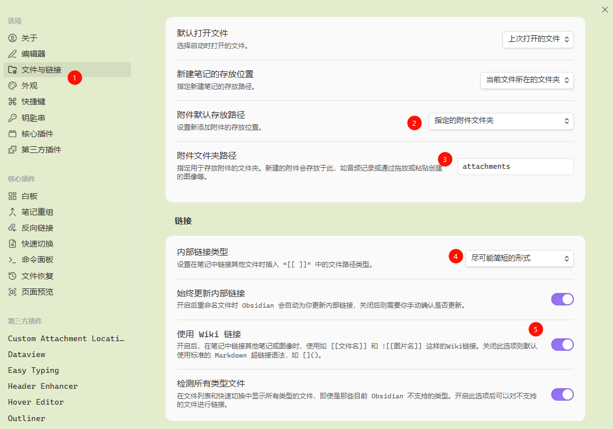
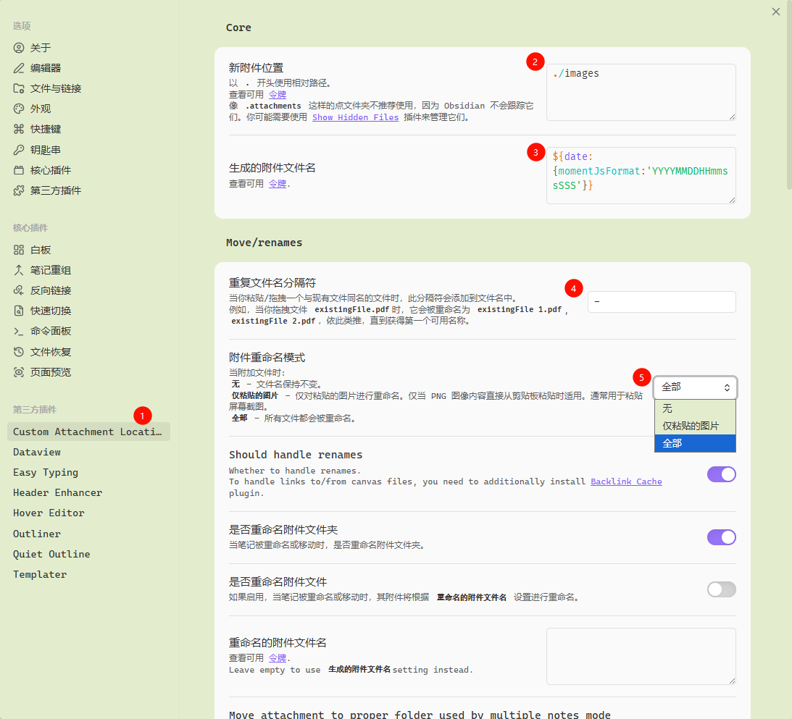
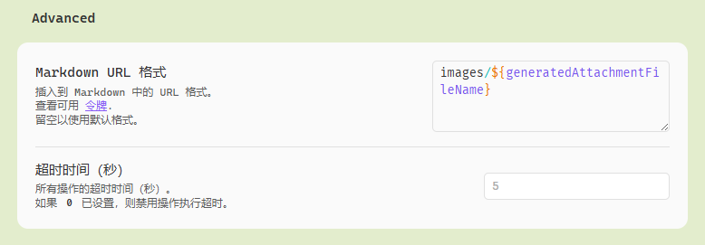
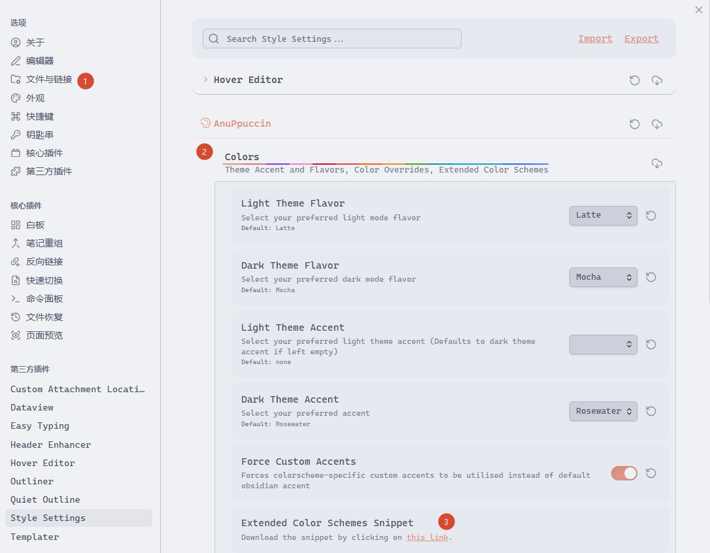
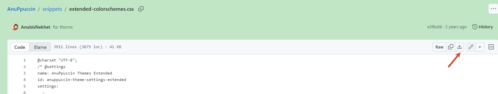
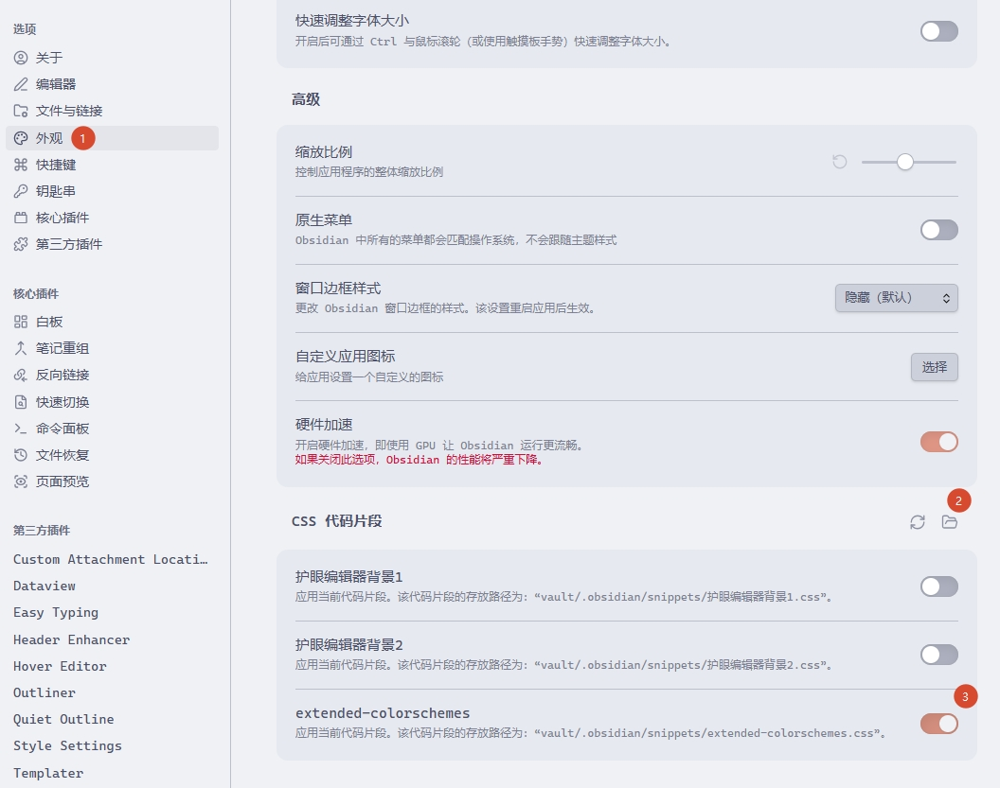
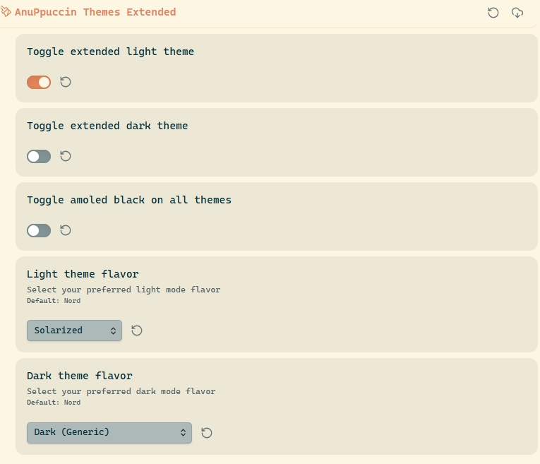
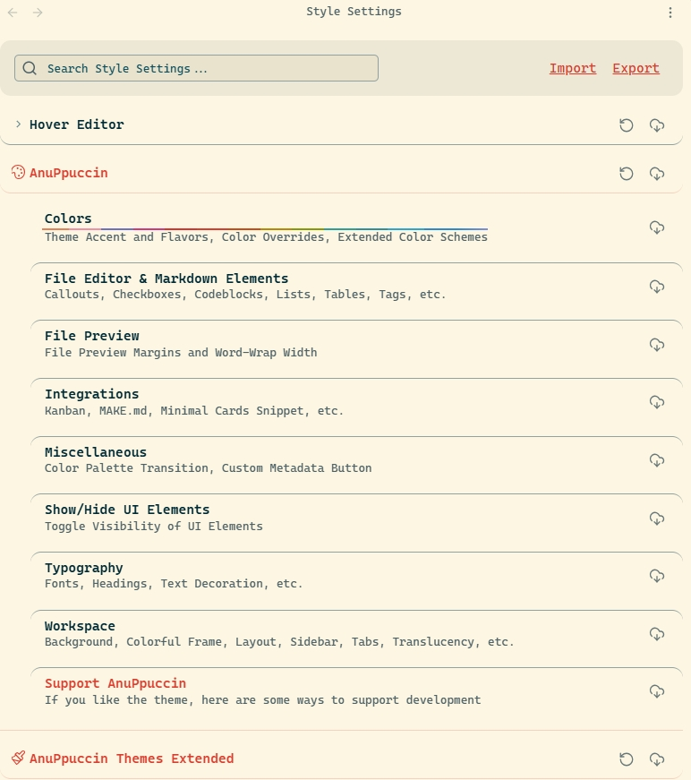

---
tags:
  - Software
---


## Obsidian 概述

- 官网：https://obsidian.md/zh/
- 官方帮助文档：[由此开始 - Obsidian 中文帮助](https://obsidian.md/zh/help/)

## 常用设置与操作

### 同步滚动的分屏

按住 Ctrl 键，同时使用鼠标点击右上角的**视图**图标，即可直接打开一个新的同步滚动的分屏，再根据需求分别调整两个分屏显示“阅读模式”或者“编辑模式”。

### 实用 CSS 代码片段

#### 引用笔记限高

如果某个笔记中引用其他内容并想直接显示，但该引用的内容又太长，会导致将原笔记展示过长，此时可以使用 css 样式来限制引用内容的显示高度。新建 scroll-embed.css 文件，复制以下代码：

```css
/* 为笔记限制其内部嵌入笔记的预览高度 */
.scroll-embed .markdown-embed-content {
    max-height: 400px; /* 限制最大高度为400像素，可根据需要修改 */
    overflow-y: auto; /* 内容超出高度时，显示垂直滚动条 */
}
```

此代码片段非全局样式，在需要使用限制预览高度的笔记中，增加 `cssclasses` 属性，属性值设置为 `scroll-embed` 即可

### 针对图片生成标准 Markdown 语法的链接

#### 需求分析

需求：原生 Obsidian 无法分类型区分链接格式：要么全 `![[]]`，要么全 ``。现希望将 Obsidian 设置两种插入附件的方式。如拖入图片类型的文件到文档时，则生成 markdown 标准的语法 ``；而插入除图片外其他类型的附件时，则生成 Obsidian 特有 Wiki 链接语法 `![[xxx]]`。即**保留双链、图片跨平台兼容、其他文件用内部链接**。

#### 最终目标

1. **图片（截图 / 拖拽粘贴）**
	- 自动存入：当前笔记同级的 `images` 文件夹
	- 链接格式：强制生成标准 Markdown ``，跨平台兼容
	- 自动自定义命名，绝不重名
2. **非图片（PDF / 文档 / 压缩包等）**
    - 插件完全不接管、不自动处理
    - 保持 Obsidian 原生 `![[]]` 双链格式
    - 不会被误存入 `images` 文件夹，可手动统一放到根目录 `attachments`
3. 全局保留 Obsidian 双链功能，不影响内部笔记跳转
4. 基础系统设置（保证附件用`![[]]`）

#### 解决方案

核心方案：使用 **Custom Attachment Location** 插件，**全局默认用 Wikilinks，仅对图片类型强制生成标准 Markdown 链接**，精准按文件类型区分。

**Obsidian 原生文件的基础设置**

1. 打开 Obsidian 设置 -> `文件与链接`
2. 指定【附件默认存放的路径】，选择“指定的附件文件夹”
3. 指定【附件文件夹路径】，按实际情况填写
4. 链接【内部链接类型】-> "尽可能简短的形式"
5. 开启✅【使用 Wiki 链接】。目的为了全局默认使用双链



> [!info] 
> 其实【附件默认存放的路径】和【附件文件夹路径】的设置，后面使用 Custom Attachment Location 插件后，该插件的设置会覆盖这两项的值，所以这里填写什么没有什么意义，重点是必须要设置好**内部链接类型使用 Wiki 链接**！

**Custom Attachment Location 插件的设置**

1. 在第三方插件选择该插件
2. 设置【新附件位置】，此设置会 overwrite 了前面原生的【附件默认存放的路径】和【附件文件夹路径】的设置。按需求是希望将图片存在当前文档所在目录下的【images】文件夹中，因此这里设置`./images`
3. 设置【生成的附件文件名】，此设置用于对粘贴或者拖入的图片（或附件）进行重命名的规则，这样可以避免图片（或附件）出现同名的情况。可以使用表达式去设置，如：`${date:{momentJsFormat:'YYYYMMDDHHmmssSSS'}}`
4. 设置【重复文件名分隔符】，此设置用于如果有附件同名，就自动在名称后加上设置的“分隔符” + “1、2、3...”，来避免覆盖原有的文件。
5. 设置【附件重命名模式】，此设置用于是否给粘贴或者拖入的图片（或附件）进行重命名。
    - 【无】：按文件原来的名称
    - 【仅粘贴的图片】：只对以粘贴方式插入到文档中的图片进行重命名。图片以外格式的附件和插入到文档的图片均不重命名
    - 【全部】：不管是粘贴或者拖入的图片（或附件），都进行重命名



6. 【Advanced】->【Markdown URL 格式】，此设置就是用于实现将 `![[xxx.jpg]]` 的链接写法替换成 `` 写法的<font color=red>**需求解决方案的关键配置**</font>。这里也是支持表达式设置，如有不同的需求可参考官方文档。此处设置 `images/${generatedAttachmentFileName}`即可实现将图片变成 Markdown 语法的标准写法。



> [!note] 值得注意，此需求只为了统一图片按标准 Markdown 语法链接写法，<font color=red>**其他类型的附件建议手动管理**</font>，此项目的附件都统一存到根目录的 attachments 目录中，需要引入附件的时候手动编写 `![[]]`，避免将非图片类的文件保存到 `images` 文件夹中，要保持其纯净不被污染。

## 文档编辑

### 属性

属性是用于组织笔记的相关信息。属性包含结构化数据，如文本、链接、日期、复选框和数字。

#### 笔记添加属性的方式

有几种方法可以为笔记添加属性：

- 使用**增加笔记属性**[命令](https://obsidian.md/zh/help/plugins/command-palette)。
- 使用 **`Cmd/Ctrl + ;`** [快捷键](https://obsidian.md/zh/help/hotkeys)。
- 从**更多选项**菜单（通过三点图标或右键点击标签页打开）中选择**增加笔记属性**。
- 在文件的最开头输入 `---`。

添加属性后，文件顶部会出现一行，包含两个输入项：属性的<u>**名称**</u>和属性的<u>**值**</u>。Obsidian 提供了几个默认属性：`tags`、`cssclasses` 和 `aliases`，也可以随意自定义属性。

#### 属性类型

除了名称和值之外，属性还有一个<u>**类型**</u>。属性的类型决定了它可以存储什么样的值以及 Obsidian 如何处理它们。要更改属性的类型，点击属性名称旁边的类型图标并选择不同的选项。Obsidian 支持以下属性类型：

- 文本
- 列表
- 数字
- 复选框
- 日期
- 日期 & 时间
- 标签

一旦属性类型被分配给某个属性名称，仓库中所有具有该名称的属性都将使用相同的类型。

#### 内联变量的写法（Dataview 插件的扩展功能）

1. 使用两个冒号 `::` 分隔，前面是key(属性名称)，后面是value（属性值），value 的部分一直到换行为止。语句格式如下：

```
key::value
```

2. 如果想将内联变量放到一个句子中，可以使用中括号来限定他的范围。如：

```
如果写在一个句子中，可以用中括号来限定[key::value]的范围
```

3. 如果想在阅读视图中隐藏key，只显示value，可以使用圆括号 `()` 包裹内联变量即可

```
想隐藏key只显示value，可以用圆括号(key::value)包裹来实现
```

## Plugin (插件)
### Outliner

Outliner 进阶增强的列表大纲插件，可以对节点进行上下的移动。

### Quiet Outline

Obsidian 核心插件“大纲”的增强版。

> Tips: 此插件完全可以代替 Obsidian 自带的核心插件『大纲』，只保留其中一个即可。

### Calendar

Calendar 日历插件，快速新建日记

### Templater

增强版模板插件。官方文档：[Introduction - Templater](https://silentvoid13.github.io/Templater/)

#### 插入模板后指定光标的位置

语法：

```html
<% tp.file.cursor(order?: number) %>
```

示例：

```html
// File cursor

// File multi-cursor
Content
```

> Note: 特别注意，此功能必须在 Templater 的设置中开启 `Automatic jump to cursor` 选项。（<font color=red>**此选项默认是关闭的，如果设置模板没有实现光标定位的效果，请检查此配置项！**</font>）

**多光标定位（高级用法）**：如果需要多个光标位置，用 `tp.file.cursor(1)` `tp.file.cursor(2)`，按 `Tab` 可以在多个光标之间切换。

```html
<font color=red>****</font> 
```

**关键说明**:

1. `<% tp.file.cursor(order?: number) %>` 是 Templater 专属光标定位标记，**不会被渲染出来**，仅控制光标位置；
2. 插入后的代码是**标准 HTML + Markdown**，兼容所有平台；
3. 上面示例在预览模式下会直接显示**相应HTML代码的效果**，编辑模式会保留源码。

#### 快捷插入内容至某个笔记的指定位置

在模板文件夹中，新增模板笔记，如：`Capture.md`。

```js
<%*
const file = tp.file.find_tfile("想插入的文件名称")
if (file) {
    const loggedItem = await tp.system.prompt("弹出框提示")
    const time = tp.date.now("HH:mm")
    const content = (await app.vault.read(file)).split("\n")
    const index = content.indexOf("### 想将当前输入的内容插入到那个标题下面")
    content.splice(index + 1, 0, `- ${time} - ${loggedItem}`)
    await app.vault.modify(file, content.join("\n"))
} else {
	new Notification("No File Found!")
}
-%>
```

> Notes: 假设示例是将输入内容插入到当天的日志中，并且日志的名称是按`YYYY-MM-DD`的规则命名，则可以使用`tp.date.now("YYYY-MM-DD")`获取文件名。可以使用`Alt+E`来打开模板选择框，或者直接针对该模板设置单独的快捷键。

#### 通过模板选择不同标注并输入（Callout）

在模板文件夹中，新增模板笔记，如：`Insert-Callouts.md`。然后使用`Alt+E`来打开模板选择框，或者给模板设置单独的快捷键。

```js
<%*
const callouts = {
	note: '🔵 ✏ Note',
	info: '🔵 ℹ Info',
	todo: '🔵 🔳 Todo',
	tip: '🌐 🔥 Tip / Hint / Important',
	abstract: '🌐 📋 Abstract / Summary / TLDR',
	question: '🟡 ❓ Question / Help / FAQ',
	quote: '🔘 💬 Quote / Cite',
	example: '🟣 📑 Example',
	success: '🟢 ✔ Success / Check / Done',
	warning: '🟠 ⚠ Warning / Caution / Attention',
	failure: '🔴 ❌ Failure / Fail / Missing',
	danger: '🔴 ⚡ Danger / Error',
	bug: '🔴 🐞 Bug',
};

const type = await tp.system.suggester(Object.values(callouts), Object.keys(callouts), true, 'Select callout type.');
const fold = await tp.system.suggester(['None', 'Expanded', 'Collapsed'], ['', '+', '-'], true, 'Select callout fold option.');

const title = await tp.system.prompt('Title:', '', true);
let content = await tp.system.prompt('Content (New line -> Shift + Enter):', '', true, true);
content = content.split('\n').map(line => `> ${line}`).join('\n')  

const calloutHead = `> [!${type}]${fold} ${title}\n`;

tR += calloutHead + content
-%>
```

> [!info] 可以适当地调整代码，根据需要减少弹出框的输入。

#### 在日志中使用 dataview 插件上下

在日志模板中，使用 dataview 动态增加“上一篇日志”和“下一篇日志”链接的效果。将以下代码复制到日志模板中。<font color=red>**需要将代码块的语言 `js` 改成 `dataviewjs`**</font>

```js
// 1. 仅筛选带 #Diary 标签的日记，并按文件名（日期）升序排列
const diaries = dv.pages("#Diary").sort(p => p.file.name, "asc");

// 2. 获取当前文件
const current = dv.current();
const index = diaries.findIndex(p => p.file.path === current.file.path);

let nav = "";

// 3. 生成上一篇日志（存在则显示）
if (index > 0) {
    const prev = diaries[index - 1];
    nav += `🡸 [[${prev.file.name}|上一篇日志]]`;
}

// 4. 生成下一篇日志（存在则显示，自动找最近的日期）
if (index < diaries.length - 1) {
    const next = diaries[index + 1];
    if (nav) nav += " ｜ ";
    nav += `[[${next.file.name}|下一篇日志]] 🡺`;
}

// 5. 渲染居中可点击链接
dv.paragraph(nav);
```

### Dataview

Dataview 插件实现将 Obsidian Vault 视为一个可供查询的数据库。它提供了一个 JavaScript API 和基于管道的查询语言，用于对 Markdown 页面进行筛选、排序和数据提取。

Github 仓库地址：https://github.com/blacksmithgu/obsidian-dataview

### Hover Editor

悬浮预览编辑器，可以有预览链接内容的同时直接修改对应的内容。

### Tag Wrangler

批量管理标签插件

### Custom Attachment Location

这是一个适用于 Obsidian 的插件，允许像 Typora 一样使用标记（如 `${noteFileName}`、`$ {date:{momentJsFormat:'YYYYMMDD'}}` 等）自定义附件位置。部分功能简介如下：

- 修改附件文件夹的位置。
- 修改“粘贴的文件”的文件名。
- 收集附件——将笔记中的所有附件收集起来，并放入相应的配置文件夹中。

官方仓库与文档：https://github.com/mnaoumov/obsidian-custom-attachment-location

### Easy typing

Easy Typing 是一个 Obsidian 书写体验增强插件，提供自动文本格式化、智能编辑增强和强大的规则引擎，用于自定义文本转换。

官网说明文档：[easy-typing-obsidian · GitHub](https://github.com/Yaozhuwa/easy-typing-obsidian/blob/master/README_ZH.md)

### Style Settings + AnuPpuccin(主题)

#### 安装步骤

1. 安装 Style Settings 插件。详情见官方仓库 [obsidian-style-settings](https://github.com/obsidian-community/obsidian-style-settings)
2. 在【外观】-> 【主题】->【管理】中，搜索并 AnuPpuccin 主题下载并使用。
3. 需要安装 AnuPpuccin 扩展主题。【文件与链接】->【AnuPpuccin】->【Colors】->点击【Extended Color Schemes snippet】的“this Link”



4. 跳转至代码仓库下载 css 代码。



5. 设置【外观】->【CSS 代码片段】中，点击打开相应的文件夹，将 css 文件复制进去，刷新后开启。



6. Ctrl+P 打开命令输入框，搜索 `Style Settings: Show style settings view` 打开设置的界面进行调试

#### AnuPpuccin Themes Extended



【AnuPpuccin Themes Extended】选择相应亮/暗主题。注意需要和原生主题色的配置一致。

#### AnuPpuccin 样式设置



【AnuPpuccin】用于设置具体元素的样式。部分常用的样式设置如下：

- 【Colors】->【Force Custom Accents】，设置是否覆盖原生设置的主题色，开启则覆盖。
- 【File Editor & Markdown Elements】->【Active line highlight】，设置当前选择/编辑行的样式
	- None：没有效果
	- Highlight：高亮底色
	- Highlight + Border：高亮底色+前边框色
	- Border only：前边框色
- 【File Editor & Markdown Elements】->【Callouts】，Callous 相关设置
- 【File Editor & Markdown Elements】->【Codeblocks】，代码块相关设置
	- 【Enable Codeblock Numbering】：是否显示代码行号
	- 【Codeblock Line Wrap】：代码块内是否换行（但目前设置没有生效??）
- 【Show/Hide UI Elements】：设置显示/隐藏一些工作区的元素
- 【Typography】->【Heading】：标题相关设置
	- 【Enable Custom Heading Colors】：是否开启标题颜色
- 【Typography】->【Text Decoration】：设置文字的“**加粗**”、“*斜体*”和“==高亮==”的样式
- 【Workspace】->【File Browser】：文件与文件夹相关设置
	- 【Enable file icons】：是否开启文件图标
	- 【Enable folder icons for collapse indicators】：是否开启文件夹图标
- 【Workspace】->【Rainbow Folders】->【Rainbow style】：彩虹色文件夹
	- None：不开启
	- Full：彩虹色底色
	- Simple：仅文字为彩虹色
- 【Workspace】->【Status Bar】->【Status Bar style】：状态栏的样式
	- Default：原生样式
	- Floating：鼠标移动至位置时悬浮
	- Fixed：固定在底部
- 【Workspace】->【Tabs】：文档标题 Tab 样式
- 【Workspace】->【Workspace Layout】->【Workspace Layout variant】：工作台布局
	- Default：原生样式
	- Border：边框式模块
	- Cards：布片式模块

### Advanced Tables

强大的表格插件

> Github 仓库地址：https://github.com/tgrosinger/advanced-tables-obsidian/tree/main

### Clear Unused Images

Clear Unused Images 用于删除在 Markdown 笔记中不再引用的图片，保持文档夹整洁。此插件会所有的 Markdown 文档中所有的图片链接，与存储库中所有图片文件进行对比。若图片没有在任何文档中被引用，将被自动删除。

> Github 仓库地址：https://github.com/ozntel/oz-clear-unused-images-obsidian

### Header Enhancer

Header Enhancer 全能型标题增强插件，核心功能用于给标题自动编号，相关设置如下：

1. 打开插件设置 -> 开启 "Enable Auto Numbering Function" 总开关，配置如下：
    - Numbering Format：选择编号样式（`1.1`、`1.2.3` 等）
    - Trigger Method：设置触发方式（输入标题后按 Enter 自动添加编号）
    - Skip Levels：设置跳过的标题层级
2. 额外增强功能：
    - 智能反向链接：自动管理标题与内容的关联链接
    - 标题字体自定义：为不同层级标题设置专属字体、大小、颜色
    - 批量处理：通过侧边栏图标一键为当前文档标题添加 / 移除编号

使用 YAML 控制是否开开启：

```yml
# 旧
---
header-auto-numbering: ["state on", "start-level h2", "end-level h6", "start-at 1", "separator ."]
---
# 新版本设置
---
header-auto-numbering: 
  - state on
  - start-level h2
  - end-level h6
  - start-at 1
  - separator .
---
```

### 待试用

- [ ] Editing toolbar
- [ ] Quick Explorer - Obsidian 更快的切换文件，快捷资源管理器。
- [ ] Notebook Navigator
- [ ] Excalidraw
- [ ] Manual Sorting - 文件夹拖拽排序 
- [ ] Iconize - 修改文件夹和颜色 
- [ ] Style Settings / ViewTuner 
- [ ] MySnippets 状态栏管理css片段
- [ ] Samrt connections 
- [ ] Mind Map 笔记转成思维导图
- [ ] weread 导入微信读书书摘
- [x] file cleaner 无用附件清理，<font color=red>**还不熟悉删除插件的执行规则，会出现大量删除仓库中除了md格式文件之外，没有在文档中链接的文件，应该不能使用，慎重测试中！！！**</font>
