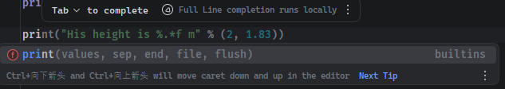
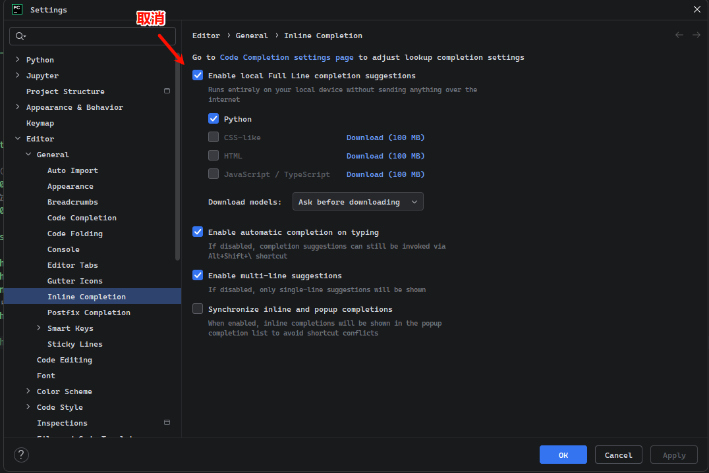
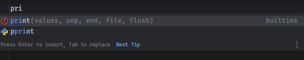

## PyCharm

### 官方资料

- [PyCharm 官网](https://www.jetbrains.com/pycharm/)
- [PyCharm 官方资源](https://www.jetbrains.com/pycharm/learn/) - 这是最权威的资源，涵盖了 PyCharm 的所有功能和使用说明。
- [PyCharm 官方帮助文档](https://www.jetbrains.com/help/pycharm/getting-started.html)

## 常用设置

### 取消内联补全

Pychaarm 默认是通过AI去补充一些函数里的一些内容，但这些内容通常都不是想用的，对于编写代码有点不太友好。建议取消。

打开【Settings】->【Editor】->【Inline Completion】，取消勾选【Enable local Full Line completion suggestions】

设置后的效果如下。只提示函数补全，不提示里面相关参数内容补全。

